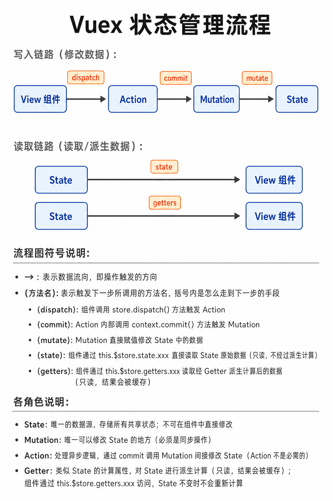
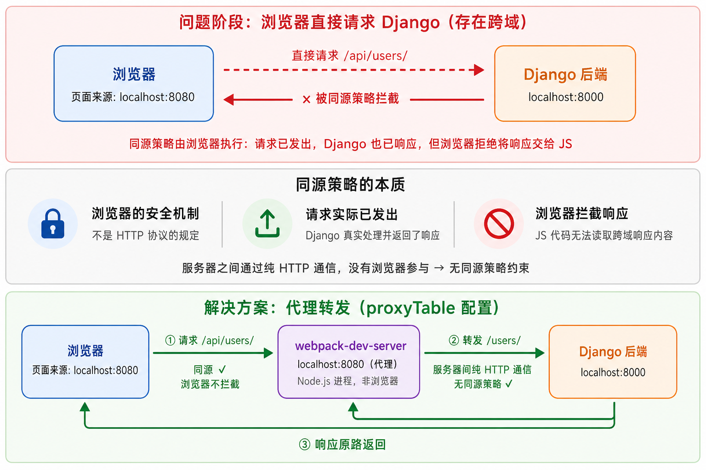

# 前端三件套 + Vue 全流程实战向导

**前端三件套**（HTML + CSS + JavaScript）是构建 Web 页面的基础技术栈，**Vue.js** 是目前最流行的渐进式 JavaScript 框架之一（vuejs/vue GitHub ⭐ 200k+，vuejs/core GitHub ⭐ 50k+，官方仓库：[https://github.com/vuejs/core](https://github.com/vuejs/core)）。
本向导以 **Vue 2 Options API** 为主线，同时标注 Vue 3 差异，
所有 API 均已与官方仓库（[https://github.com/vuejs/core](https://github.com/vuejs/core) / [https://github.com/vuejs/vue](https://github.com/vuejs/vue)）对照验证。

> **版本说明（重要）**：
> - **Vue 2**（当前主线）：最终版为 **2.7.16**，已于 **2023-12-31 正式 EOL**，不再维护。
>   当前内容基于 Vue 2 Options API，仍可学习和运行，但新项目请迁移至 Vue 3。
> - **Vue 3**（生产推荐）：当前稳定版为 **3.5.40**（2026-07-16），3.6.0 RC 阶段。
>   官方文档：[https://cn.vuejs.org/](https://cn.vuejs.org/)
> - **Vue CLI**（当前使用）：已进入 **Maintenance Mode（仅维护不新增功能）**。
>   新 Vue 3 项目官方推荐使用 `npm create vue@latest`（基于 Vite）。
> - **Node.js**：需 **v22.23.2 LTS（Maintenance）或 v24.18.1 LTS（Active，推荐）**；
>   Node 14/16/18/20 均已 EOL，`npm install -g @vue/cli` 需 Node.js ≥ 10，建议 ≥ 22。

> **核心理念**：HTML 决定结构，CSS 决定样式，JavaScript 决定行为，Vue 基于 **MVVM** 模式
> 将数据与视图通过 **双向绑定** 连接，实现声明式、组件化的前端开发方式。


| 章节 | 内容 |
| ---- | ---- |
| 一   | 前端开发概述与环境搭建：三件套职责划分、前后端分离架构、安装 Node.js 与 Vue CLI、创建 Vue 项目 |
| 二   | HTML 基础：文档结构与文档类型、常用双标签/单标签、字符实体、路径类型、标签常用属性 |
| 三   | HTML 表格与表单：表格标签（布局已被盒模型替代）、表单标签与控件 |
| 四   | CSS 基础：三种引入方式、六类选择器、颜色表示法、文本样式属性、背景属性 |
| 五   | CSS 盒模型：content/padding/border/margin 结构、盒模型特殊问题与解决、元素类型（display）、inline/inline-block 常见问题 |
| 六   | CSS 布局：浮动（Float）、清除浮动三种方法、定位（Position）四种类型 |
| 七   | JavaScript 基础：JS 概述、嵌入页面三种方式、变量与数据类型、函数定义与执行、变量与函数预解析、变量作用域 |
| 八   | JavaScript DOM 操作：获取 DOM 元素两种方法、操作元素属性、事件绑定 |
| 九   | JavaScript 进阶：条件语句、数组及操作方法、循环语句、字符串操作方法、定时器、BOM 常用对象 |
| 十   | Vue 概述与环境搭建：MVVM 模型、项目目录结构、main.js 入口文件、单文件组件结构与注册、内置属性与 `$` 命名约定 |
| 十一 | Vue 指令系统：v-html/v-text、v-bind、v-if/v-else-if/v-else/v-show、v-for、v-on、v-model 及修饰符 |
| 十二 | Vue 组件化开发：计算属性（Computed）、Class 与 Style 动态绑定、生命周期钩子 |
| 十三 | Vue 组件通信：props 父→子传值、$emit 子→父触发事件、插槽（默认/具名/作用域）|
| 十四 | Vue 进阶特性：动态组件与 keep-alive、自定义指令、过滤器（Filters）、CSS 过渡与动画 |
| 十五 | Vue Router 前端路由：路由安装与配置、路由在组件中的使用、编程式导航、导航守卫 |
| 十六 | Vuex 状态管理：概述与安装、Store 配置（state/mutations/actions/getters）、在组件中使用 Vuex |
| 十七 | Axios 异步请求：安装与配置、GET 请求、POST 请求、拦截器、跨域代理配置 |
| 十八 | **完整端到端实战（新闻资讯 SPA，一键跑通）**：项目结构、路由配置、Vuex 仓库、首页/卡片/导航栏组件、项目运行与打包 |
| 十九 | 速查表与知识汇总：npm 常用命令、Vue 指令速查、Vue 选项速查、CSS 常用属性、前端开发完整流程图、常见问题速查 |


---

## 一、前端开发概述与环境搭建

### 1.1 前端三件套职责划分


| 技术          | 职责            | 类比       |
| ------------- | --------------- | ---------- |
| HTML          | 页面结构与内容  | 房屋骨架   |
| CSS           | 页面样式与排版  | 装修与家具 |
| JavaScript    | 页面行为与交互  | 水电暖控制 |
| Vue.js        | 数据驱动视图    | 智能家居系统 |

### 1.2 前后端分离架构


### 1.3 安装 Node.js 与 Vue CLI

```bash
# ============================================================
# 第一步：安装 Node.js（包含 npm 包管理器）
# 官网下载：https://nodejs.org/en/
# 当前 LTS 版本（2026-08）：
#   - Node.js 24.18.1（Active LTS，Krypton，推荐新项目，支持至 2028-04-30）
#   - Node.js 22.23.2（Maintenance LTS，Jod，支持至 2027-04-30）
# Node.js 26.x 为 Current 版本，预计 2026-10 转 Active LTS
# Node 14/16/18/20/25 均已 EOL，请勿在生产环境使用
# ============================================================

# 验证 Node.js 与 npm 安装成功
node -v           # 打印 Node.js 版本，推荐 v24.18.1 或 v22.23.2
npm -v            # 打印 npm 版本，如 10.x.x

# ============================================================
# 第二步：安装 cnpm（淘宝镜像，国内加速，可选）
# ============================================================
npm install -g cnpm --registry=https://registry.npmmirror.com

# ============================================================
# 第三步（当前方式 A）：安装旧版 vue-cli（用于 vue init webpack）
# ⚠️  vue-cli（包名 vue-cli）已废弃，仅用于复现旧版 Vue 2 环境
# 注意：这是旧版 CLI，与下方 @vue/cli 是两个不同的包
# ============================================================
npm install -g vue-cli            # 安装旧版 vue-cli，提供 vue init 命令

# ============================================================
# 第三步（当前方式 B）：安装新版 @vue/cli（已进入 Maintenance Mode）
# ⚠️  @vue/cli 已停止新功能开发，仅维护；提供 vue create 命令
# ============================================================
npm install -g @vue/cli           # 安装 Vue CLI（@vue/cli 4.x/5.x）

# 验证 Vue CLI 安装
vue --version                     # 打印已安装 CLI 的版本号

# ============================================================
# 第三步（生产推荐）：使用 create-vue + Vite 创建 Vue 3 项目
# 这是 Vue 3 官方推荐的脚手架工具（https://github.com/vuejs/create-vue）
# ============================================================
npm create vue@latest             # 交互式选择 TypeScript / Router / Pinia 等

# ============================================================
# 补充：在已有项目中单独安装 Vue 3
# 适用于手动搭建项目或已有项目升级/引入 Vue 3 依赖
# ============================================================
npm install vue@3                 # 安装最新的 Vue 3.x 版本到当前项目
```

### 1.4 创建 Vue 项目

```bash
# ============================================================
# 方式一（当前 / Vue 2 项目）：使用旧版 vue-cli（vue init webpack）
# ⚠️  vue-cli（不是 @vue/cli）已废弃，仅用于复现当前环境
# 此命令需要 npm install -g vue-cli（旧版 CLI，非 @vue/cli）
# ============================================================
vue init webpack my-project       # 初始化名为 my-project 的 Vue2 项目

cd my-project                     # 进入项目根目录
npm install                       # 安装所有依赖包（生成 node_modules/）
npm run dev                       # 启动开发服务器，访问 http://localhost:8080

# ============================================================
# 方式二（Vue 2 / 3 兼容）：使用 @vue/cli（vue create）
# ⚠️  @vue/cli 已进入 Maintenance Mode，仍可使用但不推荐新项目
# ============================================================
vue create my-vue2-project        # 交互式选择 Vue 2 + Babel + ESLint 等
cd my-vue2-project
npm run serve                     # 启动开发服务器（新版命令）
npm run build                     # 构建生产版本，输出到 dist/ 目录

# ============================================================
# 方式三（Vue 3 生产推荐）：使用 create-vue + Vite
# 官方仓库：https://github.com/vuejs/create-vue
# ============================================================
npm create vue@latest             # 交互式选择 TypeScript / Pinia / Router / Vitest 等
cd <project-name>
npm install
npm run dev                       # 启动 Vite 开发服务器（极速热更新）
npm run build                     # 构建生产版本
```

---

## 二、HTML 基础

### 2.1 HTML 概述与文档结构

HTML（HyperText Mark-up Language，超文本标记语言）是构建网页的基础语言，
一个 HTML 文件就是一个网页，浏览器负责解析标签并将其渲染成可视化页面。

> **CSS 引入方式说明**：在 HTML 中引入 CSS 共有三种方式，优先级从高到低依次为：
>
> | 方式 | 写法 | 作用范围 | 适用场景 |
> | ---- | ---- | -------- | -------- |
> | 行内（`style` 属性） | `<p style="color: red;">` 写在标签上 | 仅当前标签生效 | 极少量样式覆盖 |
> | 内嵌（`<style>`） | `<style> p { color: red; } </style>` 写在 `<head>` 内 | 仅当前页面生效 | 单页面或临时调试 |
> | 外联（`<link>`） | `<link rel="stylesheet" href="main.css">` | 多页面共享，浏览器可缓存 | 正式项目，**推荐** |
>
> 三种方式可同时存在，**行内 > 内嵌 > 外联**（相同选择器权重时，后声明的覆盖先声明的）。

```html
<!-- DOCTYPE 声明：通知浏览器使用 HTML5 标准解析本文档；实际项目中应为文件第一行 -->
<!DOCTYPE html>

<!-- <html> 根标签：整个 HTML 文档的最外层容器，所有内容必须写在其内部 -->
<!-- lang="zh-CN"：声明页面主要语言为简体中文；
     作用①：SEO（搜索引擎优化），帮助搜索引擎识别语言；
     作用②：辅助技术（如屏幕阅读器）正确发音；
     其他常用值：lang="en"（英文）、lang="zh-TW"（繁体中文） -->
<html lang="zh-CN">

<head>
    <!-- <head> 区域：文档头部，存放元信息，内容不显示在页面上，但影响浏览器行为和 SEO -->

    <!-- <meta charset>：声明文档字符编码；
         UTF-8 是 Unicode 万国码，支持中文、日文、韩文及各种特殊符号；
         若缺少此声明，中文内容在部分浏览器中会显示为乱码；
         必须放在 <head> 内尽可能靠前的位置 -->
    <meta charset="UTF-8">

    <!-- <meta name="viewport">：控制移动端视口（可视区域）行为，实现响应式布局的基础配置；
         width=device-width：将视口宽度设为设备屏幕实际宽度（而非默认 980px）；
         initial-scale=1.0：页面初始缩放比例为 1（不缩放，保持 CSS 像素与设备像素 1:1）；
         可追加属性：maximum-scale=1.0（禁止放大）、user-scalable=no（禁止用户手动缩放，部分场景不推荐） -->
    <meta name="viewport" content="width=device-width, initial-scale=1.0">

    <!-- <title>：网页标题；
         显示在浏览器标签页、书签名称、搜索引擎结果标题中；
         每个页面应有唯一且描述性强的标题，建议长度 25~30 个汉字以内 -->
    <title>网页标题</title>

    <!-- <link>：引入外部资源，最常用于引入 CSS 样式文件；
         rel="stylesheet"：声明引入的是样式表（relationship 关系类型）；
         type="text/css"：资源 MIME 类型，HTML5 中可省略（浏览器默认识别）；
         href="css/main.css"：外部 CSS 文件的路径（支持相对路径和绝对路径） -->
    <link rel="stylesheet" type="text/css" href="css/main.css">

    <!-- <script>：引入外部 JavaScript 文件；
         type="text/javascript"：脚本 MIME 类型，HTML5 中可省略；
         src="js/index.js"：外部 JS 文件路径（支持相对路径或网络 URL）；
         放在 <head> 中会阻塞页面渲染，推荐放在 </body> 前或使用 defer/async 属性；
         defer：延迟到 HTML 解析完成后执行，不阻塞渲染；
         async：异步加载，加载完立即执行，顺序不保证 -->
    <script type="text/javascript" src="js/index.js"></script>
</head>

<body>
    <!-- <body> 区域：文档主体，所有在页面上可见的内容都写在这里；
         浏览器从上到下解析并渲染 body 内的标签，最终呈现为用户可见的页面 -->
    网页显示内容
</body>

</html>
```

### 2.2 文档类型

| 文档类型    | 声明方式              | 说明                              |
| ----------- | --------------------- | --------------------------------- |
| HTML5       | `<!DOCTYPE html>`     | 当前主流，向下兼容，推荐使用      |
| XHTML 1.0   | 完整 DTD 声明         | 老版本，部分遗留网站仍在使用      |

### 2.3 常用双标签

```html
<!-- ============================================================
   块元素（Block Element）：默认占一整行，支持全部样式属性
   ============================================================ -->
<h1>一级标题</h1>               <!-- 标题标签，h1~h6 六个级别，h1 最大 -->
<h2>二级标题</h2>
<p>段落内容</p>                  <!-- 段落标签，自带上下外边距 -->
<div>块容器</div>                <!-- 无语义块容器，最常用的布局标签 -->
<ul>                            <!-- 无序列表（Unordered List），子项前有圆点 -->
    <li>列表项一</li>            <!-- List Item，块元素（display: list-item），每个列表项独占一行 -->
    <li>列表项二</li>
</ul>
<ol>                            <!-- 有序列表（Ordered List），子项前有数字序号 -->
    <li>第一步</li>
    <li>第二步</li>
</ol>
<dl>                            <!-- 描述列表（Description List） -->
    <dt>HTML</dt>               <!-- 描述术语（Description Term），块元素 -->
    <dd>负责页面结构</dd>        <!-- 术语的解释（Description Details），块元素，默认有左缩进 -->
</dl>
<!-- ============================================================
   HTML5 语义化布局标签（块元素）：与 div 功能相同，但具有明确语义，
   利于 SEO 和屏幕阅读器，推荐替代纯 div 布局
   ============================================================ -->
<header>页头区域</header>        <!-- 页面或区块的头部，通常放 Logo、导航 -->
<nav>导航区域</nav>              <!-- 导航链接集合（Navigation） -->
<main>主体内容</main>            <!-- 页面核心内容，一个页面只用一次 -->
<section>内容分区</section>      <!-- 独立的内容块，通常有标题 -->
<article>文章内容</article>      <!-- 可独立分发的完整内容，如博客文章 -->
<aside>侧边栏</aside>            <!-- 与主内容相关但可独立的辅助内容 -->
<footer>页脚区域</footer>        <!-- 页面或区块的底部，通常放版权、联系方式 -->

<!-- ============================================================
   媒体标签（块元素）
   ============================================================ -->
<!-- video：视频播放标签；src：视频地址（支持相对路径或网络 URL）；controls：显示播放控件；
     autoplay：自动播放（需配合 muted 才能在大多数浏览器生效）；
     loop：循环播放；width/height：播放器尺寸 -->
<video src="movie.mp4" controls autoplay muted loop width="640" height="360"></video>
<!-- audio：音频播放标签；src：音频地址（支持相对路径或网络 URL）；controls：显示播放控件；
     autoplay：自动播放；loop：循环播放 -->
<audio src="music.mp3" controls></audio>

<!-- ============================================================
   代码展示标签 —— pre 为块元素，code 为行内元素
   ============================================================ -->
<!-- pre（Preformatted Text）：块元素，保留原始空白和换行，
     单独用 code 时浏览器会压缩空白，需嵌套在 pre 内才能正确显示多行代码 -->
<pre>
<!-- code：行内元素，标记一段代码片段；
     class="language-xxx"：通行约定（W3C 推荐），用于标注代码语言类型，
     供 Prism.js、highlight.js 等高亮库识别并着色；
     单行代码可单独使用 code，无需 pre -->
<code class="language-javascript">const msg = 'hello'</code>
</pre>

<!-- ============================================================
   行内块元素（Inline-Block Element）：不独占一行，但可设置宽高
   ============================================================ -->
<!-- button：行内块元素，可包含文字或图标；
     type="button"：普通按钮（不触发表单提交）；
     type="submit"：提交按钮，提交目标地址由所在 <form> 的 action 属性决定；
     type="reset"：重置按钮，将表单所有控件恢复为默认值 -->
<button type="button">点击按钮</button>
<!-- textarea：多行文本输入框，行内块元素；
     rows：可见行数（高度），cols：可见列数（字符宽度，实际宽高建议用 CSS 控制）；
     name：表单提交时的字段名；placeholder：未输入时的灰色提示文字；
     标签内的内容即默认值，通常保持开闭标签紧邻以避免多余空白 -->
<textarea name="bio" rows="4" cols="40" placeholder="请输入个人简介"></textarea>

<!-- ============================================================
   行内元素（Inline Element）：不换行，宽高由内容决定
   ============================================================ -->
<span>行内容器</span>            <!-- 无语义行内容器，常用于局部样式控制 -->
<!-- a 标签（Anchor）：超链接；href 跳转地址；title 鼠标悬停提示；
     target="_self"（默认，原页面跳转）；target="_blank"（新标签页打开）
     href="#" 表示链接到页面顶部，常用于占位 -->
<a href="https://vuejs.org" title="Vue官网" target="_blank">Vue 官网</a>
<i>斜体文字</i>                  <!-- italic：专业词汇斜体 -->
<b>粗体文字</b>                  <!-- bold：关键字粗体 -->
<em>强调文字</em>                <!-- emphasis：带语气强调，显示为斜体 -->
<strong>重要文字</strong>        <!-- 非常重要的内容，显示为粗体 -->
<!-- iframe：行内元素，在当前页面内嵌入另一个 HTML 文档；
     src：嵌入页面的 URL；width/height：显示尺寸；
     frameborder="0"：隐藏边框（HTML5 中已废弃，推荐用 CSS border: none 替代）；
     scrolling="no"：禁止滚动条（HTML5 已废弃属性，推荐用 CSS overflow: hidden 替代） -->
<iframe src="https://www.baidu.com" width="900" height="400"
    frameborder="0" scrolling="no" style="border: none; overflow: hidden;"></iframe>
```

### 2.4 常用单标签

```html
<!-- ============================================================
   块元素（Block Element）：默认占一整行
   ============================================================ -->
<hr>                             <!-- 水平分割线（Horizontal Rule），块元素 -->

<!-- ============================================================
   行内块元素（Inline-Block Element）：不独占一行，但可设置宽高
   ============================================================ -->
<!-- img：图片标签（Image），行内块元素；
     src：图片路径（支持相对路径或网络 URL；相对路径：./ 当前目录，../ 上级目录）；
     alt：图片加载失败时显示的替代文字（SEO 重要，盲人读屏使用）；
     width/height：图片显示尺寸；仅设其中一个，另一个由浏览器等比缩放；
     同时设置两个且比例与原图不同时会拉伸变形 -->


<!-- ============================================================
   行内元素（Inline Element）：不换行，宽高由内容决定
   ============================================================ -->
<br>                             <!-- 换行（Break），行内元素，强制换行 -->
<!-- input：表单输入控件，行内元素，单标签；
     type 决定控件类型：text 文本框、password 密码框、radio 单选、
     checkbox 复选、file 文件上传、submit 提交按钮等；
     详细用法见 3.2 表单标签 -->
<input type="text" name="username"/>
```

### 2.5 字符实体

```html
&nbsp;     <!-- 不换行空格（Non-Breaking Space）；宽度与普通空格相同，
             特性①：不会被浏览器折叠（多个 &nbsp; 均可见，普通空格连续写只渲染为一个）；
             特性②：该位置不允许自动换行 -->
&lt;       <!-- 小于号 < （less than）；防止被识别为标签开始符 -->
&gt;       <!-- 大于号 > （greater than） -->
&amp;      <!-- 和号 & -->
&copy;     <!-- 版权符号 © -->
```

### 2.6 路径类型

| 路径类型 | 示例                      | 说明                                                   |
| -------- | ------------------------- | ------------------------------------------------------ |
| 相对路径 | `./images/pic.jpg`        | 相对于当前文件，项目迁移不受影响，**推荐使用**         |
| 绝对路径 | `C:/Users/demo/pic.jpg`   | 相对于磁盘根目录，迁移后路径可能失效，**不推荐**       |
| 网络路径 | `https://example.com/pic` | 直接引用网络资源                                       |

### 2.7 标签常用属性

HTML 属性写在开始标签内，格式为 `属性名="属性值"`，用于为标签提供额外信息或控制行为。

**通用属性**（几乎所有标签都支持）：

| 属性 | 说明 | 示例 |
|------|------|------|
| `id` | 唯一标识，页面内不可重复，供 CSS/JS 精准选中 | `<div id="app">` |
| `class` | 类名，可重复，供 CSS 批量设置样式 | `<p class="title">` |
| `style` | 内联样式，直接写 CSS | `<p style="color:red">` |
| `title` | 鼠标悬停时显示的提示文字 | `<a title="跳转首页">` |
| `hidden` | 隐藏元素（等价于 `display:none`） | `<div hidden>` |

**表单 / 输入类属性**：

| 属性 | 适用标签 | 说明 |
|------|---------|------|
| `placeholder` | `<input>` `<textarea>` | 输入框未输入时显示的灰色提示文字，输入后消失 |
| `value` | `<input>` | 输入框的初始值；`type="radio/checkbox"` 时是提交给后端的数据值 |
| `type` | `<input>` | 输入框类型：`text`（文本）、`password`（密码）、`checkbox`（复选）、`radio`（单选）、`number`（数字）、`submit`（提交按钮）等 |
| `name` | `<input>` `<select>` `<textarea>` | 表单提交时的字段名，后端通过此名取值；同一组 radio 的 `name` 必须相同 |
| `action` | `<form>` | 表单数据提交的目标 URL |
| `method` | `<form>` | 提交方式：`get`（数据附在 URL）/ `post`（数据放请求体，更安全） |
| `for` | `<label>` | 与 `<input>` 的 `id` 对应，点击 label 时自动聚焦/选中绑定的输入框 |
| `disabled` | 表单元素 | 禁用元素，不可交互，提交时该字段不会被包含 |
| `readonly` | `<input>` `<textarea>` | 只读，不可修改，但提交时包含该字段 |
| `required` | 表单元素 | 标记为必填，浏览器在提交前自动校验是否有值 |
| `checked` | `checkbox` `radio` | 初始选中状态 |
| `selected` | `<option>` | 下拉框默认选中项 |
| `maxlength` | `<input>` `<textarea>` | 限制最多可输入的字符数 |

**链接 / 媒体类属性**：

| 属性 | 适用标签 | 说明 |
|------|---------|------|
| `href` | `<a>` `<link>` | 链接目标地址 |
| `src` | `` `<script>` `<audio>` `<video>` | 外部资源文件路径 |
| `alt` | `` | 图片加载失败时显示的替代文字，屏幕阅读器也会朗读此内容 |
| `width` / `height` | `` `<video>` | 指定宽高（px 或不带单位的数字）；建议只设一边让另一边等比缩放 |
| `target` | `<a>` | 链接打开方式：`_blank`（新标签页）/ `_self`（当前页，默认） |
| `rel` | `<a>` `<link>` | 声明与目标资源的关系，如 `rel="stylesheet"`；`<a>` 外链推荐加 `rel="noopener"` |

---

## 三、HTML 表格与表单

### 3.1 表格标签（不重要，表格布局已被盒子模型替代）

```html
<!-- ============================================================
   table 布局：传统布局方式，主要用于 EDM（广告邮件页面）
   现代主流布局方式是 HTML+CSS（DIV+CSS）
   ============================================================ -->
<!-- table：定义整个表格；
     border：边框宽度（px）；width/height：表格尺寸；
     cellpadding：单元格内容距边框距离；
     cellspacing：相邻单元格之间的距离；
     align：表格相对浏览器水平对齐方式（left/center/right） -->
<table border="1" width="600" height="300"
       cellpadding="10" cellspacing="0" align="center">
    <!-- tr（Table Row）：定义一行，height 控制行高 -->
    <tr height="50">
        <!-- th（Table Header）：表头单元格，内容加粗居中显示；
             colspan：横向合并 n 个单元格 -->
        <th colspan="3" align="center">基本情况</th>
    </tr>
    <tr>
        <!-- td（Table Data）：普通数据单元格；
             width：列宽（只需第一行写即可，后续行自动对齐）；
             align：单元格内容水平对齐（left/center/right）；
             valign：单元格内容垂直对齐（top/middle/bottom）；
             rowspan：纵向合并 n 行单元格 -->
        <td width="30%" align="left" valign="middle">姓名</td>
        <td>&nbsp;&nbsp;&nbsp;</td>
        <td rowspan="2"></td>
    </tr>
    <tr>
        <td>性别</td>
        <td></td>
    </tr>
</table>
```

### 3.2 表单标签

> **表单三要素：标签 / name / value**
>
> - **标签**：决定控件的类型和交互方式（如 `<input>`、`<select>`、`<textarea>`）
> - **name**：提交时数据的键名，后端通过此名取值；没有 `name` 的控件不会被提交
> - **value**：提交时数据的值；文本框的 `value` 是用户输入内容，单选/复选框的 `value` 是预设的提交值（不是显示文字），提交按钮的 `value` 默认不提交（加 `name` 后才提交）
>
> 最终提交的数据是一组 `name=value` 键值对，例如：`username=张三&gender=0`
> GET 方式将其拼接在 URL 后（`?username=张三&gender=0`），POST 方式格式相同但放在请求体中、URL 不可见

```html
<!-- ============================================================
   表单（Form）：用于收集用户输入，提交到服务器
   action：表单数据提交的目标地址（URL）
   method：提交方式；get=数据附加在 URL 中（明文可见）；post=数据在请求体中传输（URL 中不可见，但需配合 HTTPS 才能加密）
   ============================================================ -->
<form action="http://www.example.com/submit" method="post">

    <!-- label：行内元素（inline），为表单控件提供说明文字；必须与控件关联才能实现点击聚焦：
         关联方式①（显式）：label 加 for="id值"，input 加对应 id，点击 label 文字可聚焦到控件；
         关联方式②（隐式）：将 input 直接嵌套在 label 内，无需 for/id，点击 label 同样聚焦；
         以下示例：姓名/密码/照片/简介/城市 使用方式①（for+id），性别/爱好 使用方式②（label 包裹 input） -->
    <p>
        <!-- 显式关联示例：label for 对应 input id，点击"姓名"文字可聚焦输入框 -->
        <label for="username">姓名：</label>
        <!-- type="text"：单行文本输入框；
             id：与 label for 对应，实现点击 label 聚焦；
             name：提交时数据的键名（后端用此名取值）；
             value：表单元素的当前值（文本框的预填内容） -->
        <input type="text" id="username" name="username" value="默认值"/>
    </p>

    <p>
        <label for="password">密码：</label>
        <!-- type="password"：密码输入框，输入内容显示为 ● -->
        <input type="password" id="password" name="password"/>
    </p>

    <p>
        <label>性别：</label>
        <!-- type="radio"：单选框；同一组 name 相同，只能选其一；
             value：选中后实际提交的值；
             label 包裹 input 实现隐式关联，点击文字"男"/"女"也可选中单选框 -->
        <label><input type="radio" name="gender" value="0"/> 男</label>
        <label><input type="radio" name="gender" value="1"/> 女</label>
    </p>

    <p>
        <label>爱好：</label>
        <!-- type="checkbox"：复选框；同名可多选，提交时值为列表；
             label 包裹 input 实现隐式关联 -->
        <label><input type="checkbox" name="like" value="sing"/> 唱歌</label>
        <label><input type="checkbox" name="like" value="run"/>  跑步</label>
    </p>

    <p>
        <label for="avatar">照片：</label>
        <!-- type="file"：文件上传控件，点击后弹出系统文件选择框 -->
        <input type="file" id="avatar" name="avatar"/>
    </p>

    <p>
        <label for="bio">个人简介：</label>
        <!-- textarea：多行文本输入框；rows 行数，cols 列数（字符宽度） -->
        <textarea id="bio" name="bio" rows="4" cols="40"></textarea>
    </p>

    <p>
        <label for="city">所在城市：</label>
        <!-- select + option：下拉选择框；selected 为默认选中项 -->
        <select id="city" name="city">
            <option value="0">北京</option>
            <option value="1" selected>上海</option>
            <option value="2">广州</option>
        </select>
    </p>

    <p>
        <!-- type="hidden"：隐藏字段，用于传递额外数据（如主键 id） -->
        <input type="hidden" name="user_id" value="12345"/>
        <!-- type="submit"：提交按钮，点击后触发表单 action；
             value：按钮显示的文字，默认不提交；
             若加上 name 属性，则 name=value 会随表单一并提交（用于区分多个提交按钮）；
             不写 value 则浏览器显示默认文字"提交/Submit" -->
        <input type="submit" value="提交"/>
        <!-- type="reset"：重置按钮，将所有字段恢复默认值 -->
        <input type="reset" value="重置"/>
        <!-- type="button"：普通按钮，配合 JS onclick 事件使用 -->
        <input type="button" value="普通按钮" onclick="alert('点击了')"/>
    </p>

</form>
```

---

## 四、CSS 基础

### 4.1 CSS 概述与引入方式

CSS（Cascading Style Sheets，层叠样式表）负责控制 HTML 元素的视觉表现，
将文档结构与样式完全分离。

```html
<!-- ============================================================
   方式一：内联式（Inline Style）——直接写在标签 style 属性中
   优点：立即生效；缺点：无法复用，维护困难
   ============================================================ -->
<div style="color: red; font-size: 20px;">内联样式文字</div>

<!-- ============================================================
   方式二：嵌入式（Embedded Style）——写在 head 的 style 标签内
   优点：当前页面复用；缺点：跨页面无法共享
   ============================================================ -->
<head>
    <style type="text/css">
        div {
            color: blue;
            font-size: 16px;
        }
    </style>
</head>

<!-- ============================================================
   方式三：外联式（External Style）——link 标签链接外部 .css 文件
   优点：多页面共享，便于维护；实际开发首选
   ============================================================ -->
<head>
    <link rel="stylesheet" type="text/css" href="css/main.css">
</head>
```

### 4.2 六类选择器

#### 4.2.1 定义选择器

> **CSS 规则定义无先后顺序要求：**
>
> CSS 不是顺序执行的编程语言，浏览器会先将所有 CSS 规则全部解析完毕，再统一与 HTML 元素匹配应用。因此规则之间不存在"必须先定义才能使用"的依赖关系，任意调换规则顺序均不影响结果。**唯一的例外**：相同元素、相同属性、相同优先级时，书写顺序靠后的声明覆盖靠前的声明。

> **同一选择器先后定义的层叠规则：**
>
> - **属性不同 → 合并（扩展）**：两次声明的属性名不冲突，全部保留，效果等价于写在一起。
>   ```css
>   .red { color: red; }
>   .red { font-size: 20px; }
>   /* 最终等价于：.red { color: red; font-size: 20px; } */
>   ```
>
> - **属性相同 → 后者覆盖前者**：优先级相同时，CSS 层叠规则规定书写顺序靠后的声明胜出。
>   ```css
>   .red { color: red; }
>   .red { color: blue; }   /* 覆盖上方同名属性，最终 color 为 blue */
>   ```

```css
/* ============================================================
   CSS 基本语法：选择器 { 属性: 值; 属性: 值; }
   选择器将样式规则与 HTML 元素关联
   注释：Ctrl+/ (VS Code 切换注释；CSS 只有块注释，格式为 斜杠星 ... 星斜杠)
   ============================================================ */

/* --- 1. 标签选择器（元素选择器）---
   选中页面上所有该标签元素，影响范围大
   建议配合层级选择器缩小范围 */
div { color: red; font-size: 16px; }
/* 通配符 CSS Reset：清除所有元素的默认 margin/padding
   原因：浏览器对 body/h1~h6/p/ul 等元素内置了默认间距，
   且不同浏览器默认值不同，导致页面在各浏览器显示不一致；
   统一清零后由开发者自己按需添加间距，保证跨浏览器一致性 */
* { margin: 0; padding: 0; }

/* --- 2. id 选择器 ---
   通过 id 属性值精确选中唯一元素（id 全页面不重复）
   一般让 JS 使用，CSS 不推荐，因为无法复用
   （原因：HTML 规定同一个 id 值全页面唯一，只能用于一个元素，
    因此针对该 id 写的 CSS 样式也只能作用于那一个元素，
    无法被其他元素共享；而 class 可以多个元素同时使用同一个名字，
    一条 CSS 规则可同时作用于所有同名 class 元素，故 class 可复用） */
#box { color: pink; font-size: 25px; }

/* --- 3. 类选择器 ---
   通过 class 属性名选中，一个类可用于多个元素，最常用 */
.red { color: red; }
.big { font-size: 20px; }
.mt10 { margin-top: 10px; }

/* --- 4. 层级选择器（后代选择器）---
   空格表示"后代"关系，选中父元素内所有匹配的后代（不限直接子元素，嵌套多层也能选中）
   每一层可以是任意合法的 CSS 选择器（标签、类、id、伪类等均可），层数不限，实际项目建议不超过 3 层
   若只想选直接子元素，用 > 代替空格，如：.box > p（只选 .box 的直接子 p）
   父级选择器不需要有任何 CSS 样式，可以仅作为"作用范围限定"使用：
     - 有样式 + 限定范围：父级既有自己的样式，又限定后代的作用范围
     - 仅限定范围（无样式）：父级本身无 CSS，纯粹作为命名空间隔离不同区域的样式，防止选择器污染全局，这在实际项目中更常见 */
.box span { color: black; }             /* .box 内所有 span */
.box .red { color: pink; }              /* .box 内 class="red" 的元素 */
.list li a { text-decoration: none; }   /* 三层后代 */

/* --- 5. 组选择器 ---
   逗号分隔，多个选择器共享相同样式，逗号相当于"和"
   每个选择器可以是任意种类（标签、类、id、伪类、后代选择器等），互相独立，没有限制
   本质：把同一套样式同时应用给逗号分隔的每个选择器各自选中的元素 */
.box1, .box2, .box3 { width: 100px; height: 100px; }

/* --- 6. 伪类与伪元素选择器 ---
   伪类（单冒号 :）：表示元素的特殊状态，如 :hover（鼠标悬停）、:focus（获得焦点）、:nth-child()（第n个子元素）等
   伪元素（双冒号 ::）：在元素前/后插入虚拟内容，如 ::before、::after
   注意：伪元素 CSS3 起规范写法为双冒号 ::，旧写法单冒号 : 浏览器兼容保留但不推荐 */
a:hover { color: gold; text-decoration: underline; } /* 鼠标悬浮时的样式 */
.box1::before { content: "前缀文字"; color: blue; }  /* 在元素前插入虚拟内容 */
.box2::after  { content: "后缀文字"; color: blue; }  /* 在元素后插入虚拟内容 */
```

**选择器优先级**：`id 选择器 > 类选择器 > 标签选择器`（权重越高越优先）

#### 4.2.2 应用选择器

```html
<!-- ============================================================
     以下 HTML 演示六类选择器的对应应用场景
     ============================================================ -->

<!-- 1. 标签选择器：直接匹配标签名，div 和 * 均由 CSS 中标签选择器控制 -->
<div>我是 div，被标签选择器 div { color: red } 选中，文字红色</div>
<!-- * 通配符已将所有元素 margin/padding 重置为 0 -->

<!-- 2. id 选择器：id 属性值与 CSS 中 #box 对应，全页面唯一 -->
<div id="box">我是 id="box"，被 #box 选中，文字粉色、字号 25px</div>

<!-- 3. 类选择器：class 属性值与 CSS 中 .red/.big/.mt10 对应，可叠加多个类 -->
<p class="red">我有 class="red"，文字红色</p>
<p class="big mt10">我有 class="big mt10"，字号 20px 且上外边距 10px</p>
<p class="red big">我有 class="red big"，同时应用两个类：红色 + 大字号</p>

<!-- 4. 层级选择器：.box 内部的 span / .red / li>a 被后代选择器选中 -->
<div class="box">
  <span>我是 .box 内的 span，被 .box span 选中，文字黑色</span>
  <p class="red">我是 .box 内的 .red，被 .box .red 选中，文字粉色（覆盖 .red 的红色）</p>
</div>
<ul class="list">
  <li><a href="#">我是 .list li a，被三层后代选择器选中，去掉下划线</a></li>
</ul>

<!-- 5. 组选择器：三个元素共享 .box1, .box2, .box3 { width/height } 样式 -->
<div class="box1">box1：宽高均为 100px</div>
<div class="box2">box2：宽高均为 100px</div>
<div class="box3">box3：宽高均为 100px</div>

<!-- 6. 伪类与伪元素：a 的 :hover 状态、.box1 的 ::before、.box2 的 ::after -->
<a href="#">鼠标悬停时文字变金色并出现下划线（:hover 伪类）</a>
<!-- ::before / ::after 是 CSS 生成的虚拟内容，无需额外 HTML 标签，CSS 自动插入：
     .box1::before 效果：在 box1 文字前插入"前缀文字" → 实际显示为：前缀文字 box1：宽高均为 100px
     .box2::after  效果：在 box2 文字后插入"后缀文字" → 实际显示为：box2：宽高均为 100px 后缀文字
     以上两个 div 已在第 5 条（组选择器）中定义，::before / ::after 会自动作用于它们，无需重复写 HTML -->
```

### 4.3 CSS 颜色表示法

```css
/* ============================================================
   三种颜色表示方法，效果相同，可以互换使用
   ============================================================ */
.text-red    { color: red; }                /* 1. 颜色名（语义清晰，但种类有限） */
.text-green  { color: rgb(0, 255, 0); }     /* 2. RGB 函数（R/G/B 各 0~255） */
.text-blue   { color: #0000ff; }            /* 3. 十六进制（可简写为 #00f） */
.text-gold   { color: #ffd700; }            /* 十六进制两位一组表示 R/G/B 通道 */
.text-rgba   { color: rgba(255, 0, 0, 0.5); } /* RGBA：第四个参数是透明度 0~1 */
```

### 4.4 CSS 文本样式属性

```css
/* ============================================================
   常用文本样式属性汇总
   ============================================================ */
.text-style {
    color: #333;                        /* 文字颜色（注意：不是背景色） */
    font-size: 16px;                    /* 字号，单位 px（像素）或 em/rem */
    font-family: 'Microsoft Yahei', sans-serif; /* 字体，多个字体备选 */
    font-style: italic;                 /* 字体倾斜：normal（正常）/ italic（斜体） */
    font-weight: bold;                  /* 字体加粗：normal（正常）/ bold（加粗）/ 100~900 */
    line-height: 24px;                  /* 行高：文字上下各加 (行高-字号)/2 的间距 */
    /* ⚠️ font 简写会覆盖上方所有单独的 font-* 属性，并将未指定的子属性重置为默认值
       （如上方 font-style: italic 会被重置为 normal）；实际开发中两种写法选其一即可
       完整语法（[] 表示可选，无 [] 表示必填，顺序固定）：
       font: [font-style] [font-variant] [font-weight] [font-stretch] font-size [/line-height] font-family
         [font-style]   : 字体倾斜，可选；normal（默认直立）/ italic（斜体）/ oblique（强制倾斜）
         [font-variant] : 字母大小写变体，可选；normal（默认）/ small-caps（小型大写字母）
                          注意：font-variant-numeric 等扩展子属性不能写入 font 简写，需单独声明
         [font-weight]  : 字体粗细，可选；normal / bold / 100~900（100 最细，900 最粗）
         [font-stretch] : 字体宽窄，可选；normal / condensed（压缩）/ expanded（拉伸），需字体文件本身支持
         font-size      : 字号，必填；如 16px / 1rem / 1.2em / 120%
         [/line-height] : 行高，可选；紧跟 font-size 后以 / 分隔，如 /24px / /1.5（无单位表示字号倍数）
         font-family    : 字体族，必填，放最后；多个备选字体用逗号分隔，最后写通用族名兜底 */
    font: italic small-caps bold 16px/24px 'Microsoft Yahei'; /* 含全部可选项的完整示例 */
    font: bold 16px/24px 'Microsoft Yahei';                   /* 常用写法：只写 weight size/line-height family */
    text-decoration: none;              /* 文本装饰：none（去下划线）/ underline / line-through */
    text-indent: 32px;                  /* 首行缩进，2个字符通常设为 font-size * 2 */
    text-align: center;                 /* 水平对齐：left / center / right */
    background-color: yellow;           /* 背景颜色（color 是文字颜色） */
    list-style: none;                   /* 去除 ul/ol 前的小圆点和数字 */
}
```

### 4.5 背景（Background）属性

```css
/* ============================================================
   background 复合属性（建议写在一起，性能更好）
   background: 颜色 url(图片路径) 重复方式 位置 附件
   ============================================================ */
.bg-demo {
    background-color: #00ff00;                          /* 背景颜色 */
    background-image: url(images/bg.jpg);               /* 背景图片路径；url() 是 CSS 函数语法，路径字符串必须包在 url() 内才能被识别为资源，不可直接写裸路径 */
    background-repeat: no-repeat;                       /* 不重复（repeat/repeat-x/repeat-y） */
    background-position: left center;                   /* 背景图位置（方位词或像素值） */
    background-attachment: fixed;                       /* 背景固定（fixed 不随滚动条滚动） */

    /* 简写形式 */
    background: #00ff00 url(bg.jpg) no-repeat left center fixed;
}

/* ============================================================
   CSS Sprite（雪碧图）：名称源自电子游戏"精灵图集（Sprite Sheet）"，
   将多个图标拼合到一张大图（sprite.png），所有图标共用同一张图片文件，
   仅通过 background-position 负值偏移让不同区域"对准"元素窗口显示，
   从而将多次 HTTP 请求合并为一次，提升页面加载性能。
   负值原理：大图默认左上角对齐，负值表示将大图向左/上移动，
   使目标图标区域正好露出到元素窗口内。
   ============================================================ */

/* sprite.png 是一张包含所有图标的大图，各图标坐标不同，偏移量各异 */
.icon-home   { width: 30px; height: 30px; background: url(sprite.png) -110px -150px; } /* 显示 home 图标 */
.icon-user   { width: 30px; height: 30px; background: url(sprite.png)    0px -150px; } /* 显示 user 图标，同一张图，不同偏移 */
.icon-search { width: 30px; height: 30px; background: url(sprite.png) -220px -150px; } /* 显示 search 图标，同一张图，不同偏移 */
```

---

## 五、CSS 盒模型

### 5.1 盒模型结构


> **`box-sizing: content-box`（默认）**：
> - 盒子真实宽度 = width + 左右 padding + 左右 border（不含 margin）
> - 盒子真实高度 = height + 上下 padding + 上下 border（不含 margin）
>
> **`box-sizing: border-box`（推荐，现代项目常用）**：
> - 盒子真实宽度 = width（padding 和 border 已包含在内，不额外撑大）
> - 盒子真实高度 = height（同上）
> - content 实际宽度 = width − 左右 padding − 左右 border

```css
/* ============================================================
   盒模型常用属性速查（以下同一属性多次出现时仅作可选值展示，实际只保留一条）
   ============================================================ */
.box {
    /* --- box-sizing（盒模型计算方式，应优先声明） --- */
    box-sizing: content-box;            /* 默认：width/height 只计算 content，padding/border 额外撑大盒子 */
    box-sizing: border-box;             /* 推荐：width/height 含 content+padding+border，不会撑大；
                                           现代项目通常全局设置 * { box-sizing: border-box; } */

    /* --- 尺寸 --- */
    width: 200px;                       /* 内容区宽度 */
    height: 100px;                      /* 内容区高度 */
    min-width: 100px;                   /* 最小宽度：内容再少也不窄于此值 */
    max-width: 800px;                   /* 最大宽度：常用于响应式布局限制最大展开宽度 */
    min-height: 50px;                   /* 最小高度：内容再少也不矮于此值 */
    max-height: 400px;                  /* 最大高度：超出后配合 overflow: auto 出现滚动条 */

    /* --- 文字与内容对齐 --- */
    color: black;                       /* 文字颜色 */
    font-size: 16px;                    /* 字号 */
    font-weight: bold;                  /* 字体加粗：normal / bold / 100~900 */
    font-family: 'Microsoft Yahei', sans-serif; /* 字体，多个备选 */
    line-height: 100px;                 /* 行高；与 height 相等可实现单行文字垂直居中 */
    text-align: center;                 /* 盒内水平对齐：left / center / right */
    text-decoration: none;              /* 文本装饰：none（去下划线）/ underline / line-through */
    text-indent: 32px;                  /* 首行缩进，2字符通常设为 font-size × 2 */
    vertical-align: middle;             /* 行内/行内块元素垂直对齐方式：top / middle / bottom / baseline（默认） */

    /* --- 背景 --- */
    background-color: yellow;           /* 背景色（覆盖 content + padding 区域） */

    /* --- border --- */
    border: 1px solid #ccc;            /* 简写：粗细 样式 颜色；样式可选 solid/dashed/dotted/none */
    border-top: 2px solid red;          /* 单独设置某一边（覆盖上方 border 的对应方向） */
    border-radius: 10px;                /* 圆角半径；50% 可实现圆形 */
    box-shadow: 2px 2px 8px rgba(0,0,0,0.2); /* 盒子阴影：水平偏移 垂直偏移 模糊半径 [扩散半径] 颜色；
                                                   扩散半径可选，正值阴影扩大，负值收缩，如 0 0 10px 4px rgba(0,0,0,0.2) */

    /* --- padding（内边距，content-box 模式下会撑大盒子尺寸） --- */
    padding: 20px 10px 20px 10px;       /* 四值：上 右 下 左（顺时针） */
    padding: 20px 10px;                 /* 两值：上下 左右 */
    padding: 20px;                      /* 一值：四边相同 */

    /* --- margin（外边距，不影响盒子尺寸，影响与外部的间距） --- */
    margin: 20px auto;                  /* 上下 20px，左右 auto → 块元素水平居中 */
    margin: -1px;                       /* 负边距（上下左右均生效）：值取 border-width 的相反数，使相邻盒子 border 互相重叠合并为一条线，消除双 border */

    /* --- 其他常用 --- */
    display: block;                     /* 元素类型：block / inline / inline-block / none */
    overflow: hidden;                   /* 溢出处理：visible / hidden / scroll / auto */
    opacity: 0.8;                       /* 整体透明度：0（全透明）~ 1（不透明），影响子元素 */
    cursor: pointer;                    /* 鼠标样式：pointer（手型）/ default / not-allowed / text 等 */
    list-style: none;                   /* 去除 ul/ol 列表项前的圆点和数字 */
}
```

### 5.2 盒模型特殊问题与解决

> **margin 的特殊机制说明**
> - **外边距合并**：垂直方向上两个相邻元素的 margin 不叠加，而是取两者中的较大值作为最终间距；水平方向不存在此机制。这是 CSS 的设计规范，并非 bug。
> - **margin-top 塌陷**：父元素没有 border 或 padding 时，子元素的 `margin-top` 会"穿透"父元素，表现为父元素整体下移。本质是父子元素之间缺少隔断，导致 margin 逃逸到父元素外部。

```css
/* ============================================================
   问题 1：margin-top 塌陷（子元素 margin-top 加到父元素上）
   解决方法一：父元素设置 border（最直接）
   解决方法二：父元素设置 overflow: hidden
   解决方法三：使用 clearfix 伪元素（推荐）
   ============================================================ */
/* .clearfix 加在父元素上，::before 在父元素内部顶部插入隐形块，拦截子元素 margin 穿透 */
.clearfix::before {
    content: "";
    display: table;         /* display:table 产生匿名 table-wrapper 盒，作为 margin 穿透的隔断；
                               注意：这并非 BFC，而是表格格式化上下文的副作用；
                               真正创建 BFC 的方式：overflow:hidden / display:inline-block|flex|grid / float / position:absolute|fixed */
}

/* ============================================================
   问题 2：元素溢出（子元素尺寸超过父元素）
   通过 overflow 属性控制溢出行为（加在父元素上）
   ============================================================ */
.parent {   /* 父元素 */
    /* 注意：同一属性多次声明时最后一条生效，以下各行仅列举 overflow 的可选值，实际只保留最后一条 */
    overflow: visible;      /* 默认：溢出内容正常显示在元素框外 */
    overflow: hidden;       /* 裁剪溢出内容（同时清除浮动、解决 margin 塌陷） */
    overflow: scroll;       /* 始终显示滚动条（不论是否溢出） */
    overflow: auto;         /* 按需显示滚动条（实际开发最常用） */
    overflow: inherit;      /* 继承父元素的 overflow 值（此行最终生效，仅作可选值展示） */
}
```

```html
<!-- 问题 1：margin-top 塌陷 -->
<!-- .clearfix 加在父元素上，解决子元素 margin-top 穿透问题 -->
<div class="clearfix">       <!-- 父元素 -->
    <div class="child"></div>  <!-- 子元素：margin-top 不再穿透到父元素外 -->
</div>

<!-- 问题 2：元素溢出 -->
<!-- overflow 加在父元素上，控制超出父元素范围的子元素内容如何显示 -->
<div class="parent">         <!-- 父元素：设置 overflow -->
    <div class="child"></div>  <!-- 子元素：尺寸可能超过父元素 -->
</div>
```

### 5.3 元素类型（display 属性）

| 类型            | 代表标签                    | 特点                                                      |
| --------------- | --------------------------- | --------------------------------------------------------- |
| 块元素 block    | `div p ul li h1~6 dl dt dd` | 独占一行；默认宽度撑满父元素（width: 100%）；可设 width/height；支持全部 margin/padding |
| 内联元素 inline | `a span em b strong i`      | 不换行；宽高由内容决定；不支持 width/height/margin 上下；padding 上下视觉生效但不影响布局 |
| 内联块 inline-block | `img input`（行为类似：两者默认是 inline，但天生支持 width/height，表现与 inline-block 相同） | 不换行；支持全部样式；默认垂直对齐 baseline（并排时可能错位）；代码换行会有间距问题 |

```css
/* ============================================================
   display 属性可以转换元素类型
   ============================================================ */
.block-el    { display: block; }          /* 转为块元素 */
.inline-el   { display: inline; }         /* 转为内联元素 */
.inblock-el  { display: inline-block; }   /* 转为内联块元素 */
.hidden-el   { display: none; }           /* 隐藏元素且不占位 */
```

### 5.4 inline 和 inline-block 常见问题

#### 5.4.1 代码换行产生间距

> 原因：HTML 标签之间的换行符会被浏览器渲染为一个空白字符（本质是文字），inline/inline-block 元素会显示该空白，产生约 4px 间距；block 元素不受影响。
> 方案：父元素 `font-size` 设为 `0`，空白字符不可见；子元素重新声明字号恢复正常。

```css
.parent { font-size: 0; }                 /* 父元素字号设为 0，消除换行符产生的空白间距 */
.child  { font-size: 16px; }             /* 子元素重新设置字号，内容显示不受影响 */
```

```html
<!-- 两个 span 之间的换行符会产生间距，font-size:0 消除后紧贴在一起 -->
<div class="parent">         <!-- 父元素：font-size: 0 消除间距 -->
    <span class="child">A</span>   <!-- 子元素：font-size: 16px 恢复字号 -->
    <span class="child">B</span>   <!-- 与上一个元素之间的换行符被消除，紧贴在一起 -->
</div>
```

#### 5.4.2 并排时垂直错位

> 原因：inline-block 默认以各自的文字基线（baseline）对齐；若各盒子高度不同或含空盒子，基线位置不一致，视觉上高低不齐。
> 方案：统一设置 `vertical-align: top` 或 `middle`，脱离基线对齐。

```css
.child { vertical-align: middle; }       /* 统一居中对齐，脱离基线，解决并排错位问题 */
```

```css
/* 复现问题所需 CSS：tall-box / short-box 必须设为 inline-block 才会出现 baseline 错位 */
.tall-box  { display: inline-block; width: 100px; height: 100px; background: #6af; }
.short-box { display: inline-block; width: 100px; height:  50px; background: #fa6; }
```

```html
<!-- 复现问题：两个高度不同的 inline-block 盒子，默认 baseline 对齐会错位 -->
<div>
    <div class="tall-box">高盒子</div>    <!-- 较高，基线在文字底部 -->
    <div class="short-box"></div>         <!-- 空盒子，基线在底部边缘，导致两者高低不齐 -->
</div>

<!-- 修复：子元素加上 child 类，应用 vertical-align: middle，统一对齐方式 -->
<div>
    <div class="tall-box child">高盒子</div>   <!-- 加 child 类，应用 vertical-align: middle -->
    <div class="short-box child"></div>        <!-- 加 child 类，居中对齐，不再错位 -->
</div>
```

---

## 六、CSS 布局

### 6.1 浮动（Float）

```css
/* ============================================================
   浮动：子元素的 margin box 在父元素 padding box 中向左/右浮动
   浮动特性（以下"浮动子元素"均指设置了 float 的直接子元素）：
   1. 浮动子元素设置 float:left / right 后，向左或向右浮动
   2. 相邻浮动子元素可并排一行，超出父元素宽度时自动换行
   3. 浮动子元素行为类似 inline-block（支持宽高、并排排列，消除相邻元素间距问题；
      注意：display 的计算值并不会变成 inline-block，用 getComputedStyle 查仍为 block）
   4. 同级未浮动的普通元素会占据浮动子元素原位置，但其内部文字会绕开浮动子元素排列（文字绕图效果）
   5. 相邻浮动子元素之间没有垂直 margin 合并问题
   6. 父元素不设 height 时，内部全浮动的子元素无法撑开父元素高度（高度塌陷）
   ============================================================ */

/* 以下选择器加在需要浮动的子元素上 */
.float-left  { float: left; }            /* 子元素向左浮动 */
.float-right { float: right; }           /* 子元素向右浮动 */
```

### 6.2 清除浮动（撑开父元素）三种方法

```css
/* ============================================================
   清除浮动目的：让不设 height 的父元素被子元素撑开
   ============================================================ */

/* 方法一：父元素设置 overflow: hidden（最简单，常用） */
.parent { overflow: hidden; }

/* 方法二：在最后一个浮动子元素后添加空 div 并设 clear:both（不推荐） */
/* <div style="clear:both"></div> */

/* 方法三：clearfix 伪元素法（推荐！代码语义清晰，无多余 HTML）
   .clearfix:before 解决 margin-top 塌陷
   .clearfix:after  解决浮动塌陷（clear:both 清除两侧浮动）
   zoom:1 兼容 IE6/7 */
.clearfix:before, .clearfix:after {
    content: "";
    display: table;
}
.clearfix:after { clear: both; }
.clearfix { zoom: 1; }
```

### 6.3 定位（Position）

> **偏移属性 `top / left / right / bottom` 的精确含义：**
>
> 值 = **定位元素自身的 margin box 外边缘** 到 **参照元素的 padding box 外边缘（border 内侧）** 的距离。参照元素的 border 和定位元素自身的 margin 均不计入偏移量，直接被跨过。**偏移的起点**（从哪里开始移）因定位类型不同而不同：
>
> - `relative`：从元素**自身在文档流中的原始位置**开始偏移
> - `absolute`：从最近的 position 非 static 祖先元素的 padding box 外边缘开始偏移
> - `fixed`：从浏览器视口边缘开始偏移

> **偏移属性使用 `%` 时的参照基准：**
>
> `%` 的计算基准（即 1% 等于多少像素）与偏移起点不同，始终相对于**包含块的尺寸**：`left / right` 参照包含块**宽度**，`top / bottom` 参照包含块**高度**。包含块因定位类型不同而不同：
>
> - `relative`：包含块为**父元素的内容区**（注意：偏移起点是自身原始位置，但 `%` 的计算基准是父元素尺寸，二者不同）
> - `absolute`：包含块为最近的非 static 祖先元素的 **padding box**
> - `fixed`：包含块为**浏览器视口**，与父元素无关

```css
/* ============================================================
   relative（相对定位）：
   - 相对于元素自身原始位置偏移
   - 占据文档流（原位置不释放）
   ============================================================ */
.relative-box {
    position: relative;
    left: 50px;     /* 相对原位置向右偏移 50px */
    top: 50px;      /* 相对原位置向下偏移 50px */
}

/* ============================================================
   absolute（绝对定位）：
   - position 默认值为 static（普通文档流，top/left 等偏移属性无效）
   - 相对于最近的 position 不为 static 的祖先元素定位
   - 若找不到，则相对于 body 定位
   - 脱离文档流（原位置释放，不影响其他元素布局）
   - 行内（inline）元素应用 absolute/fixed 后，computed display 自动变为 block（获得块级特性，可设宽高）；
     块元素应用后 display 仍为 block，视觉上内容宽度收缩是因为脱离文档流不再填满包含块，并非变为 inline-block
   ============================================================ */
.parent { position: relative; }  /* 父元素设置 relative，让子元素的绝对定位参照它 */
.absolute-box {
    position: absolute;
    left: 50px;     /* 距离参照元素左边 50px */
    top: -10px;     /* 负值：超出参照元素上边 10px */
}

/* ============================================================
   fixed（固定定位）：
   - 相对于浏览器窗口定位
   - 脱离文档流；滚动页面时位置不变
   - 常用于顶部导航栏、返回顶部按钮、弹窗遮罩
   ============================================================ */
.fixed-nav {
    position: fixed;
    width: 960px;
    height: 80px;
    top: 0;
    left: 50%;              /* 先向右移 50% */
    margin-left: -480px;    /* 再向左移半个自身宽度 → 实现水平居中固定 */
    z-index: 9999;          /* 层级最高，始终在最上层 */
}

/* ============================================================
   z-index（层级）：定位元素的叠放顺序
   值越大越靠上，可取任意整数（含负数），CSS 规范无最小/最大限制，
   浏览器通常支持到约 ±2^31；实际项目常用范围 -1 ~ 9999
   只对设置了 position（非 static）的元素有效
   ============================================================ */
.overlay { position: fixed; z-index: 9998; }  /* 遮罩层 */
.popup   { position: fixed; z-index: 9999; }  /* 弹窗（在遮罩上方） */

/* 固定定位水平垂直居中弹窗（经典写法） */
.popup-center {
    position: fixed;
    width: 500px;
    height: 300px;
    left: 50%;
    margin-left: -250px;    /* -1/2 width */
    top: 50%;
    margin-top: -150px;     /* -1/2 height */
}
```

---

## 七、JavaScript 基础

### 7.1 JavaScript 概述

JavaScript（简称 JS）是浏览器端的脚本语言，主要解决前端与用户的交互问题。
JS 由三部分组成：
- **ECMAScript**：JS 的核心语法（变量、函数、循环等）
- **DOM**（Document Object Model）：操作 HTML 和 CSS 的 API
- **BOM**（Browser Object Model）：操作浏览器行为的 API

### 7.2 嵌入页面的三种方式

```html
<!-- ============================================================
   方式一：行间事件（主要用于事件处理，写在标签属性中）
   页面加载到该标签且用户触发事件时执行
   ============================================================ -->
<input type="button" value="点我" onclick="alert('行间事件!');">
<div onclick="fnHandler()">点击块元素触发</div>

<!-- ============================================================
   方式二：嵌入式（写在 script 标签内，可放 head 或 body 中）
   页面加载时按顺序执行（放 head 内注意 DOM 未加载问题）
   原因：浏览器从上到下解析 HTML，script 在 head 中执行时 body 尚未解析，
   此时用 document.getElementById 等方法获取元素会返回 null 并报错。
   解决方案一：将 script 放在 body 内的最后位置，此时上方所有元素已全部解析完毕，可安全操作 DOM。
   解决方案二：保留在 head，用 window.onload 包裹，等页面完全加载后再执行 DOM 操作。
   ============================================================ -->
<head>
    <script type="text/javascript">
        // 推荐写法：等页面完全加载后再执行 DOM 操作
        window.onload = function() {
            // 此处可安全获取 DOM 元素
        };
        alert('嵌入式 JS');
    </script>
</head>

<!-- ============================================================
   方式三：外链式（生产环境推荐，src 引入外部 .js 文件）
   type="text/javascript" 在 HTML5 中可省略，script 默认类型即为 text/javascript
   ============================================================ -->
<head>
    <script src="js/index.js"></script>  <!-- HTML5 推荐写法，省略 type -->
</head>
```

### 7.3 变量与数据类型

```javascript
// ============================================================
// JavaScript 是弱类型语言，变量类型由其值决定
// 使用 var 声明变量（ES5，有变量提升）
// ES6 新增 let（块级作用域）和 const（常量，不可重赋值）
// ============================================================

// 5 种基本数据类型
var iNum    = 123;          // number：数字类型（整数/浮点数统一）
var sStr    = 'hello';      // string：字符串类型（单引号/双引号均可）
var bFlag   = true;         // boolean：布尔类型（true / false）
var uVal;                   // undefined：变量声明但未赋值
var oNull   = null;         // null：空值（原始类型，表示有意不指向任何对象；
                            //        注意：typeof null === 'object' 是 JS 历史遗留 bug，null 并非对象；
                            //        常用于初始化将来要存储对象的变量）

// 1 种复合类型
var oObj    = { name: 'Vue', version: 2 }; // object：对象类型
var aArr    = [1, 2, 3, 'a'];              // 数组也是对象

// 同时声明多个变量（逗号分隔，共用 var）
var iA = 10, sB = 'abc', bC = false;

// ============================================================
// 匈牙利命名风格（当前推荐）
// o=Object  a=Array  s=String  i=Integer  b=Boolean  f=Float
// fn=Function  re=RegExp
// ============================================================

// NaN（Not a Number）：数字类型的特殊值，表示"非数字结果"
var nResult = parseInt('abc'); // → NaN
isNaN(nResult);                 // → true（isNaN 判断是否为 NaN）
```

### 7.4 函数定义与执行

```javascript
// ============================================================
// 函数定义：使用 function 关键字，不需要声明返回类型
// ============================================================

// 具名函数
function fnAdd(iNum01, iNum02) {
    var iRs = iNum01 + iNum02;  // 执行加法
    return iRs;                  // return：返回结果；同时结束函数运行
    // return 后的代码不会执行
}
var iCount = fnAdd(3, 4);       // 调用函数，iCount = 7
alert(iCount);                  // 弹框显示 7

// 匿名函数（赋值给变量或直接作为回调）
var fnMyAlert = function() {
    alert('我是匿名函数');
};
fnMyAlert();                    // 像调用普通函数一样调用

// 封闭函数（立即执行函数 IIFE）：创建独立作用域，防止命名冲突
(function() {
    var iPrivate = 24;          // 此变量不影响外部同名变量
    alert(iPrivate);
})();                           // 定义完立即执行
```

### 7.5 变量与函数预解析

```javascript
// ============================================================
// JS 解析过程：编译阶段 → 执行阶段
// 编译阶段：function 定义提前；var 声明提前（赋值为 undefined）
// ============================================================
fnAlert();          // 正常弹出 'hello!'（函数定义被提前到编译阶段）
alert(iNum);        // 弹出 undefined（var 声明提前，但赋值未提前）

function fnAlert() {
    alert('hello!');
}
var iNum = 123;
```

### 7.6 变量作用域

```javascript
// ============================================================
// 全局变量：函数外定义，整个页面可访问
// 局部变量：函数内用 var 定义，只在函数内部可访问
// ============================================================
var iGlobal = 12;           // 全局变量

function fnScope() {
    var iLocal = 23;        // 局部变量
    alert(iGlobal);         // 可访问全局变量 → 弹出 12
    alert(iLocal);          // 可访问局部变量 → 弹出 23
}
fnScope();
alert(iGlobal);             // → 12（全局可访问）
// alert(iLocal);           // → 报错：iLocal 未定义（局部变量不可在外部访问）
```

---

## 八、JavaScript DOM 操作

> **DOM 节点体系：**
>
> DOM（Document Object Model）将整个 HTML 文档表示为树形结构，每个节点都是 `Node` 的子类型：
>
> - `Document`：`document` 对象，代表**整个 HTML 文档**，是访问 DOM 的全局入口，通过其方法查找页面元素
> - `Element`：单个 HTML 元素节点（如 `<div>`、`<input>`），由 `document` 的查找方法返回，用于读写元素内容、样式、属性等
>
> 二者均继承自 `Node`，是父子关系而非同一类型：`document` 负责"找元素"，`Element` 负责"操作元素"。

> **`document` 与 `Element` 的常用属性和方法：**
>
> `document` 对象（Document 类型）：
>
> 查找元素的方法返回类型分两种：返回单个元素的方法返回 `Element`（未找到时返回 `null`）；返回集合的方法返回 `HTMLCollection` 或 `NodeList`（均为类数组，集合中每一项均为 `Element`，可用下标取出后直接操作，长度为 0 时不报错）。
>
> | 分类 | 属性 / 方法 | 说明 |
> |---|---|---|
> | 查找元素 | `getElementById(id)` | 按 id 返回单个 **Element**，未找到返回 `null` |
> | | `getElementsByTagName(tag)` | 按标签名返回 **HTMLCollection** 集合 |
> | | `getElementsByClassName(cls)` | 按 class 名返回 **HTMLCollection** 集合 |
> | | `querySelector(selector)` | 按 CSS 选择器返回第一个匹配的 **Element** ① |
> | | `querySelectorAll(selector)` | 按 CSS 选择器返回所有匹配元素的 **NodeList** ① |
> | 创建节点 | `createElement(tag)` | 创建并返回新 **Element** 节点 ② |
> | 文档信息 | `document.title` | 页面标题 |
> | | `document.body` / `document.head` | body / head 元素 ③ |
> | | `document.URL` | 当前页面 URL |
>
> ① `selector`：CSS 选择器字符串，语法与 CSS 完全一致，如 `'#box'`（id）、`'.item'`（class）、`'ul li'`（后代）、`'p'`（标签选择器）等，比 `getElementById` 更灵活，可表达任意选择器组合。  
> ② `tag`：HTML 标签名字符串，如 `'div'`、`'span'`、`'input'`，创建后需通过 `appendChild` 等方法插入 DOM 才会显示。  
> ③ `document.body` / `document.head` 返回对应的 Element 节点，可直接像普通元素一样操作，是 `document.getElementsByTagName('body')[0]` 等写法的快捷方式。`getElementsByTagName('body')` 是在全局文档中查找所有标签名为 `body` 的元素（HTML 规范规定页面只有一个 `<body>`），`[0]` 取出的是 `<body>` 元素本身，而非 body 内部的第一个子元素。
>
> `Element` 对象（元素节点）：
>
> | 分类 | 属性 / 方法 | 说明 |
> |---|---|---|
> | 内容 | `innerHTML` | 读写元素内部 HTML 字符串 |
> | | `innerText` | 读写纯文本内容（不含标签） |
> | | `value` | 表单元素的值（input、select 等） |
> | 样式 | `style.color` 等 | 读写行内样式 |
> | | `className` | 读写 class 属性字符串 |
> | 属性 | `getAttribute(name)` | 读取任意 HTML 属性值 |
> | | `setAttribute(name, val)` | 设置任意 HTML 属性值 |
> | | `removeAttribute(name)` | 删除指定属性 |
> | 查找子元素 | `getElementsByTagName(tag)` | 在该元素范围内按标签名查找 |
> | | `querySelector(selector)` | 在该元素范围内按选择器查找 |
> | DOM 操作 | `appendChild(node)` | 末尾插入子节点 ④ |
> | | `removeChild(node)` | 删除指定子节点 ④ |
> | | `parentNode` | 获取父节点 ⑤ |
> | | `children` | 获取所有直接子元素集合 ⑥ |
> | 事件 | `addEventListener(event, fn)` | 绑定事件监听器 ⑦ |
> | | `onclick` / `oninput` 等 | 直接赋值绑定单个事件处理函数 ⑧ |
>
> ④ `node`：任意 DOM 节点对象（通常是 `createElement` 创建的 Element 节点，或通过查找方法获取的已有节点），`appendChild` 将其插入当前元素末尾，`removeChild` 将其从当前元素的子节点中移除（`node` 必须是当前元素的直接子节点，否则报错）。  
> ⑤ `parentNode` 返回当前节点的直接父节点，类型为 `Element | Document | DocumentFragment`（普通元素的父节点通常是 `Element`，`<html>` 的父节点是 `Document`）；`document.parentNode` 返回 `null`。  
> ⑥ `children` 返回当前元素所有直接子元素的 `HTMLCollection`，集合中每一项均为 `Element`，不包含文本节点和注释节点；动态更新，DOM 变化时集合自动同步。  
> ⑦ `event`：事件名字符串，如 `'click'`、`'input'`、`'mouseover'`（不加 on 前缀）；`fn`：事件触发时执行的回调函数，可同一元素同一事件绑定多个，互不覆盖。  
> ⑧ `onclick` 等属性直接赋值函数，同一元素同一事件只能绑定一个处理函数，后赋值会覆盖前者；`addEventListener` 则可对同一元素同一事件绑定多个处理函数，点击时所有函数依次执行，互不覆盖。

### 8.1 获取 DOM 元素（两种方法）

```javascript
// ============================================================
// 注意：JS 获取元素的代码需在元素加载完后执行
// 推荐写在 window.onload 回调中（页面全部加载后触发）
// ============================================================
window.onload = function() {

    // --- 方法一：通过 id 获取单个元素 ---
    // document.getElementById(id) → 返回对应的 HTML 元素对象（或 null）
    var oDiv = document.getElementById('div1');

    // --- 方法二：通过标签名获取元素集合（类数组，可用下标访问）---
    // document.getElementsByTagName(tag) → 返回 HTMLCollection（选择集）
    var aLi = document.getElementsByTagName('li');    // 获取所有 li 元素
    var iLen = aLi.length;                            // 选择集的元素个数

    // 在指定元素下查找
    var oUl = document.getElementById('list1');
    var aLi2 = oUl.getElementsByTagName('li');        // 只获取 list1 内的 li
};
```

### 8.2 操作元素属性

> **HTML 特性（Attribute）vs DOM 属性（Property）**
>
> 浏览器解析 HTML 后，会为每个标签创建对应的 DOM 对象。**HTML 特性（Attribute）** 是写在标签上的原始字符串键值对；**DOM 属性（Property）** 是浏览器在 JS 对象上暴露的访问接口。对于 W3C 规范定义的**标准特性**（如 `id`、`href`、`title`、`style` 等），浏览器会自动将其映射为同名 DOM 属性，因此可直接用 `.` 点语法读写，无需调用 `getAttribute()`。
>
> | 方式 | 本质 | 适用范围 | 返回值 |
> |---|---|---|---|
> | `elem.id` | DOM 属性（Property） | 仅限标准特性 | 可能是对象（如 `.style`）|
> | `elem.getAttribute('id')` | 读取 HTML 特性（Attribute）原始字符串 | 标准特性 + 自定义特性 | 永远是字符串 |
>
> **注意**：`class` 是 JS 保留字，对应的 DOM 属性名改为 `className`；`data-*` 是 HTML5 官方的自定义数据属性，可通过 `getAttribute('data-xxx')` 或 `element.dataset.xxx`（如 `data-id="5"` → `element.dataset.id`）两种方式读取；非 `data-*` 的任意自定义特性（如 `myattr="123"`）在 DOM 上无对应属性，只能通过 `getAttribute()` 读取。

```javascript
window.onload = function() {
    var oDiv  = document.getElementById('div1');
    var oLink = document.getElementById('mylink');

    // ============================================================
    // "." 操作（属性名确定时使用）
    // ============================================================
    var sId = oDiv.id;                      // 读取 id 属性 → string
    oDiv.style.color = 'red';               // 写 CSS 样式：属性名去掉横杠改驼峰
    oDiv.style.fontSize = '20px';           // font-size → fontSize
    oDiv.style.backgroundColor = 'pink';    // background-color → backgroundColor
    oLink.href = 'http://www.baidu.com';    // 修改链接地址
    oLink.title = '跳转到百度';             // 修改悬停提示文字

    // class 属性对应 JS 中的 className（class 是 JS 保留字）
    oDiv.className = 'box2';

    // ============================================================
    // "[ ]" 操作（属性名用变量表示时使用）
    // ============================================================
    var sSubStyle = 'backgroundColor';      // 属性名存储在变量中
    var sValue    = 'red';
    oDiv.style[sSubStyle] = sValue;         // 等价于 oDiv.style.backgroundColor='red'

    // ============================================================
    // innerHTML：读取或写入元素内部的 HTML 内容
    // 写操作时字符串被当成 HTML 解析（可插入子标签）
    // ============================================================
    var sTr = oDiv.innerHTML;               // 读取元素内部 HTML 字符串
    oDiv.innerHTML = '<a href="#">链接</a>'; // 写入（解析为 HTML，可含标签）
};
```

### 8.3 事件绑定

```javascript
window.onload = function() {
    var oBtn = document.getElementById('btn01');
    var oDiv = document.getElementById('div1');

    // ============================================================
    // 方式一：直接赋值具名函数（函数名不加括号，绑定引用而非调用）
    // ============================================================
    oBtn.onclick = fnChange;            // 点击时执行 fnChange（不加括号）
    function fnChange() {
        oDiv.style.color = 'red';
        oDiv.style.fontSize = '30px';
    }

    // ============================================================
    // 方式二：赋值匿名函数（最常用写法）
    // ============================================================
    oBtn.onclick = function() {
        oDiv.style.color = 'blue';
    };

    // ============================================================
    // window.onload：页面加载完成事件，确保 DOM 已经加载
    // 常见事件列表：
    //   onclick     鼠标点击
    //   onmouseover 鼠标悬浮
    //   onmouseout  鼠标离开
    //   onchange    输入内容改变
    //   onkeyup     键盘抬起
    //   onfocus     获取焦点
    //   onblur      失去焦点
    // ============================================================
};
```

---

## 九、JavaScript 进阶

### 9.1 条件语句

```javascript
// ============================================================
// if...else 条件判断
// ============================================================
var iNum01 = 3, iNum02 = 5;

if (iNum01 > iNum02) {
    alert('大于');
} else if (iNum01 === iNum02) {
    alert('等于');
} else {
    alert('小于');
}

// ============================================================
// == vs === 的区别
// ==：先进行类型转换再比较值（宽松相等）
// ===：类型和值都必须相同（严格相等）；推荐使用 ===
// 特殊规则：NaN === NaN → false（NaN 不等于自身）
// ============================================================
alert(2 == '2');    // true（先转类型，值相同）
alert(2 === '2');   // false（类型不同）
alert(null == undefined);  // true（特例）
alert(NaN === NaN); // false（NaN 特例）

// ============================================================
// switch 语句（多分支性能高于多重 if...else）
// ============================================================
var iNow = 2;               // iNow：待判断的数值，此处为 2
switch (iNow) {             // 以 iNow 的值依次匹配各 case
    case 1:                 // 匹配值为 1（严格相等 ===）
        alert('星期一');
        break;              // 必须写 break，否则会继续执行后续 case（fall-through）
    case 2:                 // 匹配值为 2，iNow === 2 成立，执行此分支
        alert('星期二');
        break;              // 执行完毕后跳出 switch，不再向下匹配
    default:                // 以上所有 case 均不匹配时执行的兜底分支
        alert('其他');
        // default 位于末尾时 break 可省略，但建议保留以保持风格统一
}
```

### 9.2 数组及操作方法

```javascript
// ============================================================
// 定义数组
// ============================================================
var aList = new Array(1, 2, 3);     // 通过构造函数创建
var aList2 = [1, 2, 3, 'asd'];      // 直接量创建（推荐）
var aMatrix = [[1, 2], ['a', 'b']]; // 多维数组

// ============================================================
// 常用数组操作方法
// ============================================================
aList.length;                   // number：数组长度（元素个数）
aList[0];                       // 下标访问：获取第 0 个元素（下标从 0 开始）
aList.join('-');                 // string：将数组元素用分隔符连接成字符串，如 '1-2-3'
aList.push(4);                  // 在数组末尾增加元素，返回新 length
aList.pop();                    // 删除末尾元素，返回被删除的元素
aList.unshift(0);               // 在数组头部增加元素
aList.shift();                  // 删除头部元素
aList.reverse();                // 就地反转数组，返回反转后的数组
aList.indexOf(2);               // number：返回元素第一次出现的下标，不存在返回 -1
aList.splice(2, 1, 7, 8, 9);   // 从下标 2 开始，删除 1 个元素，然后插入 7,8,9
aList.concat([4, 5]);           // 合并数组，返回新数组（不改变原数组）
aList.filter(function(num) {    // 过滤：返回满足条件的元素组成的新数组
    return num % 2 !== 0;
});

// 数组去重（利用 indexOf 检测是否第一次出现）
var aSource = [1, 2, 3, 4, 4, 3, 2, 1];
var aUniq = [];
for (var i = 0; i < aSource.length; i++) {
    if (aSource.indexOf(aSource[i]) === i) {  // 第一次出现的位置就是当前 i
        aUniq.push(aSource[i]);
    }
}
```

### 9.3 循环语句

```javascript
// ============================================================
// for 循环（次数确定时使用）
// ============================================================
var aMovies = ['美人鱼', '疯狂动物城', '魔兽', '美国队长3'];
var iLen = aMovies.length;
var sTr = '';

for (var i = 0; i < iLen; i++) {
    sTr += '<li>' + aMovies[i] + '</li>';   // 拼接 HTML 字符串
}
document.getElementById('list').innerHTML = sTr; // 一次性写入（性能优化）

// ============================================================
// while 循环（次数不确定时使用）
// ============================================================
var i = 0;
while (i < 8) {
    // 循环体
    i++;    // 必须有更新条件，否则死循环
}
```

### 9.4 字符串操作方法

```javascript
var sTr = 'hello world';

parseInt('12.56');              // number: 12（字符串转整数，截断小数）
parseFloat('12.56');            // number: 12.56（字符串转浮点数）
parseInt('abc123');             // NaN（不能转换则返回 NaN）

sTr.split(' ');                 // array: ['hello', 'world']（按分隔符拆分为数组）
sTr.charAt(0);                  // string: 'h'（获取指定位置字符）
sTr.indexOf('world');           // number: 6（子串首次出现的位置，不存在返回 -1）
sTr.substring(0, 5);            // string: 'hello'（截取，不含 end）
sTr.toUpperCase();              // string: 'HELLO WORLD'（转大写）
sTr.toLowerCase();              // string: 'hello world'（转小写）
(3.14159).toFixed(2);           // string: '3.14'（保留 n 位小数，四舍五入）

// 字符串反转
var sReverse = sTr.split('').reverse().join('');  // 拆成数组 → 反转 → 合并
```

### 9.5 定时器

```javascript
// ============================================================
// 定时器用途：制作动画、异步操作、函数防抖/节流
// ============================================================

// setTimeout：只执行一次，等待指定毫秒后执行
var oTimer1 = setTimeout(function() {
    alert('2 秒后弹出，只弹一次');  // 2000ms 后异步执行，仅触发一次
}, 2000);                           // 2000ms = 2s
// clearTimeout 应在回调触发前的某个条件/事件中调用，而非紧跟在 setTimeout 之后；
// 若紧跟调用，定时器会在触发前被立即取消，回调永远不会执行。
// clearTimeout(oTimer1);          // 取消单次定时器（按需调用）

// setInterval：每隔指定毫秒重复执行
var iLeft = 0;
var oTimer2 = setInterval(function() {
    iLeft += 3;
    document.getElementById('box').style.left = iLeft + 'px'; // 移动动画
    if (iLeft > 700) {
        clearInterval(oTimer2);     // 满足条件时停止定时器
    }
}, 30);                             // 每 30ms 执行一次（约 33fps）

// 实时时钟示例
function fnTimego() {
    var sNow = new Date();
    var iYear   = sNow.getFullYear();   // number：当前年份，如 2026
    var iMonth  = sNow.getMonth() + 1;  // number：月份 0~11，加 1 得实际月份
    var iDate   = sNow.getDate();       // number：日期 1~31
    var iHour   = sNow.getHours();      // number：小时 0~23
    var iMinute = sNow.getMinutes();    // number：分钟 0~59
    var iSecond = sNow.getSeconds();    // number：秒 0~59
    document.getElementById('clock').innerHTML =
        iYear + '年' + iMonth + '月' + iDate + '日 ' +
        iHour + ':' + iMinute + ':' + iSecond;
}
fnTimego();                             // 立刻执行一次，解决初始 1s 空白
setInterval(fnTimego, 1000);           // 每 1s 刷新一次
```

### 9.6 BOM 常用对象

**URL 完整结构**


**window.location 常用属性**

| 属性 | 含义 | 示例值 |
|---|---|---|
| `location.href` | 完整 URL 字符串 | `"https://www.example.com:8080/path?id=1#s2"` |
| `location.protocol` | 协议（含冒号） | `"https:"` |
| `location.hostname` | 主机名（不含端口） | `"www.example.com"` |
| `location.port` | 端口号 | `"8080"` |
| `location.host` | 主机名 + 端口 | `"www.example.com:8080"` |
| `location.pathname` | 路径部分 | `"/path/to/page"` |
| `location.search` | 查询参数（含 `?`） | `"?id=1&topic=js"` |
| `location.hash` | 哈希锚点（含 `#`） | `"#section2"` |

> **注意**：`location.search` 返回的是原始字符串，需手动 `split` 或使用 `URLSearchParams` 解析多个参数。

```javascript
// ============================================================
// BOM（Browser Object Model）：操作浏览器行为的 API
// window 是浏览器环境的全局对象，所有 BOM 对象均挂载于其上，
// 访问时可省略 window. 前缀（如 window.location 等价于 location）
// ============================================================

// --- window.location（URL 读写与页面跳转）---
window.location.href;               // string：当前页面的完整 URL
window.location.search;             // string：URL 中 ? 之后的参数部分，如 '?id=1'
window.location.hash;               // string：URL 中 # 之后的哈希值，如 '#section2'
window.location.href = 'http://www.baidu.com'; // 跳转到指定 URL（可后退）
window.location.replace('http://www.baidu.com'); // 跳转并替换历史记录（不可后退）
window.location.reload();           // 刷新当前页面

// 解析 URL 参数（使用 URLSearchParams）
// URLSearchParams 是浏览器内置全局 API，无需 import，与 Math、Date 一样直接使用
// 假设 URL 为 https://example.com?topic=1&id=2
var oParams = new URLSearchParams(window.location.search);
var sTopic  = oParams.get('topic');    // string：'1'，参数不存在时返回 null
var sId     = oParams.get('id');       // string：'2'

// --- window.history（浏览器历史记录导航）---
window.history.back();              // 后退一步，等价于点击浏览器后退按钮
window.history.forward();           // 前进一步，等价于点击浏览器前进按钮
window.history.go(-1);              // number：负数后退，正数前进，0 刷新当前页
window.history.length;              // number：当前会话历史记录的条数

// --- window.navigator（浏览器与设备信息）---
window.navigator.userAgent;         // string：浏览器标识字符串（UA），可用于判断浏览器类型
window.navigator.language;          // string：浏览器界面语言，如 'zh-CN'
window.navigator.onLine;            // boolean：是否联网（true = 在线）
window.navigator.platform;          // string：操作系统平台，如 'Win32'

// --- window.screen（屏幕分辨率信息）---
window.screen.width;                // number：屏幕总宽度（像素）
window.screen.height;               // number：屏幕总高度（像素）
window.screen.availWidth;           // number：可用宽度（排除任务栏后）
window.screen.availHeight;          // number：可用高度（排除任务栏后）

// --- window 定时器（异步延迟执行）---

// setTimeout：延迟 ms 毫秒后执行一次回调，返回定时器 ID（number）
var nTimer = window.setTimeout(function() {
    console.log('1秒后执行一次');   // 1000ms 后异步执行，仅触发一次
}, 1000);
// clearTimeout 应在回调触发前的某个条件/事件中调用，而非紧跟在 setTimeout 之后；
// 若紧跟调用，定时器会在触发前被立即取消，回调永远不会执行。
// window.clearTimeout(nTimer);    // 取消尚未触发的 setTimeout（按需调用）

// setInterval：每隔 ms 毫秒重复执行回调，返回定时器 ID（number）
var nCount = 0;                     // number：记录回调已执行的次数
var nInterval = window.setInterval(function() {
    nCount++;                       // 每次回调时次数加 1
    console.log('第' + nCount + '次执行');  // 每隔 1000ms 输出一次
    if (nCount >= 3) {
        window.clearInterval(nInterval);    // 执行 3 次后停止重复，防止无限运行
    }
}, 1000);

// --- window 弹窗（阻塞式，实际项目中通常用自定义弹窗替代）---
window.alert('提示信息');           // undefined：弹出提示框，仅有确认按钮
window.confirm('确定要删除吗？');   // boolean：弹出确认框，确认返回 true，取消返回 false
window.prompt('请输入姓名：');      // string | null：弹出输入框，返回输入值或 null

// --- Math 数学对象（JS 内置，非 BOM，但常与 BOM 配合使用）---
Math.random();                  // number：0~1 之间的随机小数（含 0，不含 1，即 [0, 1)）
Math.floor(5.9);                // number：5（向下取整）
Math.ceil(5.1);                 // number：6（向上取整）
Math.round(5.5);                // number：6（四舍五入）
Math.abs(-3);                   // number：3（取绝对值）
Math.max(1, 5, 3);              // number：5（取最大值）
Math.min(1, 5, 3);              // number：1（取最小值）
Math.PI;                        // number：圆周率 3.14159...

// 生成 min~max 之间的随机整数
function fnRandInt(min, max) {
    return Math.floor((max - min + 1) * Math.random()) + min;
}
fnRandInt(10, 20);              // 返回 10 到 20 之间的随机整数
```

### 9.10 箭头函数

ES6 引入的**箭头函数**是普通函数的简写形式，除语法更简洁外，最核心的区别是 **`this` 的指向规则不同**。在 Vue 组件的异步回调（如 Axios 的 `.then()`、`setTimeout` 等）中，必须使用箭头函数才能正确访问组件实例。

#### 9.10.1 基本语法

```javascript
// ============================================================
// 文件：任意 JS 文件或 Vue 组件的 <script> 块
// 演示箭头函数的五种常见写法，与等价的普通函数对比
// 注意：实际项目中每个函数应使用独立的变量名，此处为教学对比分开展示
// ============================================================

// ---- 写法一：多参数 + 多行函数体（最完整形式）----
// 普通函数写法（function 关键字声明）
function add(a, b) {
    return a + b;           // 显式 return 语句，返回两数之和（number）
}

// 等价的箭头函数写法一（完整形式，有 {} 和 return）
// 参数列表放在 () 内，=> 后跟函数体 {}，需要显式 return 语句
const addV1 = (a, b) => {
    return a + b;           // 与普通函数完全等价，返回值类型相同（number）
};

// ---- 写法二：函数体只有一行 return 时，省略 {} 和 return ----
// 表达式直接作为返回值（隐式返回），代码更简洁
// 参数（a, b）：两个数值（number）
// 返回值（number）：a + b 的计算结果
const addV2 = (a, b) => a + b;

// ---- 写法三：只有一个参数时，可省略参数括号 () ----
// 参数 n（number）：要翻倍的数值
// 返回值（number）：n 的两倍
const double = n => n * 2;

// ---- 写法四：无参数时，括号 () 不可省略（语法要求）----
// 返回值（string）：固定问候语
const greet = () => 'Hello, Vue!';

// ---- 写法五：返回对象字面量时，必须用 () 包裹对象 ----
// 原因：不加 () 时，{ } 会被 JS 解析器误认为是函数体，而非对象字面量，导致语法错误
// 返回值（object）：包含 name（string）和 age（number）字段的对象
const getUser = () => ({ name: 'Tom', age: 18 });

// ============================================================
// 调用箭头函数：与普通函数调用方式完全相同，函数名后加 ()
// ============================================================

// 调用 add（普通函数）：传入两个 number 参数，返回 number
const r1 = add(3, 5);           // r1（number）：8

// 调用 addV1（箭头函数完整形式）：与普通函数调用方式无区别
const r2 = addV1(3, 5);         // r2（number）：8

// 调用 addV2（箭头函数简写形式）：结果与上面完全相同
const r3 = addV2(3, 5);         // r3（number）：8

// 调用 double（单参数箭头函数）：传入一个 number，返回 number
const r4 = double(6);           // r4（number）：12

// 调用 greet（无参数箭头函数）：括号内不传任何值
const r5 = greet();             // r5（string）：'Hello, Vue!'

// 调用 getUser（返回对象的箭头函数）：返回值为对象，可用 . 访问字段
const r6 = getUser();           // r6（object）：{ name: 'Tom', age: 18 }
const userName = r6.name;       // userName（string）：'Tom'

// 也可以直接链式调用，无需中间变量
console.log(addV2(10, 20));     // 输出（number）：30
console.log(getUser().age);     // 输出（number）：18
```

#### 9.10.2 `this` 指向差异

```javascript
// ============================================================
// 箭头函数与普通函数在 this 指向上的核心区别
// 普通函数：this 在"调用时"动态确定，指向调用者
// 箭头函数：this 在"定义时"静态确定，继承外层作用域的 this
// ============================================================

const obj = {
    name: 'Vue组件',

    // normalFunc()：普通方法，内部使用普通函数作为异步回调
    normalFunc() {
        // 此处 this → obj（normalFunc 由 obj 调用）

        setTimeout(function() {
            // 普通函数的 this 由"谁调用它"决定
            // setTimeout 的回调由浏览器计时器模块调用，调用者不是 obj
            // 非严格模式：this → window，window.name 默认为 ""（空字符串），不是 'Vue组件'
            // 严格模式（ES module 默认开启）：this → undefined，访问 this.name 直接报错
            //   TypeError: Cannot read properties of undefined (reading 'name')
            console.log(this.name); // 非严格模式输出 ""，严格模式抛出 TypeError
        }, 1000);
    },

    // arrowFunc()：普通方法，内部使用箭头函数作为异步回调
    arrowFunc() {
        // 此处 this → obj（arrowFunc 由 obj 调用）

        setTimeout(() => {
            // 箭头函数没有自己的 this，向外层作用域查找
            // 外层是 arrowFunc()，其 this 是 obj
            // 所以箭头函数内的 this 也是 obj
            console.log(this.name); // 'Vue组件'，正确访问 obj.name
        }, 1000);
    }
};

obj.normalFunc(); // 1秒后：非严格模式输出 ""（window.name 默认值），严格模式抛出 TypeError
obj.arrowFunc();  // 1秒后输出：'Vue组件'（this 正确指向 obj）
```

#### 9.10.3 在 Vue 组件中的应用

```javascript
// ============================================================
// 文件：src/components/NewsList.vue 的 <script> 块
// 展示为什么 Vue 组件的异步回调中必须使用箭头函数
// ============================================================

export default {
    data() {
        return {
            newsList: []    // array：新闻列表，初始为空数组，由请求结果填充
        };
    },

    created() {
        // created() 钩子由 Vue 框架调用，此处 this → Vue 组件实例
        // 组件实例上挂载了 data、methods、$axios、$store 等所有属性

        // ---- 错误示例：普通函数（this 丢失）----
        this.$axios.get('/api/news/').then(function(res) {
            // .then() 的回调由 Promise 内部调用，调用者不是 Vue 组件
            // 此处 this → undefined（严格模式，ES module 默认开启）
            this.newsList = res.data; // TypeError: Cannot set properties of undefined
        });

        // ---- 正确示例：箭头函数（this 继承自 created）----
        this.$axios.get('/api/news/').then(res => {
            // 箭头函数没有自己的 this，向外层 created() 查找
            // created() 的 this 是 Vue 组件实例，所以这里的 this 也是组件实例
            // 可以正常访问 this.newsList、this.$store、this.$router 等
            this.newsList = res.data; // 正常赋值，Vue 响应式系统自动更新视图
        });
    }
};
```

**使用场景总结**

| 场景 | 应使用 | 原因 |
|---|---|---|
| Axios `.then()` / `.catch()` 回调 | 箭头函数 | 需要访问组件实例 `this` |
| `setTimeout` / `setInterval` 回调 | 箭头函数 | 需要访问组件实例 `this` |
| `Array.map` / `filter` / `forEach` 回调 | 箭头函数 | 简洁，通常也需要 `this` |
| Vue 组件 `methods` 中定义方法 | 普通函数 | Vue 需要将 `this` 绑定到组件实例 |
| 需要 `arguments` 对象的场景 | 普通函数 | 箭头函数没有自己的 `arguments` |

---

## 十、Vue 概述与环境搭建

> **版本对照（2026）**：
> - **Vue 2.7.16**：最终版，2023-12-31 EOL，当前主线，Options API，不再维护
> - **Vue 3.5.40**（当前稳定）：生产推荐，Composition API / Options API 均支持
> - 官方仓库（Vue 2）：[https://github.com/vuejs/vue](https://github.com/vuejs/vue)
> - 官方仓库（Vue 3）：[https://github.com/vuejs/core](https://github.com/vuejs/core)

### 10.1 MVVM 模型


### 10.2 项目目录结构

```
my-project/                      ← 项目根目录（package.json 所在位置）
├── node_modules/                 ← npm 安装的所有依赖包（不上传 git）
├── src/                          ← 源码目录（开发工作在此进行）
│   ├── main.js                   ← 项目入口文件，实例化根 Vue 组件
│   ├── App.vue                   ← 根 Vue 组件（整个页面的根组件）
│   ├── router/
│   │   └── index.js              ← Vue Router 路由配置
│   ├── store/
│   │   └── index.js              ← Vuex 状态管理配置
│   ├── components/               ← 可复用的公共组件目录
│   │   └── MyComponent.vue
│   ├── pages/                    ← 页面级组件目录（与路由对应）
│   │   ├── HomePage.vue
│   │   └── DetailPage.vue
│   └── assets/                   ← 静态资源（图片、字体等，经 webpack 处理）
├── static/                       ← 纯静态资源（不经 webpack 处理，直接复制）
├── config/
│   └── index.js                  ← 开发/生产环境配置（端口、代理等）
├── index.html                    ← 项目根 HTML 模板（SPA 的唯一 HTML 文件）
├── package.json                  ← 项目依赖和脚本配置文件
└── .babelrc                      ← Babel 编译配置（ES6+ 转 ES5）
```

### 10.3 main.js 入口文件

```javascript
// ============================================================
// main.js：项目入口，将所有包和根组件在此注册
// ============================================================
import Vue from 'vue'              // 导入 Vue 框架
import App from './App'            // 导入根 Vue 组件
import router from './router'      // 导入路由配置
import store from './store'        // 导入 Vuex 状态仓库
import Axios from 'axios'          // 导入 Axios 异步请求库

// 将 Axios 挂载到 Vue 原型，所有组件可通过 this.$axios 访问
Vue.prototype.$axios = Axios;

// 设置 Axios 全局默认配置（baseURL、请求头等）
Axios.defaults.baseURL = 'http://localhost:8000';

// 关闭 Vue 生产模式提示
Vue.config.productionTip = false;

// 实例化根 Vue，挂载到 index.html 中 id="app" 的 div 上
new Vue({
    el: '#app',             // 作用域：只有 id="app" 的元素内才能使用 data
    router,                 // 注入路由
    store,                  // 注入状态管理
    components: { App },    // 注册根组件
    template: '<App/>'      // 渲染根组件
})
```

### 10.4 Vue 单文件组件（.vue）结构

```vue
<!-- ============================================================
   .vue 文件：Vue 单文件组件（SFC, Single File Component）
   由三个部分组成，各司其职
   ============================================================ -->
<template>
    <!-- template：视图层，相当于 HTML，只能有一个根元素（div） -->
    <div class="my-component">
        <h2>{{ title }}</h2>
        <p>{{ content }}</p>
    </div>
</template>

<script>
// script：逻辑层，组件的数据、方法、生命周期等
export default {
    name: 'MyComponent',    // 组件名称，与文件名保持一致（PascalCase）
    data() {
        // data 必须是函数并返回对象，保证每个组件实例有独立数据
        return {
            title: '我的组件',
            content: '这是组件内容'
        }
    },
    methods: {
        // 组件方法
    },
    computed: {
        // 计算属性
    }
}
</script>

<style scoped>
/* style：样式层，scoped 限制样式只在当前组件内生效 */
.my-component {
    color: #333;
    padding: 20px;
}
</style>
```

#### 10.4.1 export default 常用选项

`export default {}` 是 Vue 2 Options API 的核心，所有组件配置都以 **选项（Option）** 的形式写在这个对象中。

| 选项 | 类型 | 作用 |
|---|---|---|
| `name` | `String` | 组件名，用于调试、递归组件和 DevTools 显示 |
| `data()` | `Function` | 返回组件的响应式数据对象，必须是函数 |
| `methods` | `Object` | 定义组件方法，可在模板和其他选项中调用 |
| `computed` | `Object` | 计算属性，依赖响应式数据自动缓存计算结果 |
| `watch` | `Object` | 侦听器，监听数据变化并执行回调 |
| `props` | `Array / Object` | 声明从父组件接收的属性 |
| `components` | `Object` | 注册局部子组件 |
| `directives` | `Object` | 注册局部自定义指令（仅在当前组件内可用） |
| `filters` | `Object` | 过滤器（Vue 2 特有，Vue 3 已移除） |
| `beforeCreate` | `Function` | 实例初始化之后，`data` / `methods` 尚未就绪 |
| `created` | `Function` | 实例创建完成，`data` / `methods` 已就绪，DOM 未挂载；适合发起请求 |
| `beforeMount` | `Function` | 模板编译完成，即将挂载；真实 DOM 尚未生成，不可操作 DOM |
| `mounted` | `Function` | DOM 已挂载，可操作真实 DOM 或初始化第三方库 |
| `beforeUpdate` | `Function` | 响应式数据变化，DOM 重新渲染之前 |
| `updated` | `Function` | DOM 重新渲染完成之后；避免在此修改数据（可能死循环） |
| `beforeDestroy` | `Function` | 组件销毁前，实例仍可用；适合清除定时器、取消订阅 |
| `destroyed` | `Function` | 组件已销毁，所有子实例和事件监听器已移除 |

```vue
<script>
export default {
    // 组件名：建议与文件名一致（PascalCase），用于 DevTools 调试和递归组件
    name: 'MyComponent',

    // data：必须是函数，保证每个组件实例拥有独立的数据副本
    // 返回对象中的所有字段均为响应式数据，变化时自动触发视图更新
    data() {
        return {
            count: 0,               // Number，计数器
            username: '',           // String，用户名
            userInfo: {             // Object，用于演示 deep 深度监听
                age: 18,
                city: '北京'
            }
        }
    },

    // methods：组件方法，this 指向当前组件实例，可直接访问 data 中的字段
    // 注意：methods 不会缓存，每次调用都会重新执行
    methods: {
        increment() {
            this.count++    // 通过 this 访问响应式数据
        },
        reset() {
            this.count = 0
        }
    },

    // computed：计算属性，依赖的响应式数据不变时直接返回缓存值，性能优于 methods
    // 适合需要基于已有数据派生出新值的场景
    computed: {
        // 只读计算属性（getter）
        doubleCount() {
            return this.count * 2   // count 变化时自动重新计算
        },
        // 可读写计算属性（getter + setter）
        fullInfo: {
            get() {
                return `用户：${this.username}，计数：${this.count}`
            },
            set(val) {
                this.username = val // 写入时执行 setter
            }
        }
    },

    // watch：侦听器，监听某个响应式数据的变化并执行副作用（如请求接口、日志等）
    // 适合需要在数据变化时执行异步操作或复杂逻辑的场景
    watch: {
        // 简写：只监听，不需要配置项
        count(newVal, oldVal) {
            console.log(`count 从 ${oldVal} 变为 ${newVal}`)
        },
        // 完整写法：支持 immediate（立即执行）和 deep（深度监听对象/数组内部变化）
        // deep 默认为 false，监听基本类型或只需监听引用变化时无需写；
        // 监听对象内部属性变化时才需设为 true
        userInfo: {
            handler(newVal) {
                console.log('userInfo 变化：', newVal)
            },
            immediate: true,    // 组件创建时立即执行一次 handler
            deep: true          // 深度监听：userInfo 内部任意属性变化都会触发
        }
    },

    // props：声明从父组件接收的属性
    // 注意：required: true 与 default 互斥——必传项不应设默认值，否则 Vue 会发出警告
    props: {
        title: {
            type: String,       // 类型校验：传入值必须为 String
            required: true,     // 必传：父组件未传时 Vue 发出警告
        },
        subtitle: {
            type: String,       // 类型校验：传入值必须为 String
            default: '副标题'   // 默认值：非必传时生效（不能与 required: true 同用）
        }
    },

    // components：注册局部子组件，仅在当前组件内可用
    components: {
        // MyButton,   // 引入后在此注册，模板中可用 <MyButton />
    },

    // directives：注册局部自定义指令，仅在当前组件内可用
    // 每个指令是一个对象，包含 bind / inserted / update / unbind 等钩子
    directives: {
        focus: {
            inserted(el) {
                el.focus()  // 元素插入 DOM 后自动聚焦，模板中用 v-focus 调用
            }
        }
    },

    // filters：过滤器（Vue 2 特有，Vue 3 已移除），用于模板中对数据做格式化处理
    // 使用方式：{{ 数据 | 过滤器名 }}，管道符前的值作为函数第一个参数自动传入
    // 写法为方法简写（ES6），等价于 "过滤器名: function(value){}"
    filters: {
        moneyFormat(value) {            // value：管道符前的原始值
            if (typeof value === 'number') {
                return '¥' + value.toFixed(2)   // 数字格式化为货币字符串，如 20 → '¥20.00'
            }
            return value                        // 非数字则原样返回
        }
    },

    // ── 生命周期钩子（Vue 2 完整顺序）────────────────────────────────
    beforeCreate() {
        // 实例初始化之后，data / methods 尚未就绪，this.count 此时为 undefined
    },
    created() {
        // data / methods 已就绪，DOM 尚未挂载；最常用的发起数据请求的时机
        console.log('created：可访问 this.count =', this.count)
    },
    beforeMount() {
        // 模板编译完成，即将挂载；此时真实 DOM 尚未生成，不可操作 DOM
        // （根实例的 this.$el 指向原始挂载点，子组件的 this.$el 尚未赋值）
    },
    mounted() {
        // DOM 已挂载，this.$el 可用；适合初始化第三方库（如图表、地图）
        console.log('mounted：DOM 已就绪')
    },
    beforeUpdate() {
        // 响应式数据变化，虚拟 DOM 重新渲染之前；可在此获取更新前的 DOM 状态
    },
    updated() {
        // DOM 已完成本次更新；避免在此修改响应式数据，否则可能引发无限循环
    },
    beforeDestroy() {
        // 组件即将销毁，实例仍完整可用；适合清除定时器、取消事件订阅
    },
    destroyed() {
        // 组件已完全销毁，所有子实例、事件监听器、指令绑定均已移除
    }
}
</script>
```

> **`computed` vs `methods` vs `watch` 的选择：**
>
> | | `computed` | `methods` | `watch` |
> |---|---|---|---|
> | 是否缓存 | 是（依赖不变则不重算） | 否（每次调用都执行） | — |
> | 返回值 | 必须有返回值 | 可有可无 | 无需返回值 |
> | 适用场景 | 从现有数据**派生新值** | 事件处理、操作逻辑 | 数据变化时执行**副作用**（异步请求、日志等） |
> | 模板调用方式 | `{{ doubleCount }}` （不加括号） | `{{ fn() }}` （加括号） | 不在模板中调用 |

### 10.5 单文件组件的注册与使用

**使用位置**

`.vue` 单文件组件**不在 `index.html` 中使用**，而是在其他 `.vue` 文件（父组件）中引入使用。

- `index.html` 只作为挂载点，仅包含 `<div id="app"></div>`，Vue 接管该节点后页面内容完全由组件树渲染，`index.html` 本身不写任何业务内容。
- `App.vue` 是根组件（整个页面的顶层容器），是最常见的使用入口。
- **任意 `.vue` 文件都可以作为父组件**去引入并使用其他组件，不限于 `App.vue`。

**文件层级关系**

```
public/index.html          ← 只有挂载点 <div id="app">，不写组件
src/main.js                ← 入口文件，挂载根组件 App.vue
src/App.vue                ← 根组件，页面总容器
  ├── Header.vue           ← 子组件，import 后使用
  ├── HomePage.vue         ← 子组件，可再嵌套其他组件
  │     └── MyComponent.vue  ← 10.4 定义的组件，在这里被引入使用
  └── Footer.vue           ← 子组件
```

**三步使用流程**

在任意父组件（如 `App.vue`）中，按以下三步使用子组件：

```vue
<template>
    <div id="app">
        <!-- 第三步：以标签形式使用组件（PascalCase 或 kebab-case 均可） -->
        <MyComponent />
    </div>
</template>

<script>
// 第一步：import 导入组件文件
// 路径以当前文件（App.vue）所在目录为起点，'./' 表示与 App.vue 同级的 components 文件夹
import MyComponent from './components/MyComponent.vue'

export default {
    name: 'App',
    // 第二步：在 components 选项中注册，注册后才能在 template 中使用
    components: {
        MyComponent
    }
}
</script>
```

**使用位置对比**

| 位置 | 能否使用组件 | 说明 |
|------|------------|------|
| `index.html` | 不能 | 只写挂载点 `<div id="app">`，不写组件逻辑 |
| `App.vue` | 能 | 根组件，最顶层的父组件，通常作为使用入口 |
| 任意其他 `.vue` 文件 | 能 | import + components 注册后即可使用，无层级限制 |

**组件可见性规则**

想让组件在页面上可见，它必须**直接或间接**出现在 `App.vue` 的模板渲染链路中：

- **直接（顶层组件）**：`App.vue` 的直接子组件，必须在 `App.vue` 中完成导入 → 注册 → 写标签三步，缺一不可。
- **间接（深层组件）**：孙级及以下的组件，只需在各自的直接父组件中注册即可，不需要回到 `App.vue`，但必须保证父组件本身已被 `App.vue` 渲染。

```
index.html <div id="app">
  └── App.vue（main.js 挂载，替换 #app）
        ├── Header.vue       ← 顶层，必须在 App.vue 导入+注册+写标签才可见
        └── HomePage.vue     ← 顶层，必须在 App.vue 导入+注册+写标签才可见
              └── NewsCard.vue  ← 深层，只需在 HomePage.vue 中注册即可见
```

| 组件层级 | 注册位置 | 可见条件 |
|---------|---------|---------|
| 顶层组件（`App.vue` 的直接子组件） | 必须在 `App.vue` 中注册并写标签 | 直接显示在页面上 |
| 深层组件（孙级及以下） | 在各自直接父组件中注册即可 | 父组件可见则间接可见 |

### 10.6 Vue 内置属性与 `$` 前缀命名约定

`$` 是 Vue 给**框架内置属性和方法**加的命名前缀，用于与开发者在 `data`、`methods` 中自定义的属性区分，避免命名冲突。

```javascript
export default {
    data() {
        return {
            message: '我自己定义的变量',  // 自定义属性，通过 this.message 访问
            refs: '又一个自定义变量',     // 自定义属性，通过 this.refs 访问
        }
    },
    methods: {
        showInfo() {
            console.log(this.message);       // 访问 data 中自定义的 message
            console.log(this.refs);          // 访问 data 中自定义的 refs
            console.log(this.$refs);         // 访问 Vue 内置的 $refs（获取 DOM/子组件实例）
            this.$emit('my-event', 'hello'); // 访问 Vue 内置的 $emit（向父组件发送事件）
            // 加了 $ 前缀，内置属性与自定义属性一眼可区分，不会冲突
        }
    }
}
```

**常见的 `$` 内置属性：**

| 属性 | 注入来源 | 作用 |
|---|---|---|
| `this.$router` | Vue Router | 编程式导航（`push`、`replace`、`go`） |
| `this.$route` | Vue Router | 当前路由信息（`params`、`query`、`path`，只读） |
| `this.$store` | Vuex | 访问状态仓库（`state`、`commit`、`dispatch`、`getters`） |
| `this.$axios` | 手动挂载到原型 | 发送 HTTP 请求（需在 `main.js` 中 `Vue.prototype.$axios = Axios`） |
| `this.$emit` | Vue 内置 | 向父组件发送自定义事件 |
| `this.$refs` | Vue 内置 | 访问模板中用 `ref` 标记的 DOM 元素或子组件实例 |
| `this.$nextTick` | Vue 内置 | DOM 更新完成后执行回调（数据变更后操作 DOM 时使用） |
| `this.$set` | Vue 内置 | 响应式地为对象添加新属性（直接赋值不会触发视图更新） |

> **一句话总结**：`$` 开头 = Vue 框架或插件注入的内置功能；非 `$` 开头 = 开发者自己定义的数据和方法。

**`this` 的省略规则：**

在 `<template>` 模板中访问 `$` 属性时，可以省略 `this`；在 `<script>` 中必须写 `this`。

```vue
<template>
    <!-- 模板中：省略 this，Vue 编译时会自动绑定当前组件实例作用域 -->
    <div>{{ $route.params.count }}</div>
    <div>{{ $store.state.count }}</div>
</template>

<script>
export default {
    methods: {
        show() {
            // script 中：必须通过 this 明确指向当前组件实例
            console.log(this.$route.params.count);
            console.log(this.$store.state.count);
        }
    }
}
</script>
```

> 模板内写 `$route` 与写 `this.$route` 效果完全相同。Vue 在编译模板时会将模板表达式自动放在当前组件实例的作用域下执行，相当于隐式加上了 `this.`，约定俗成省略以保持模板简洁。

---

## 十一、Vue 指令系统

Vue 的指令是以 `v-` 开头的特殊属性，由 Vue 引擎翻译为原生 JS/CSS 操作。

> **在 Vue 中使用 data 数据的两种方式，取决于位置：**
>
> | 位置 | 语法 | 示例 |
> |------|------|------|
> | 标签内容区域（开闭标签之间） | `{{ 变量 }}` 模板语法（Mustache） | `<p>{{ message }}</p>` |
> | 标签属性值 | `v-bind:属性名` 或简写 `:属性名` | `:src="imgSrc"` |
>
> 模板语法 `{{ }}` **只能用于内容区域**，不能写在属性值里；属性值中若需要绑定 data，必须使用 `v-bind`（`:`）。

> **模板语法 `{{ }}` 的大括号内写的是 JavaScript 表达式**，因此 data 变量和任意合法的 JS 语法（运算、拼接、三元、方法调用等）均可直接使用：
>
> ```vue
> <p>{{ 1 + 1 }}</p>                                       <!-- 数学运算，输出 2 -->
> <p>{{ count > 10 ? '大' : '小' }}</p>                    <!-- 三元表达式 -->
> <p>{{ message.split('').reverse().join('') }}</p>         <!-- 方法调用，字符串翻转 -->
> ```

> **【指令系统共性规则】所有 Vue 指令引号内写的都是 JavaScript 表达式**，data 变量和任意合法的 JS 语法（运算、拼接、三元、方法调用等）均可直接使用，Vue 会在运行时执行该表达式并将结果应用到对应位置：
>
> ```vue
> v-if="score >= 90"                      <!-- JS 比较表达式 -->
> v-show="isLogin"                        <!-- data 变量（布尔值） -->
> v-for="item in list"                    <!-- JS 迭代语法 -->
> v-on:click="handleClick()"             <!-- JS 方法调用 -->
> v-model="inputVal"                      <!-- data 变量 -->
> :class="isActive ? 'on' : 'off'"       <!-- 三元表达式 -->
> :style="{ fontSize: textSize + 'px' }" <!-- 运算与拼接 -->
> ```

### 11.1 v-html 与 v-text（内容渲染）

```vue
<template>
    <div>
        <!-- v-html：将字符串解析为 HTML 标签后渲染，htmlContent 中的 <b> 标签会生效显示为加粗 -->
        <!-- 注意：v-html 存在 XSS 风险，只渲染可信内容，不要渲染用户输入 -->
        <p v-html="htmlContent"></p>
        <!-- v-text：将值作为纯文本输出，标签字符会原样显示，不会被解析为 HTML -->
        <p v-text="textContent"></p>
        <!-- {{ }}（Mustache 语法）：最常用的文本插值方式，直接输出变量的值 -->
        <p>{{ message }}</p>
        <!-- {{ }} 内可写任意单个 JS 表达式，1 + 1 会被求值为 2 -->
        <p>{{ 1 + 1 }}</p>
        <!-- split('') 将字符串拆为数组，reverse() 反转，join('') 重新拼接为字符串 -->
        <p>{{ message.split('').reverse().join('') }}</p>
        <!-- 三元表达式：count > 10 为 true 时显示"大"，否则显示"小" -->
        <p>{{ count > 10 ? '大' : '小' }}</p>
    </div>
</template>
<script>
export default {
    data() {
        return {
            htmlContent: '<b>加粗文字</b>', // 包含 HTML 标签的字符串，供 v-html 解析渲染
            textContent: '<b>文字</b>',     // 包含标签字符的字符串，供 v-text 原样输出
            message: 'Hello Vue',           // 普通字符串，供 {{ }} 和 v-text 展示
            count: 5                        // 数字，用于三元表达式条件判断演示
        }
    }
}
</script>
```

### 11.2 v-bind（属性绑定）

> **`v-bind` 是单向绑定（data → 视图）**：data 中的值发生变化时，页面上绑定的属性会同步更新；但用户在页面上的操作（如手动输入）**不会**反向修改 data。如需双向同步，应使用 `v-model`。
>
> | 指令 | 绑定方向 | 用户操作能否影响 data |
> |------|---------|-------------------|
> | `v-bind`（`:`） | 单向：data → 视图 | 不能 |
> | `v-model` | 双向：data ↔ 视图 | 能 |

```vue
<template>
    <div>
        <!-- v-bind:属性名="表达式"：将标签的 HTML 属性与 data 中的数据绑定，data 变化时属性自动更新 -->
        <input type="text" v-bind:value="inputVal">
        <!-- : 是 v-bind: 的简写，两者完全等价，推荐用简写；className 是字符串，直接作为 class 属性值 -->
        <div :class="className">通过变量设置 class</div>
        <!-- :class 对象语法：{ CSS类名: 布尔值 }，布尔值为 true 时添加该类，false 时移除 -->
        <!-- isActive=true → 添加 active；isDisabled=false → 不添加 disabled → 最终 class="active" -->
        <div :class="{ active: isActive, disabled: isDisabled }">对象语法</div>
        <!-- :class 数组语法：数组内可混合字符串变量和对象，字符串变量直接追加，对象按布尔值决定是否追加 -->
        <!-- baseClass='base'、isHighlight=true → 最终 class="base highlight" -->
        <div :class="[baseClass, { highlight: isHighlight }]">数组语法</div>
        <!-- :style 内联对象语法：CSS 属性名用驼峰命名（fontSize 而非 font-size），值为 JS 表达式 -->
        <!-- textSize + 'px' 将数字 18 拼接为字符串 '18px' 作为 font-size 的值 -->
        <p :style="{ color: textColor, fontSize: textSize + 'px' }">内联样式</p>
        <!-- :style 绑定样式对象：将 data 中定义好的样式对象整体绑定，适合样式属性较多时使用 -->
        <p :style="styleObject">样式对象</p>
        <!-- :src 绑定图片路径，:alt 绑定图片描述文本（图片加载失败时显示） -->
        
        <!-- :href 绑定链接地址，:title 绑定鼠标悬停时的提示文字 -->
        <a :href="linkUrl" :title="linkTitle">链接</a>
    </div>
</template>
<script>
export default {
    data() {
        return {
            inputVal: '初始值',                                    // 字符串，绑定到 input 的 value 属性
            className: 'box active',                               // 字符串，直接作为 class 属性值
            isActive: true,                                        // 布尔值，控制 active 类是否添加
            isDisabled: false,                                     // 布尔值，控制 disabled 类是否添加
            isHighlight: true,                                     // 布尔值，控制 highlight 类是否添加
            baseClass: 'base',                                     // 字符串，数组语法中直接追加的类名
            textColor: 'red',                                      // 字符串，CSS color 属性值
            textSize: 18,                                          // 数字，与 'px' 拼接后作为 font-size 值
            styleObject: { fontWeight: 'bold', lineHeight: '24px' }, // 对象，整体绑定到 :style
            imgSrc: 'images/logo.png',                             // 字符串，图片路径
            imgAlt: '网站 Logo',                                   // 字符串，图片描述
            linkUrl: 'https://cn.vuejs.org',                       // 字符串，链接地址
            linkTitle: 'Vue 官方文档'                              // 字符串，鼠标悬停提示文字
        }
    }
}
</script>
```

### 11.3 v-if / v-else-if / v-else 与 v-show（条件渲染）

```vue
<template>
    <div>
        <!-- v-if：score >= 90 为 true 时渲染此元素，否则销毁（节点从 DOM 中移除，不占空间） -->
        <div v-if="score >= 90">优秀</div>
        <!-- v-else-if：前一个 v-if 不满足时继续判断，score >= 60 为 true 时渲染 -->
        <div v-else-if="score >= 60">及格</div>
        <!-- v-else：前面所有条件都不满足时渲染，不需要写条件表达式 -->
        <div v-else>不及格</div>

        <!-- <template> 是 Vue 的虚拟容器，自身不渲染为真实 DOM 节点 -->
        <!-- 配合 v-if 可同时控制多个平级子元素，而不引入多余的包裹标签 -->
        <!-- show=true 时两个 <span> 都会被渲染，show=false 时均不渲染 -->
        <template v-if="show">
            <span>内容一</span>
            <span>内容二</span>
        </template>

        <!-- v-show：isVisible 为 false 时添加 display:none，DOM 节点始终存在 -->
        <!-- 与 v-if 的区别：v-show 节点始终在 DOM 中，只改变 CSS；切换频繁时性能更好 -->
        <div v-show="isVisible">v-show 控制的内容</div>
    </div>
</template>
<script>
export default {
    data() {
        return {
            score: 85,      // 数字，用于 v-if / v-else-if 条件判断，85 会匹配到"及格"分支
            show: true,     // 布尔值，控制 <template> 内两个 span 是否渲染
            isVisible: false // 布尔值，控制 v-show 元素的显隐，false 表示初始隐藏
        }
    }
}
</script>
```

**v-if vs v-show 对比**：

| 指令    | 实现原理             | 初始渲染开销 | 切换开销 | 适用场景             |
| ------- | -------------------- | ------------ | -------- | -------------------- |
| v-if    | 销毁/重建 DOM        | 低（惰性）   | 高       | 条件很少改变         |
| v-show  | CSS display 切换     | 高（总渲染） | 低       | 需要频繁切换显隐     |

### 11.4 v-for（列表渲染）

> **`v-for` 是 Vue 专属的列表渲染指令**，括号内的写法借鉴了 JS 解构形式，但按**固定位置顺序**分配，变量名可自定义，由 Vue 编译器解析，不是原生 JS 语法：
>
> | 遍历目标 | 语法 | 括号内各位置含义 |
> |---------|------|--------------|
> | 数组 | `(item, index) in 数组` | 第一个=当前元素，第二个=下标（从 0 开始） |
> | 对象 | `(val, key, idx) in 对象` | 第一个=值，第二个=键，第三个=下标（从 0 开始） |
> | 数字 | `n in 5` | 直接是数字，从 1 到 n |
>
> 括号可省略第二、三个参数，只取第一个时直接写 `item in 数组` 即可。

> **`v-for` 的循环变量作用域**：循环变量（如 `item`、`n`）在 **`v-for` 所在标签及其所有子元素内部**均可直接使用，包括 `{{ }}`、`v-bind`、`v-on` 等；超出该标签范围则变量不存在。

> **`<template>` 配合 `v-for`**：`<template>` 是 Vue 的虚拟容器，不会渲染成真实 DOM 节点，在其上使用 `v-for` 可以循环渲染一组元素而不引入多余的包裹标签。关于 `:key` 的位置：Vue 2.5.2 之前不支持将 `:key` 写在 `<template>` 上，需写在内部每个子元素上；**Vue 2.5.2+ 起**已支持将 `:key` 写在 `<template>` 上（两种写法均可）；Vue 3 同样支持写在 `<template>` 上。

> **`:key` 的作用与规范**：`key` 是 Vue diff 算法用来识别节点身份的特殊属性，相当于每个节点的"身份证号"。有 key 时 Vue 按 key 精准匹配节点，无 key 时按位置就地复用，在列表有增删排序或含表单元素时会导致节点复用错误。**推荐始终为 `v-for` 加上 `:key`，并使用唯一 `id` 而非 `index`**（用 `index` 做 key 在增删时 index 会变，key 失去意义）。

```vue
<template>
    <div>
        <!-- v-for 遍历数组：(item, index) 按位置接收，item 是当前元素，index 是下标（从 0 开始） -->
        <!-- :key="item.id" 使用唯一 id 作为 key，帮助 Vue diff 算法精准匹配节点，避免复用错误 -->
        <li v-for="(item, index) in movieList" :key="item.id">
            <!-- index + 1 将下标从 0 变为从 1 开始的序号；item.name、item.year 读取对象的属性 -->
            {{ index + 1 }}. {{ item.name }} - {{ item.year }}
        </li>

        <!-- v-for 遍历对象：(val, key, idx) 按位置接收，val=属性值，key=属性名，idx=下标（从 0 开始） -->
        <!-- :key="key" 使用属性名作为 key，对象属性名唯一，适合做 key -->
        <p v-for="(val, key, idx) in userInfo" :key="key">
            <!-- 输出示例：0: name = 张三 / 1: age = 20 / 2: city = 北京 -->
            {{ idx }}: {{ key }} = {{ val }}
        </p>

        <!-- v-for 遍历数字：n 从 1 开始递增到 5，共循环 5 次；:key="n" 使用 n 本身作为 key -->
        <span v-for="n in 5" :key="n">{{ n }} </span>

        <!-- v-for 与 v-if 同时使用时，v-for 优先级高于 v-if，先循环再判断每项是否显示 -->
        <!-- 不推荐在同一节点上同时使用，性能差；推荐用 computed 先过滤好数据再遍历 -->
        <!-- filteredList 为空数组时不渲染任何节点，不会报错 -->
        <li v-for="item in filteredList" :key="item.id" v-if="item.active">
            {{ item.name }}
        </li>
    </div>
</template>
<script>
export default {
    data() {
        return {
            // 数组，每项是包含 id/name/year 的对象；id 作为 :key，唯一且稳定
            movieList: [
                { id: 1, name: '美人鱼', year: 2016 },
                { id: 2, name: '疯狂动物城', year: 2016 }
            ],
            // 对象，遍历时 key 为属性名（name/age/city），val 为对应的值
            userInfo: { name: '张三', age: 20, city: '北京' },
            // 空数组占位，表示类型为数组；实际使用时通过 computed 或方法填入过滤后的数据
            filteredList: []
        }
    }
}
</script>
```

### 11.5 v-on（事件绑定）

> **事件对象 `$event` 的传递规则**：
>
> - `@click="handleClick"`：方法名**不加括号**，Vue 自动将原生事件对象作为第一个参数传入，方法里直接用 `event` 接收即可，无需手动传。
> - `@click="getItem(index, $event)"`：方法名**加括号传参**时，Vue 只传括号内写的参数，不会自动追加事件对象；如果还需要事件对象，必须在括号内手动写 `$event` 占位。

> **`event` 是什么**：`event` 是浏览器原生的事件对象（属于 DOM 规范，与 Vue 无关），用户触发事件时由浏览器自动生成，Vue 只是将其透传给方法。它记录了本次事件的所有信息，**用不到时不写该参数即可**。常用属性/方法如下：
>
> | 属性/方法 | 含义 |
> |----------|------|
> | `event.target` | 触发事件的那个元素 |
> | `event.type` | 事件类型（`"click"`、`"input"` 等） |
> | `event.clientX/Y` | 鼠标位置 |
> | `event.key` | 键盘按下的键名（键盘事件） |
> | `event.preventDefault()` | 阻止默认行为（如阻止表单提交） |
> | `event.stopPropagation()` | 阻止事件冒泡 |

> **`v-on` 常用事件名**（均为浏览器原生事件，Vue 底层通过 `addEventListener` 监听）：
>
> | 类型 | 事件名 | 触发时机 |
> |------|--------|---------|
> | 鼠标 | `click` | 单击 |
> | 鼠标 | `dblclick` | 双击 |
> | 鼠标 | `mouseenter` | 鼠标移入（不冒泡） |
> | 鼠标 | `mouseleave` | 鼠标移出（不冒泡） |
> | 鼠标 | `mousemove` | 鼠标移动 |
> | 键盘 | `keydown` | 键盘按下 |
> | 键盘 | `keyup` | 键盘松开 |
> | 表单 | `input` | 输入框内容每次变化时 |
> | 表单 | `change` | 输入框失焦且内容变化时 |
> | 表单 | `submit` | 表单提交时 |
> | 表单 | `focus` | 获得焦点 |
> | 表单 | `blur` | 失去焦点 |
> | 其他 | `scroll` | 滚动时 |
>
> 日常最常用：`click`、`input`、`change`、`submit`、`keyup`。

```vue
<template>
    <div>
        <!-- v-on:事件名="方法名"：完整写法，监听原生 DOM 事件，底层调用 addEventListener -->
        <button v-on:click="handleClick">点击（完整写法）</button>
        <!-- @事件名 是 v-on:事件名 的简写，两者完全等价，推荐用简写 -->
        <button @click="handleClick">点击（简写）</button>

        <!-- 方法加括号传参时，Vue 不会自动传事件对象 -->
        <!-- $event 是模板中访问原生事件对象的关键字，需手动传入 -->
        <!-- :key 使用 index 仅作演示，实际开发推荐用唯一 id -->
        <li v-for="(name, index) in names" :key="index"
            @click="getItem(index, $event)">{{ name }}</li>

        <!-- 事件修饰符：写在事件名后面，用 . 连接，可链式叠加 -->
        <!-- .once：该事件只响应第一次触发，之后自动移除监听 -->
        <button @click.once="handleOnce">只触发一次</button>
        <!-- .stop：相当于在方法里调用 event.stopPropagation()，阻止事件冒泡到父元素 -->
        <button @click.stop="handleStop">阻止冒泡</button>
        <!-- .prevent：相当于在方法里调用 event.preventDefault()，阻止表单提交时的页面刷新跳转 -->
        <form @submit.prevent="handleSubmit">阻止默认行为</form>

        <!-- 按键修饰符：用于键盘事件，只有按下指定键时才触发 -->
        <!-- .enter：只在按下 Enter 键时触发 keyup 事件 -->
        <input @keyup.enter="handleEnter" placeholder="按 Enter 提交">
        <!-- .esc：只在按下 Esc 键时触发 keyup 事件 -->
        <input @keyup.esc="handleEsc" placeholder="按 ESC 清空">

        <!-- 内联表达式：简单操作可直接写在模板中，无需定义方法 -->
        <button @click="count += 1">计数 {{ count }}</button>
    </div>
</template>
<script>
export default {
    data() {
        return {
            names: ['Alice', 'Bob'], // 用于 v-for 演示的数组
            count: 0                 // 计数器初始值
        }
    },
    methods: {
        // 方法名不加括号时，Vue 自动将原生事件对象作为第一个参数传入
        handleClick(event) {
            console.log(this);       // this 指向当前 Vue 组件实例，可访问 data、methods 等
            console.log(event);      // 原生 MouseEvent 对象，包含点击位置、目标元素等信息
            this.count++;            // 通过 this 访问并修改 data 中的响应式数据
        },
        // index 是自定义参数，event 对应模板中手动传入的 $event
        getItem(index, event) {
            console.log(this.names[index]); // 通过下标取出 names 数组中对应的元素
            console.log(event.target);      // event.target：实际触发点击事件的 DOM 元素
        },
        // .once 修饰符保证此方法最多执行一次
        handleOnce() { alert('只执行一次'); },
        // .stop 修饰符已在模板层阻止冒泡，方法内无需再写 event.stopPropagation()
        handleStop() { /* 父元素的点击事件不会被触发 */ },
        // .prevent 修饰符已在模板层阻止默认行为，方法内无需再写 event.preventDefault()
        handleSubmit() { /* 表单不会触发页面刷新跳转，在此处理提交逻辑 */ },
        // e.target 是触发事件的 input 元素，.value 取其当前输入值
        handleEnter(e) { console.log('按下回车，当前输入值：', e.target.value); },
        // 直接操作 DOM 将 input 的值清空
        handleEsc(e) { e.target.value = ''; }
    }
}
</script>
```

### 11.6 v-model（双向数据绑定）

> **v-model 的本质是语法糖，同时完成两个方向的同步：**
> - **数据 → DOM**：data 变量变化时，表单控件的显示状态自动更新
> - **DOM → 数据**：用户操作表单控件时，data 变量自动更新
>
> **`v-model="..."` 等号右边必须是可写的响应式数据变量**（即 `data()` 中声明的字段，或 Vue 3 的 `ref` / `reactive`），不能是普通 JS 表达式、字面量或计算属性（只读）。这是因为 Vue 需要在用户操作 DOM 时将新值**写回**该变量；若右边不可写，双向绑定的"DOM → 数据"方向将无法完成。
>
> 写法上 `v-model="xxx"` 虽然看起来像单向（只写了右边的数据变量），但它等价于同时声明了 `:value="xxx"` 和 `@input="xxx = $event.target.value"` 两件事。
>
> 不同表单元素的等价展开：
>
> | 元素 | v-model 等价于 |
> |---|---|
> | `<input type="text">` | `:value` + `@input` |
> | `<input type="checkbox">` | `:checked` + `@change` |
> | `<input type="radio">` | `:checked` + `@change`（`value` 属性决定选中时写入变量的值） |
> | `<select>` | `:value` + `@change` |

> **v-model 的适用范围：**
>
> | 使用对象 | 是否支持 | 说明 |
> |---|---|---|
> | 原生表单元素（`input` / `textarea` / `select`） | 支持 | Vue 内置处理，直接使用 |
> | 自定义组件（Vue 2） | 支持 | 需组件内部配合实现，默认等价于 `:value="xxx"` + `@input="xxx = $event"`；可通过组件内 `model: { prop, event }` 选项自定义 prop 名和事件名（Vue 3 改为 `:modelValue` + `@update:modelValue`） |
> | 普通非表单标签（`div`、`span` 等） | 不支持 | 无用户输入行为，无法触发"DOM → 数据"方向的同步 |

> **checkbox `v-model` 的数据类型：**
>
> | 场景 | 绑定变量类型 | 说明 |
> |---|---|---|
> | 单个复选框（默认） | `Boolean` | 选中 `true`，取消 `false` |
> | 单个复选框（自定义值） | 任意类型 | 配合 `true-value` / `false-value`（Vue 专有属性）自定义选中/取消时写入变量的值，不影响表单原生提交 |
> | 多个复选框 | `Array` | Vue 自动将选中项的 `value` 加入数组，取消时移除，如 `hobbies = ["reading", "cooking"]` |

> **Vue 表单控件为何普遍不需要 `name` 属性：**
>
> - 原生 HTML 中，`name` 有两个作用：① radio 分组互斥；② 表单提交时作为字段的键。
> - Vue 中这两个作用都被替代：① radio 靠多个控件绑定**同一个 `v-model` 变量**实现互斥，无需 `name` 分组；其他控件（`checkbox`、`select`、`input`、`textarea`）本身不依赖 `name` 分组，同样无需 `name`。② Vue SPA 不依赖原生表单提交，`name` 作为提交键的作用也不再需要。
> - 原生 HTML 表单提交时，`name` 是键，无 `name` 的控件会被忽略；Vue SPA 不依赖原生表单提交，而是通过 `axios` / `fetch` 手动发送 JSON；提交的键名由开发者在 JS 对象中自定义，与 `name` 无关：
>   ```js
>   axios.post('/api', { gender: this.gender, hobbies: this.hobbies })
>   ```

```vue
<template>
    <div>
        <!-- v-model：双向绑定，输入框内容改变时自动更新 msg，msg 变化时输入框也同步更新 -->
        <!-- 等价于 :value="msg"（单向绑定）+ @input="msg=$event.target.value"（监听输入同步回 data） -->
        <input type="text" v-model="msg">
        <!-- msg 是响应式数据，v-model 修改它后 {{ msg }} 立即同步更新 -->
        <p>实时显示：{{ msg }}</p>

        <!-- .lazy 修饰符：将监听事件从 input（每次输入触发）改为 change（失焦或回车时才触发），减少更新频率 -->
        <input v-model.lazy="msg2">
        <!-- .trim 修饰符：自动去除用户输入值的首尾空白字符，相当于 msg3 = value.trim() -->
        <input v-model.trim="msg3">
        <!-- .number 修饰符：将输入值转为 Number 类型；不加时 input 默认返回字符串（如 "18" 而非 18） -->
        <input v-model.number="num">

        <!-- textarea 多行文本框：v-model 绑定字符串，用户输入的内容实时同步到 content -->
        <textarea v-model="content"></textarea>
        <!-- checkbox 单个复选框：v-model 默认绑定布尔值，选中时 checked=true，取消时 checked=false -->
        <input type="checkbox" v-model="checked">
        <!-- radio 单选框：同一组 radio 绑定同一变量 gender，选中时将对应 value 赋给 gender -->
        <input type="radio" value="male"   v-model="gender">
        <input type="radio" value="female" v-model="gender">
        <!-- select 下拉框：v-model 绑定选中的 option 的 value 值 -->
        <!-- 初始 selectedCity='bj'，页面默认选中"北京"；用户切换后 selectedCity 同步更新 -->
        <select v-model="selectedCity">
            <option value="bj">北京</option>
            <option value="sh">上海</option>
        </select>
    </div>
</template>
<script>
export default {
    data() {
        return {
            msg: 'hello',        // 字符串，与文本输入框双向绑定，初始显示 hello
            msg2: '',            // 字符串，与 .lazy 输入框绑定，失焦时才更新
            msg3: '',            // 字符串，与 .trim 输入框绑定，自动去除首尾空白
            num: 0,              // 数字，与 .number 输入框绑定，值会被转为 Number 类型
            content: '',         // 字符串，与 textarea 双向绑定
            checked: false,      // 布尔值，与 checkbox 绑定，true=选中，false=未选中
            gender: 'male',      // 字符串，与 radio 组绑定，值为选中项的 value（'male' 或 'female'）
            selectedCity: 'bj'   // 字符串，与 select 绑定，值为选中 option 的 value
        }
    },
    watch: {
        // watch 侦听器：监听指定的 data 属性，属性值发生变化时自动执行回调函数
        // 属性名 msg 对应 data 中的同名字段
        msg: function(newVal, oldVal) { // newVal：变化后的新值；oldVal：变化前的旧值
            console.log('msg 从', oldVal, '变为', newVal); // 每次 msg 变化时打印日志
            if (newVal === '哈哈') {   // 当新值恰好为 '哈哈' 时触发弹窗
                alert('输入了哈哈！');
            }
        }
    }
}
</script>
```

---

## 十二、Vue 组件化开发

### 12.1 计算属性（Computed）

```vue
<script>
export default {
    data() {
        return {
            message: 'Hello Vue',  // 字符串，reversedMessage 的依赖数据，改变时 computed 重新计算
            firstName: 'John',     // 字符串，全名的姓，与 lastName 一同被 fullName 依赖
            lastName: 'Doe',       // 字符串，全名的名
            price: 99.9            // 数字，商品原始价格，被 formattedPrice 格式化为货币字符串
        }
    },
    computed: {
        // 计算属性：依赖响应式数据，有缓存（依赖不变时直接返回缓存结果）
        // 调用时不加括号，像访问普通属性一样
        reversedMessage() {
            return this.message.split('').reverse().join(''); // 翻转字符串
        },
        fullName() {
            return this.firstName + ' ' + this.lastName;     // 拼接姓名
        },
        formattedPrice() {
            return '¥' + this.price.toFixed(2);              // 格式化价格
        }
        // 计算属性 vs methods 的区别：
        // computed：有缓存，依赖的 data 不变则不重新计算（性能好）
        // methods：每次调用都执行（无缓存）
        // 建议：结果依赖其他数据时用 computed；纯操作（如按钮点击）用 methods
    }
}
</script>
```

### 12.2 Class 与 Style 动态绑定

```vue
<template>
    <div>
        <!-- Class 对象语法：键为类名，值为 Boolean，true 时应用该类 -->
        <p :class="styleObj">哈哈</p>
        <!-- Class 数组语法 -->
        <p :class="[demo1, demo2]">哈哈 1</p>
        <!-- 混合：数组中可以包含对象 -->
        <div :class="[{ active: isActive }, 'info-' + id]"></div>
        <!-- 列表中每行根据奇偶应用不同 class -->
        <ul>
            <li v-for="(name, index) in names" :key="index"
                :class="[{ active: index % 2 === 0 }, 'item']">
                {{ name }}
            </li>
        </ul>
        <!-- Style 对象语法（驼峰命名） -->
        <p :style="{ color: 'red', fontSize: '30px' }">内联对象</p>
        <p :style="styleObjData">样式对象变量</p>
    </div>
</template>
<script>
export default {
    data() {
        return {
            isActive: true,                                   // 布尔值，控制 active 类；被 computed styleObj 依赖
            isDemo: true,                                     // 布尔值，控制 demo 类；被 computed styleObj 依赖
            demo1: 'demo11',                                  // 字符串，数组语法中直接追加的类名
            demo2: 'demo22',                                  // 字符串，数组语法中直接追加的第二个类名
            id: 10,                                           // 数字，用于拼接动态类名 'info-10'
            names: ['Alice', 'Bob', 'Carol'],                 // 数组，v-for 遍历时根据奇偶 index 切换 active 类
            styleObjData: { color: 'blue', fontWeight: 'bold' } // 对象，整体绑定到 :style，直接应用内联样式
        }
    },
    computed: {
        // computed 中返回 class 对象，动态计算
        styleObj() {
            return {
                active: this.isActive,  // isActive=true 时添加 active 类
                demo: this.isDemo       // isDemo=true 时添加 demo 类
            }
        }
    }
}
</script>
<style scoped>
.active { background: #f1f1f1; }
.demo   { color: red; }
</style>
```

### 12.3 生命周期钩子

```vue
<script>
export default {
    name: 'LifecycleDemo',
    data() {
        return { msg: 'hello' }
    },
    // ============================================================
    // Vue 实例生命周期钩子函数（按执行顺序排列）
    // ============================================================
    beforeCreate()  { /* 实例初始化之前，data/methods 还不可用 */ },
    created() {
        // 实例创建完成，data/methods 已可用，DOM 还未挂载
        // 常用于：发送 Ajax 请求获取初始数据
        this.$axios.get('/api/data').then(res => {
            this.msg = res.data;
        });
    },
    beforeMount()   { /* DOM 挂载之前 */ },
    mounted() {
        // DOM 挂载完成，可以访问/操作 DOM
        // 常用于：初始化第三方库（如图表）、直接操作 DOM
        console.log(this.$el);          // $el：当前组件的根 DOM 元素，类型为 HTMLElement（原生 DOM 节点），挂载后可用；可调用 .style、.classList、.querySelector() 等所有原生 DOM 方法
    },
    beforeUpdate()  { /* 数据变化、DOM 更新之前 */ },
    updated()       { /* DOM 更新完成（注意不要在此处修改 data，会无限循环）*/ },
    beforeDestroy() { /* 组件销毁之前，清理定时器、事件监听 */ },
    destroyed()     { /* 组件已销毁 */ }
}
</script>
```

---

## 十三、Vue 组件通信

### 13.1 父 → 子：props 传值

```vue
<!-- ============================================================
   父组件 Parent.vue
   ============================================================ -->
<template>
    <div>
        <input type="text" v-model="lifemsg">
        <!-- 通过 v-bind 向子组件传递数据；变量名要与子组件 props 中的名字一致 -->
        <Son :title="msg" :lifemsg="lifemsg" :num="count" :objdata="myobj" :lifearr="arr"/>
        <button @click="changeMsg">修改数据</button>
    </div>
</template>
<script>
import Son from './Son'     // 导入子组件
export default {
    name: 'Parent',
    data() {
        return {
            msg: '我是活的数据',              // 字符串，通过 :title 传给子组件，changeMsg 方法会修改它
            lifemsg: 'hello',                 // 字符串，与输入框双向绑定，通过 :lifemsg 传给子组件
            count: 10,                        // 数字，通过 :num 传给子组件
            arr: ['熊大', '熊二', '熊三'],    // 数组，通过 :lifearr 传给子组件
            myobj: { name: 'iwen', age: 20 }  // 对象，通过 :objdata 传给子组件
        }
    },
    components: { Son },    // 注册子组件，才能在 template 中使用 <Son />
    methods: {
        changeMsg() { this.msg = '修改后的数据'; }
    }
}
</script>

<!-- ============================================================
   子组件 Son.vue
   ============================================================ -->
<template>
    <div>
        <!-- 子组件使用父组件传来的 props 数据 -->
        儿子: {{ title }} - {{ lifemsg }} - {{ num * 2 }} - {{ objdata.name }}
        <ul>
            <li v-for="item in lifearr" :key="item">{{ item }}</li>
        </ul>
    </div>
</template>
<script>
export default {
    name: 'Son',
    props: {
        // props 接收父组件传来的数据，指定类型/必填/默认值
        title:   [String, Number],        // 多类型验证（值必须是其中一种）
        lifemsg: { type: String, required: true },          // 必填
        num:     { type: Number, default: 5 },              // 默认值
        lifearr: Array,                                          // 数组类型验证
        objdata: {
            type: Object,
            default: function() {                           // 对象/数组默认值必须是函数
                return { name: '未知', age: 0 }
            }
        }
    }
}
</script>
```

### 13.2 子 → 父：$emit 触发事件

```vue
<!-- ============================================================
   父组件 Parent.vue
   ============================================================ -->
<template>
    <div>
        <!-- @子组件中 $emit 的事件名="父组件中处理的方法" -->
        <Son @sendmsg="receiveMsg" :num="getNum"/>
        <p>收到子组件的数据：{{ info }}</p>
    </div>
</template>
<script>
import Son from './Son'
export default {
    data() {
        return {
            info: '',  // 字符串，初始为空，接收到子组件 $emit 的数据后更新
            num: 5     // 数字，通过 :num 传给子组件，getNum 会对其进行类型保证
        }
    },
    computed: {
        getNum() { return this.num - 0; }   // 减 0 将值强制转为 Number 类型，再通过 props 传给子组件
    },
    components: { Son },
    methods: {
        receiveMsg(data) {          // 接收子组件通过 $emit 传来的数据
            this.info = data;
        }
    }
}
</script>

<!-- ============================================================
   子组件 Son.vue
   ============================================================ -->
<template>
    <div>
        <button @click="sendToParent">向父组件发送数据</button>
    </div>
</template>
<script>
export default {
    name: 'Son',
    data() {
        return {
            msg: '我是子组件的数据'  // 字符串，子组件内部数据，可通过 $emit 传递给父组件
        }
    },
    props: { num: { type: Number, default: 5 } }, // 接收父组件传来的数字，默认值 5
    computed: {
        addNum() { return this.num * 5; } // 对 props 中的 num 乘以 5，结果作为 $emit 的载荷传给父组件
    },
    methods: {
        sendToParent() {
            // $emit('事件名', 数据)：触发自定义事件，通知父组件并传递数据
            // 事件名 'sendmsg' 必须与父组件 @sendmsg 绑定的名字完全一致
            this.$emit('sendmsg', this.addNum); // 将计算属性 addNum 的值传递给父组件
        }
    }
}
</script>
```

### 13.3 插槽（Slot）

```vue
<!-- ============================================================
   父组件：通过插槽向子组件插入自定义内容
   ============================================================ -->
<template>
    <div class="parent">  <!-- class="parent"：普通 HTML 类名（类选择器），对应 CSS 中的 .parent{}，用于语义化标识父组件根容器并挂载样式 -->
        <Son>  <!-- 插槽内容必须写在 <Son> 标签内部，子组件才能接收；写在外部则无效，子组件无法感知 -->
            <!-- 具名插槽：slot="插槽名"，插入到子组件指定位置（父→子内容） -->
            <div slot="header">
                <p>我是插入 header 插槽的内容（父→子）</p>
            </div>

            <!-- 作用域插槽：slot-scope="任意变量名" 拿到子组件暴露的数据（子→父内容格式）-->
            <!-- slot-scope="slotProps"：作用域插槽的接收器，slotProps 是自定义变量名，是一个对象，包含子组件通过 :属性名 暴露的所有数据；不写则无法访问子组件数据 -->
            <p slot-scope="slotProps" slot="footer">
                子组件传来的数据：{{ slotProps.text }}  <!-- slotProps.text 对应子组件 slot 上的 :text="slotText" -->
            </p>
        </Son>
    </div>
</template>

<!-- ============================================================
   子组件：定义插槽位置和暴露的数据
   ============================================================ -->
<template>
    <div class="son">
        <!-- slot name="插槽名"：具名插槽，<slot> 标签本身不渲染为任何 DOM 节点，仅作占位符；有父组件内容时被替换，无内容时显示 slot 内的默认内容 -->
        <slot name="header"><p>默认标题（父组件中没有使用 slot="header" 的子元素时显示）</p></slot>
        <hr>
        <!-- 作用域插槽：:text="..." 向父组件暴露子组件数据；同样 <slot> 自身不显示，最终被父组件传入的 <p slot-scope> 内容替换 -->
        <slot name="footer" :text="slotText"><p>默认底部（父组件中没有使用 slot="footer" 的子元素时显示）</p></slot>
    </div>
</template>
<script>
export default {
    data() {
        return { slotText: '子组件向父组件传递的数据' }  // 暴露给父组件的数据
    }
}
</script>
```

**三种通信方式对比**：

| 通信方向 | 方式            | 说明                                    |
| -------- | --------------- | --------------------------------------- |
| 父 → 子  | `props`         | 父通过 v-bind 传，子通过 props 接收     |
| 子 → 父  | `$emit`         | 子触发自定义事件，父监听并处理          |
| 父 → 子  | 具名插槽 `slot` | 父插入模板内容到子组件指定位置          |
| 子 → 父  | 作用域插槽      | 子通过 `:attr` 向父暴露数据，父用 slot-scope 接收 |
| 任意组件 | Vuex            | 全局状态管理，见第十六章                |

---

## 十四、Vue 进阶特性

### 14.1 动态组件与 keep-alive

```vue
<template>
    <div>
        <!-- keep-alive：缓存已挂载的组件实例，切换时不销毁，保留状态；不加则每次切换都销毁旧组件、重新创建新组件 -->
        <!-- 适用场景：表单页签切换、列表-详情切回、频繁切换且数据贵重的组件；无需保留状态时可不加 keep-alive -->
        <keep-alive>
            <!-- <component> 是 Vue 内置动态组件标签，自身不渲染为任何 DOM，仅作组件占位符 -->
            <!-- :is 是固定属性名，值为组件名字符串或组件对象，值变化时自动切换渲染对应组件，等价于对每个组件写 v-if 但更简洁 -->
            <component :is="currentView"></component>
        </keep-alive>
        <button @click="toggleView">切换组件</button>
    </div>
</template>
<script>
import Small1 from './Small1'
import Small2 from './Small2'
export default {
    data() {
        return {
            currentView: 'Small1', // 字符串，当前显示的组件名，传给 <component :is>，切换时改变此值
            flag: true              // 布尔值，标记当前显示哪个组件，toggleView 每次取反切换
        }
    },
    components: { Small1, Small2 }, // 注册两个子组件，component :is 的值必须是已注册的组件名
    methods: {
        toggleView() {
            // flag 为 true 显示 Small1，false 显示 Small2；每次点击取反实现来回切换
            this.currentView = this.flag ? 'Small1' : 'Small2';
            this.flag = !this.flag; // 反转 flag，为下次切换做准备
        }
    }
}
</script>
```

### 14.2 自定义指令

```javascript
// ============================================================
// 全局指令（在 main.js 中注册，所有组件可用）
// ============================================================
// Vue.directive('指令名', { 钩子函数 })：注册全局自定义指令，第一个参数为指令名（使用时写作 v-指令名），第二个参数为包含钩子函数的对象
Vue.directive('focus', {
    // inserted：钩子函数，当绑定指令的元素被插入到父节点（DOM）时触发，此时可安全操作真实 DOM
    inserted: function(el) {    // el：绑定该指令的真实 DOM 元素（HTMLElement 类型），由 Vue 自动传入，不需要手动获取
        el.focus();             // 调用原生 DOM 的 focus() 方法，使该元素在页面加载后自动获得焦点（聚焦输入框）
    }
});
// 使用：<input v-focus type="text">
```

```vue
<script>
// ============================================================
// 局部指令（在组件 directives 选项中定义，只在本组件内有效）
// ============================================================
export default {
    directives: {
        // directives 选项：对象，键为指令名（使用时写作 v-指令名），值为包含钩子函数的对象
        focus: {
            // inserted：钩子函数，元素插入父节点（DOM）时触发；el 为绑定该指令的真实 DOM 元素（HTMLElement），由 Vue 自动传入
            inserted(el) { el.focus(); }    // 调用 focus() 使元素自动获得焦点
        },
        mycss: {
            // inserted：元素插入 DOM 后触发；直接操作 el.style 修改内联样式
            inserted(el) { el.style.color = 'red'; } // 将绑定元素的字体颜色设为红色
        }
    }
}
// 使用：<input v-focus>  <p v-mycss>文字变红色</p>
</script>
```

### 14.3 过滤器（Filters）

```vue
<template>
    <div>
        <!-- 过滤器通过管道符 | 使用，对数据进行格式化处理 -->
        <p>{{ price | moneyFormat }}</p>     <!-- 输出：¥20.00 -->
        <p>{{ info | appendDate }}</p>       <!-- 输出：我是文字信息[当前时间] -->
        <!-- 链式调用多个过滤器 -->
        <p>{{ price | moneyFormat | addBracket }}</p>
    </div>
</template>
<script>
export default {
    data() {
        return {
            price: 20,              // 数字，经 moneyFormat 过滤器格式化后输出 ¥20.00
            info: '我是文字信息'    // 字符串，经 appendDate 过滤器追加当前日期后输出
        }
    },
    filters: {
        // filters 选项：对象，每项写法为 "过滤器名: function(value){}" 或方法简写 "过滤器名(value){}"（两者等价，此处使用简写省略了冒号和 function 关键字）；第一个参数固定为管道符 | 前面的值
        moneyFormat(value) {            // value：管道符前传入的原始值，此处为 price（number 类型）
            if (typeof value === 'number') {
                return '¥' + value.toFixed(2);  // toFixed(2)：保留两位小数，返回字符串；如 20 → '¥20.00'
            }
            return value;               // 非数字类型则原样返回，不做处理
        },
        appendDate(value) {             // value：管道符前传入的原始值，此处为 info（string 类型）
            // new Date().toLocaleDateString()：返回当前日期的本地化字符串，如 '2026/8/7'
            return value + ' [' + new Date().toLocaleDateString() + ']';    // 在字符串末尾追加当前日期，返回新字符串
        },
        addBracket(value) {             // value：管道符前传入的值，此处为 moneyFormat 处理后的字符串（如 '¥20.00'）
            return '(' + value + ')';   // 在值两侧包裹括号后返回，如 '¥20.00' → '(¥20.00)'
        }
    }
}
</script>
```

### 14.4 CSS 过渡与动画

```vue
<template>
    <div>
        <!-- 点击按钮将 show 取反，触发 <transition> 的进入/离开动画 -->
        <button @click="show = !show">切换过渡</button>
        <!-- <transition name="fade">：包裹单个元素，显隐时自动添加/移除过渡 class -->
        <!-- name="fade" 决定 CSS 类名前缀：.fade-enter、.fade-leave-active 等 -->
        <transition name="fade">
            <!-- v-show 控制元素显隐，<transition> 监听显隐变化并应用过渡动画 -->
            <p v-show="show">淡入淡出效果</p>
        </transition>

        <!-- 使用第三方动画库 Animate.css：不自定义 CSS，直接指定 Animate.css 的类名 -->
        <!-- 需在 index.html 引入：<link href="animate.css" rel="stylesheet"> -->
        <!-- enter-active-class：进入过渡期间应用的类名；leave-active-class：离开过渡期间应用的类名 -->
        <transition enter-active-class="animated flipInX"
                    leave-active-class="animated flipOutX">
            <p v-show="showAnim">翻转动画效果</p>
        </transition>
    </div>
</template>
<script>
export default {
    data() {
        return {
            show: true,     // 布尔值，控制淡入淡出元素的显隐，初始显示
            showAnim: true  // 布尔值，控制翻转动画元素的显隐，初始显示
        }
    }
}
</script>
<style>
/* 过渡类名：name="fade" → 前缀为 .fade */
/* 进入：v-enter（开始） → v-enter-active（过程） → v-enter-to（结束） */
/* 离开：v-leave（开始） → v-leave-active（过程） → v-leave-to（结束） */
.fade-enter-active, .fade-leave-active { transition: opacity 0.5s; }
.fade-enter, .fade-leave-to { opacity: 0; }    /* 进入前和离开后：透明度为 0 */
.fade-enter-to, .fade-leave { opacity: 1; }    /* 进入后和离开前：透明度为 1 */
</style>
```

---

## 十五、Vue Router 前端路由

### 15.1 路由安装与配置

```bash
# 安装 Vue Router
# --save（简写 -S）：将 vue-router 写入 package.json 的 dependencies（生产依赖）字段。
# npm 5+ 之后 --save 已是默认行为，可省略；旧版本必须显式加上，否则不会记录到 package.json。
# 对比：--save-dev（-D）写入 devDependencies（仅开发阶段使用的依赖，如构建工具、测试框架等）。
#
# 【为什么要写入 package.json】
# node_modules 体积庞大，通常不上传到 Git。package.json 相当于"依赖清单"，
# 记录了项目所需的所有包及版本。团队成员克隆项目后，只需执行 npm install，
# npm 就会按清单自动把全部依赖下载到 node_modules，无需手动逐个安装。
# 若未写入，其他人安装时会遗漏该包，导致项目运行报错。
#
# 【npm install 执行位置】
# 必须在 package.json 所在的项目根目录下执行，npm 会读取该文件并将依赖安装到
# 同级的 node_modules 文件夹中。在子目录执行虽然 npm 会向上查找，但最佳实践
# 是始终在项目根目录执行，避免依赖安装位置混乱。
cnpm install --save vue-router
```

> **路由结构说明**
> - **顶层路由**（`routes` 数组直接子项）：匹配时渲染到 `App.vue` 中的 `<router-view>`，代表一个完整的独立页面。
> - **`children` 子路由**：匹配时渲染到**父组件内部**的 `<router-view>`，适用于页面内局部内容切换（如 Tab 切换）；`path` 不加 `/`，Vue Router 会自动拼接父路径，如 `'java'` → `/course/java`。
> - **父组件必须包含 `<router-view />`**，否则子路由无处渲染。

```javascript
// ============================================================
// router/index.js：路由配置文件
// ============================================================
import Vue   from 'vue'
import Router from 'vue-router'

// 导入路由对应的页面组件
import Index  from '@/components/index'   // @ 是 src/ 的别名（webpack 配置）
import Course from '@/components/course'
import Master from '@/components/master'
import Java   from '@/components/pages/java'
import Web    from '@/components/pages/web'

Vue.use(Router)     // 注册 Router 插件到 Vue

export default new Router({
    // mode: 'hash'（默认，URL 含 #）/ 'history'（不含 #，需服务器支持）
    mode: 'history',
    // linkActiveClass：匹配的 router-link 会自动添加此 class（用于高亮导航）
    linkActiveClass: 'active',
    // routes：路由映射表，数组中每项是一条路由规则，定义 URL 路径与组件的对应关系。
    // Vue Router 会按数组顺序从上到下匹配，命中第一条匹配规则后即停止。
    routes: [
        {
            path: '/',              // URL 路径，'/' 表示根路径（首页）
            name: 'index',          // 路由命名，可在 <router-link :to="{ name: 'index' }"> 或编程式导航中通过 name 跳转，避免硬编码路径
            component: Index        // 路径匹配时渲染的组件
        },
        {
            path: '/course',        // 访问 /course 时匹配此规则
            name: 'course',
            component: Course,
            redirect: '/course/java',   // 重定向：访问 /course 时自动跳转到 /course/java（默认展示第一个子页面）
            children: [                  // 子路由（嵌套路由）：在 Course 组件内部的 <router-view> 中渲染子组件
                // 子路由 path 不加 /，最终完整路径为 /course/java 和 /course/web
                { path: 'java', name: 'java', component: Java },
                { path: 'web',  name: 'web',  component: Web  }
            ]
        },
        {
            // 动态路由：:count 是路由参数，可匹配 /master/1、/master/100 等任意值
            // 在组件内通过 this.$route.params.count 获取该参数值
            path: '/master/:count',
            name: 'master',
            component: Master
        }
    ]
})
```

### 15.2 路由在组件中的使用

> **`<router-link>` 与 `<router-view>` 的区别**
>
> | | `<router-link>` | `<router-view>` |
> |---|---|---|
> | 作用 | **触发**路由跳转（导航入口） | **渲染**路由匹配的组件（内容出口） |
> | 类比 | 超链接 `<a>`，点击后切换页面 | 画布/容器，显示目标页面的内容 |
> | 渲染结果 | 最终渲染为 `<a>` 标签 | 渲染为匹配路由对应的组件 |
> | 写几个 | 每个导航菜单项写一个 | 每层路由嵌套写一个（顶层①在 `App.vue`，子层在父组件内） |
> | 缺失时的影响 | 有 link 没有 view：URL 会变但页面内容不更新 | 有 view 没有 link：无法点击导航（但可用编程式导航代替）|
>
> ① **顶层路由**：指 `router/index.js` 的 `routes` 数组中直接定义的路由项（不在任何 `children` 内）。顶层路由匹配时，组件渲染到 `App.vue` 的 `<router-view>`；`children` 中的子路由匹配时，渲染到其父组件内部的 `<router-view>`。有几层 `children` 嵌套，就需要几层 `<router-view>`。
>
> `App.vue` 中的 `<router-view>` **不是框架自动生成的**，需要开发者手动编写。Vue CLI 初始化项目时只会生成一个空的 `App.vue` 根组件，`<router-view>` 必须自己加上，否则路由切换时 URL 会变但页面内容始终空白。`<router-view>` 本质上是 Vue Router 注册的一个普通组件，写在哪里，匹配的组件就渲染在哪里。
>
> **一句话总结**：`<router-link>` 负责"去哪里"，`<router-view>` 负责"显示什么"。

> **`<router-link>` 的 `to` 对象字段说明**
>
> `to` 属性使用对象写法（`:to="{ ... }"`）时，可包含以下由 Vue Router 规定的内置字段：
>
> | 字段 | 含义 | 示例 |
> |---|---|---|
> | `path` | 按 URL 路径跳转 | `:to="{ path: '/course' }"` |
> | `name` | 按路由名称跳转（推荐，路径改变时无需同步修改） | `:to="{ name: 'course' }"` |
> | `params` | 路由动态参数，配合 `name` 使用，拼入 URL 路径 | `:to="{ name: 'master', params: { count: 100 } }"` |
> | `query` | URL 查询参数（`?key=value`），配合 `path` 或 `name` 使用 | `:to="{ path: '/search', query: { keyword: 'vue' } }"` |
>
> **与 `router/index.js` 的对应关系**：`to` 对象中的字段值必须与路由配置严格对应——
> `path` 的值对应 `routes` 中的 `path` 字段；`name` 的值对应 `routes` 中的 `name` 字段；
> `params` 的 key 对应路由配置中动态参数的名称（如 `path: '/master/:count'` 中的 `count`）。
> 若不对应，路由将匹配失败或参数无法读取。

> **为什么组件中不需要手动 `import` router 就能使用 `<router-link>`**：
> 并非 `<router-link>` 自己导入了 router，而是 `main.js` 中执行了 `Vue.use(Router)` 并将 router 挂载到根实例，Vue Router 因此全局生效，自动向所有组件注入以下内容，无需在每个组件中单独引入：
>
> | 注入内容 | 使用位置 | 作用 |
> |---|---|---|
> | `<router-link>` | 任意组件模板 | 导航跳转（全局注册的组件） |
> | `<router-view>` | 任意组件模板 | 路由渲染出口（全局注册的组件） |
> | `this.$router` | 任意组件 JS | 编程式导航（`push`、`replace`、`go`） |
> | `this.$route` | 任意组件 JS | 读取当前路由信息（`params`、`query`、`path`） |

```vue
<!-- ============================================================
   导航栏组件 NavList.vue
   ============================================================ -->
<template>
    <div>
        <ul>
            <!-- router-link：Vue Router 提供的导航组件，最终渲染为 <a> 标签。
                 点击时通过前端路由切换页面，不向服务器发请求、不刷新页面。
                 to：目标路径，可以是字符串（静态路径）或绑定对象（动态路径）。
                 exact：开启"精确匹配"模式。
                   不加 exact 时，/ 会匹配所有以 / 开头的路径（如 /course、/master），
                   导致首页链接始终处于 active 高亮状态；加上 exact 后只有路径完全等于 / 才高亮。 -->
            <li><router-link exact to="/">首页</router-link></li>

            <!-- 对象语法（:to 绑定对象）：
                 path 跳转——适合路径固定、无需传参的场景。
                 使用 : 绑定（v-bind），值为 JS 对象而非字符串。 -->
            <li><router-link :to="{ path: '/course' }">课程</router-link></li>

            <!-- name 跳转 + params 传参：
                 name：使用路由配置中的 name 字段跳转，路径变更时无需修改此处代码（解耦）。
                 params：路由动态参数，对应路由配置中的 :count，
                         最终拼入 URL 路径，如 /master/100。
                         在目标组件中通过 this.$route.params.count 读取。
                 query：URL 查询参数（?key=value），不在此处演示，见 Master.vue。 -->
            <li><router-link :to="{ name: 'master', params: { count: 100 } }">
                专家
            </router-link></li>
        </ul>
    </div>
</template>

<!-- ============================================================
   Course.vue（含子路由的页面）
   ============================================================ -->
<template>
    <div>
        <!-- NavList：全局导航栏组件，所有页面共用，在顶部显示主导航链接 -->
        <NavList />
        <div class="left">
            <!-- 左侧侧边栏：课程分类子路由链接 -->
            <ul>
                <!-- 子路由链接：路径以父路由 /course 开头，点击切换右侧内容区 -->
                <li><router-link to="/course/java">Java</router-link></li>
                <li><router-link to="/course/web">前端</router-link></li>
            </ul>
        </div>
        <div class="right">
            <!-- router-view：子路由的渲染出口。
                 当 URL 为 /course/java 时，此处渲染 Java.vue；
                 当 URL 为 /course/web  时，此处渲染 Web.vue。
                 有几层嵌套路由，就需要几个 router-view（顶层在 App.vue，子层在父组件内）。 -->
            <router-view></router-view>
        </div>
    </div>
</template>

<!-- ============================================================
   Master.vue（接收路由参数）
   ============================================================ -->
<template>
    <div>
        <!-- $route：当前路由信息对象（只读），由 Vue Router 注入到每个组件实例。
             $route.params：动态路由参数对象，对应路由配置中的 :参数名。
               例如路由路径为 /master/:count，访问 /master/100 时，
               this.$route.params.count === '100'（字符串类型）。 -->
        专家页面 - count 参数：{{ $route.params.count }}

        <!-- $route.query：URL 查询参数对象（? 后面的键值对）。
               例如访问 /master/100?keyword=vue 时，
               this.$route.query.keyword === 'vue'。
             params 与 query 的区别：
               params → 拼入 URL 路径（/master/100），必须在路由配置中声明 :参数名，
                        必须配合 name 跳转；适合资源标识（如文章 id、用户 id）。
               query  → 拼在 URL 的 ? 后（?keyword=vue），无需路由配置声明，
                        path 或 name 跳转均可；刷新后必然保留，适合搜索条件、筛选项、页码等。 -->
        查询参数：{{ $route.query.keyword }}
    </div>
</template>
```

### 15.3 编程式导航

```javascript
// 编程式导航：在 JS 方法中通过代码控制路由跳转，无需用户点击 <router-link>。
// 适用场景：表单提交成功后跳转、登录后重定向、条件判断后跳转等。
// this.$router：全局路由实例（Router 对象），与 router/index.js 导出的是同一个实例。
// this.$route：当前路由信息对象（只读），包含 path、params、query 等。
methods: {
    goToPage() {
        // ── push：跳转并将新路由压入历史记录栈，用户可点浏览器"后退"回来 ──

        // 方式一：字符串路径（最简写法）
        this.$router.push('/course');

        // 方式二：对象 path（便于拼接动态路径，结构清晰）
        this.$router.push({ path: '/course' });

        // 方式三：name + params（推荐）
        // 通过路由名称跳转，路径变更时无需改此处代码；
        // params 会拼入 URL 路径（/master/50），需路由配置中定义 :count。
        // 注意：使用 path 时 params 会被忽略，传参必须用：
        //   name + params → 参数拼入 URL 路径，如 /master/50
        //   path + query  → 参数拼在 ? 后，如 /master?count=50
        this.$router.push({ name: 'master', params: { count: 50 } }); // → /master/50

        // ── replace：跳转但替换当前历史记录，用户无法点"后退"回到替换前的页面 ──
        // 适用场景：登录成功后跳转首页（防止用户后退回登录页）
        this.$router.replace('/course');

        // ── go：在历史记录中前进/后退，参数为步数（负数后退，正数前进）──
        this.$router.go(-1);    // 后退一步，等同于浏览器后退按钮
        this.$router.go(1);     // 前进一步，等同于浏览器前进按钮
    }
}
```

### 15.4 导航守卫

导航守卫（Navigation Guards）用于在路由跳转前后执行逻辑，常见场景：登录验证、权限拦截、页面标题设置。

> **路由跳转 = URL 变化 + 组件切换**
> 每次跳转会同时发生三件事：①浏览器地址栏路径改变；②Vue Router 卸载当前组件并挂载目标组件；③浏览器 history 栈更新。
> 导航守卫就是挂在"URL 即将变化"这一时刻的钩子，可在此拦截并决定放行（`next()`）或重定向（`next('/login')`）。
>
> **触发路由跳转的方式有两种：**
> - **编程式跳转**：代码主动调用 `this.$router.push('/profile')` 或 `router.replace()`
> - **声明式跳转**：用户点击 `<router-link to="/profile">` 链接

```javascript
// ============================================================
// router/index.js：在 Router 实例上注册全局前置守卫
// ============================================================

// const：引用不会被重新赋值，整个应用只创建一个 Router 实例（单例）
const router = new Router({ ... })

// router.beforeEach(fn)：注册全局前置守卫，每次路由跳转"发生前"都会触发
// 回调参数说明：
//   to   : Route 对象，表示即将进入的目标路由（含 path / name / meta / query 等）
//   from : Route 对象，表示当前即将离开的路由（含同上字段）
//   next : Function，"放行阀门"——必须调用，否则跳转永久挂起
//            next()                        → 放行，继续原跳转
//            next('/login')                → 中断，重定向到 /login
//            next({ path, query, ... })    → 中断，重定向并携带参数
//            next(false)                   → 中断，URL 回退到 from 的地址
router.beforeEach((to, from, next) => {
    // localStorage：浏览器内置的本地持久化存储，以键值对形式保存字符串
    //   - 关闭标签页或浏览器后数据不丢失（永久保存，直到手动清除）
    //   - 同一域名下所有页面共享（同源策略）
    //   - 只能存字符串；对象需 JSON.stringify 转换后存入，读取后再 JSON.parse 还原
    //   - 纯客户端存储，不会随 HTTP 请求自动发送到服务器（区别于 Cookie）
    //   - 常用 API：
    //       localStorage.setItem('key', value)  → 存入
    //       localStorage.getItem('key')          → 读取，不存在时返回 null
    //       localStorage.removeItem('key')       → 删除某项
    //       localStorage.clear()                 → 清空所有
    // 登录场景：后端返回 token 后，前端调用 setItem 存入；
    //          守卫通过 getItem 读取，有值说明已登录，null 说明未登录
    // !! 双重取反：将 getItem 返回的字符串或 null 转为布尔值
    // !null → true，!!null → false；!'xxx' → false，!!'xxx' → true
    const isLoggedIn = !!localStorage.getItem('token'); // Boolean：是否已登录

    // to.meta.requiresAuth：读取目标路由在 routes 配置中定义的 meta 元信息字段
    // 只有目标路由"需要登录"且"当前未登录"时才拦截
    if (to.meta.requiresAuth && !isLoggedIn) {
        // next(对象)：中断跳转，重定向到登录页
        // query.redirect 记录原本要去的路径，登录成功后可跳回
        // to.fullPath：包含 path + query + hash 的完整路径字符串，如 /profile?tab=1
        next({ path: '/login', query: { redirect: to.fullPath } });
    } else {
        // 目标路由不需要登录，或已登录：直接放行，继续原跳转
        next();
    }
});

// router.afterEach(fn)：注册全局后置守卫，每次路由跳转"完成后"触发
// 注意：afterEach 没有 next 参数，无法控制跳转，只用于收尾操作
// 回调参数：
//   to   : Route 对象，已进入的目标路由
//   from : Route 对象，已离开的来源路由
router.afterEach((to, from) => {
    // to.meta.title：读取目标路由配置的页面标题
    // || '前端应用'：若 meta.title 未定义则回退到默认标题
    // document.title：直接修改浏览器标签页显示的标题字符串
    document.title = to.meta.title || '前端应用';
});

export default router // 导出 router 实例，供 main.js 中 new Vue({ router }) 挂载使用
```

```javascript
// ============================================================
// 路由配置中通过 meta 字段携带自定义元信息
// ============================================================
// meta 是路由配置的自定义字段，Vue Router 不解析其内容，
// 由开发者在守卫中通过 to.meta / from.meta 自行读取和判断
routes: [
    {
        path: '/',            // 路由匹配的 URL 路径
        name: 'home',         // 路由命名，可用于编程式跳转 router.push({ name: 'home' })
        component: HomePage,  // 该路由对应渲染的组件
        // meta：自定义元信息对象，字段由业务自定义
        //   title         : String  页面标题，afterEach 中用于更新 document.title
        //   requiresAuth  : Boolean 是否需要登录，beforeEach 中用于权限拦截
        meta: { title: '首页', requiresAuth: false }  // 首页不需要登录
    },
    {
        path: '/profile',
        name: 'profile',
        component: ProfilePage,
        meta: { title: '个人中心', requiresAuth: true }  // 个人中心需要登录才能访问
    }
]
```

---

## 十六、Vuex 状态管理

### 16.1 Vuex 概述与安装



```bash
npm install vuex --save       # 安装 Vuex
```

### 16.2 Vuex Store 配置

```javascript
// ============================================================
// store/index.js：Vuex 状态仓库（单例模式）
// 整个应用只存在一个 Store 实例，所有组件共享同一份状态
// ============================================================

// 导入 Vue 构造函数，用于注册 Vuex 插件
import Vue   from 'vue'
// 导入 Vuex 插件，提供 Store 类和辅助函数（mapState/mapGetters 等）
import Vuex  from 'vuex'
// 在 store 中直接导入 Axios 实例
// 注意：store 不是 Vue 组件，无法通过 this.$axios 访问挂载在 Vue 原型上的属性
import Axios from 'axios'

// 将 Vuex 注册为 Vue 插件
// Vue.use() 会调用 Vuex 的 install 方法，使所有子组件都能通过 this.$store 访问仓库
Vue.use(Vuex)

// 创建并导出唯一的 Store 实例，在 main.js 中注入到根 Vue 实例
export default new Vuex.Store({

    // ----------------------------------------------------------
    // state：全局共享的响应式数据源
    // 相当于组件中的 data，但作用域是整个应用
    // 任何组件都可以通过 this.$store.state.xxx 访问
    // 不允许在组件中直接赋值修改，必须通过 Mutation
    // ----------------------------------------------------------
    state: {
        count: 10,                          // 数字类型，示例计数器，初始值为 10
        userInfo: { name: '', token: '' }   // 对象类型，存储当前登录用户信息
                                            //   name：用户名，String，初始为空字符串
                                            //   token：身份令牌，String，初始为空字符串
    },

    // ----------------------------------------------------------
    // mutations：修改 state 的唯一合法入口
    // 规则：
    //   1. 必须是同步函数（不允许在 mutation 中写异步代码）
    //   2. 第一个参数固定为 state 对象（Vuex 自动注入，指向上方 state）
    //   3. 第二个参数为 payload（载荷），是调用 commit 时手动传入的数据，可以是任意类型
    // 触发方式：this.$store.commit('mutation名称', payload)
    // ----------------------------------------------------------
    mutations: {
        // increment：将 count 加 1
        // 参数 state：Object，当前 store 的 state 对象
        // 无 payload（不需要外部传参）
        increment(state) {
            state.count++   // 自增 1，直接修改 state 属性，Vuex 会触发响应式更新
        },

        // decrease：将 count 减 1
        // 参数 state：Object，当前 store 的 state 对象
        // 无 payload
        decrease(state) {
            state.count--   // 自减 1
        },

        // setUser：用请求到的用户信息覆盖 state.userInfo
        // 参数 state：Object，当前 store 的 state 对象
        // 参数 payload：Object，commit 时传入的新用户信息，结构应与 userInfo 一致
        //              例如：{ name: 'Tom', token: 'abc123' }
        setUser(state, payload) {
            state.userInfo = payload    // 将 payload 整体赋值给 userInfo，替换旧数据
        }
    },

    // ----------------------------------------------------------
    // actions：处理异步逻辑的中间层
    // 规则：
    //   1. 可以包含任意异步操作（Ajax、setTimeout 等）
    //   2. 不能直接修改 state，必须通过 commit 调用 mutation 来间接修改
    //   3. 第一个参数为 context 对象（Vuex 自动注入），包含：
    //        context.commit(mutationName, payload)  ：提交 mutation
    //                       mutationName：String，mutations 中定义的函数名，如 'increment'、'setUser'
    //        context.dispatch(actionName, payload)  ：分发其他 action（action 可以互相调用）
    //                         actionName：String，actions 中定义的函数名，如 'asyncIncrement'
    //        context.state                          ：读取当前 state
    //        context.getters                        ：读取当前 getters
    // 触发方式：this.$store.dispatch('action名称', payload)
    // ----------------------------------------------------------
    actions: {
        // asyncIncrement：延迟 1 秒后将 count 加 1（模拟异步场景）
        // 参数 context：Object，包含 commit/dispatch/state/getters
        // 无 payload
        asyncIncrement(context) {
            setTimeout(function() {
                // 1000ms 后提交 increment mutation，间接修改 state.count
                context.commit('increment')
            }, 1000)
        },

        // fetchUserInfo：发送异步 GET 请求，获取用户信息后更新 state
        // 参数 context：Object，包含 commit/dispatch/state/getters
        // 返回值：Promise，调用方可以用 .then() 或 await 等待请求完成
        fetchUserInfo(context) {
            // Axios.get() 返回 Promise<AxiosResponse>
            // res.data 是服务器返回的响应体，类型由后端决定，此处期望为 { name, token }
            return Axios.get('/api/user').then(res => {
                // 请求成功后提交 setUser mutation，将响应数据写入 state.userInfo
                context.commit('setUser', res.data)
            })
        }
    },

    // ----------------------------------------------------------
    // getters：state 的计算属性（只读派生数据）
    // 相当于组件中的 computed，但作用域是整个 Store
    // 规则：
    //   1. 不修改 state，只做读取和派生计算
    //   2. 结果会被 Vuex 缓存，依赖的 state 不变时不会重新计算
    //   3. 第一个参数固定为 state，第二个参数（可选）为其他 getters
    // 访问方式：this.$store.getters.xxx
    // ----------------------------------------------------------
    getters: {
        // positiveCount：返回 count 的非负值（防止页面显示负数）
        // 参数 state：Object，当前 store 的 state 对象
        // 返回值：Number，若 state.count > 0 则返回原值，否则返回 0
        positiveCount(state) {
            return state.count > 0 ? state.count : 0
        },

        // isLoggedIn：判断用户是否已登录
        // 参数 state：Object，当前 store 的 state 对象
        // 返回值：Boolean，token 不为空字符串时为 true（已登录），否则为 false
        // !! 是双重取反，将任意值强制转换为布尔值
        //    '' → false，'abc123' → true
        isLoggedIn(state) {
            return !!state.userInfo.token
        }
    }
})
```

### 16.3 在组件中使用 Vuex

```vue
<template>
    <!--
        模板区域：声明式渲染 + 事件绑定
        {{ count }}        ：插值表达式，自动读取 computed 中的 count，state 变化时自动刷新
        {{ positiveCount }}：同上，读取 computed 中的 positiveCount（经 getter 派生的非负值）
        @click="方法名"    ：事件绑定，点击按钮时调用 methods 中对应的方法
    -->
    <div>
        <p>count: {{ count }}</p>               <!-- 显示原始计数值，可为负数 -->
        <p>正数 count: {{ positiveCount }}</p>  <!-- 显示经 getter 处理后的非负计数值 -->
        <button @click="add">加（同步）</button>      <!-- 点击 → 调用 add() → commit mutation → 同步修改 state -->
        <button @click="addAsync">加（异步）</button> <!-- 点击 → 调用 addAsync() → dispatch action → 1秒后修改 state -->
        <button @click="min">减</button>              <!-- 点击 → 调用 min() → commit mutation → 同步修改 state -->
    </div>
</template>

<script>
export default {
    // ----------------------------------------------------------
    // computed：将 store 中的数据映射为组件的计算属性
    // 好处：state 发生变化时，computed 自动重新求值，模板自动更新
    // 等价于手写 watch，但写法更简洁
    // ----------------------------------------------------------
    computed: {
        // count：直接读取 store 中的原始状态
        // this.$store       ：当前组件所属的 Vuex Store 实例（在 main.js 注入后全局可用）
        // this.$store.state ：Store 的 state 对象
        // 返回值：Number，与 store/index.js 中 state.count 保持同步
        count() {
            return this.$store.state.count
        },

        // positiveCount：读取 store 中经过 getter 派生处理的值
        // this.$store.getters ：Store 的 getters 对象，key 为 getter 函数名
        // 返回值：Number，count > 0 时与 count 相同，否则返回 0（getter 中定义的逻辑）
        positiveCount() {
            return this.$store.getters.positiveCount
        }
    },

    // ----------------------------------------------------------
    // methods：组件内的事件处理函数，负责触发 store 中的 mutation 或 action
    // ----------------------------------------------------------
    methods: {
        // add：同步增加计数器
        // 调用 this.$store.commit(mutationName, payload) 提交 mutation
        //   mutationName：String，'increment' 对应 store mutations 中定义的 increment 函数
        //   payload：可选，此处 increment 不需要额外参数，省略
        // 执行后 state.count 立即 +1，视图同步更新
        add() {
            this.$store.commit('increment')
        },

        // addAsync：异步增加计数器（延迟 1 秒）
        // 调用 this.$store.dispatch(actionName, payload) 分发 action
        //   actionName：String，'asyncIncrement' 对应 store actions 中定义的 asyncIncrement 函数
        //   payload：可选，此处省略
        // dispatch 立即返回，1 秒后 action 内部才会 commit mutation 修改 state
        addAsync() {
            this.$store.dispatch('asyncIncrement')
        },

        // min：同步减少计数器
        // 与 add() 相同模式，提交 'decrease' mutation
        // 执行后 state.count 立即 -1，count 可能变为负数（positiveCount 会显示 0）
        min() {
            this.$store.commit('decrease')
        }
    }
}
</script>
```

**mutations vs actions 区别**：

| 对比项   | Mutations                              | Actions                              |
| -------- | -------------------------------------- | ------------------------------------ |
| 调用方式 | `commit('mutation函数名', data)`       | `dispatch('action函数名', data)`     |
| 是否异步 | 不可异步（必须同步）                   | 可以包含异步（Ajax、setTimeout 等）  |
| 修改 state | 直接修改                             | 通过 commit 调用 mutation 间接修改   |
| 使用场景 | 简单的数据修改                         | 需要异步处理后再修改 state           |

---

## 十七、Axios 异步请求

### 17.1 安装与配置

```bash
cnpm install axios --save     # 安装 Axios 库
```

```javascript
// main.js 中全局配置 Axios
// 目的：让所有 Vue 组件都能通过 this.$axios 发起 HTTP 请求

import Axios from 'axios'   // 从 axios 包导入 Axios 构造函数，Axios 本身是一个对象/函数

// 将 Axios 挂载到 Vue 原型链上
// 这样每个组件实例（this）都继承了 $axios 属性，无需在每个组件中单独 import
// Vue.prototype：Vue 所有实例共享的原型对象
// $axios：自定义属性名，$ 前缀是 Vue 官方约定，表示"插件/工具属性"，避免与组件 data 冲突
Vue.prototype.$axios = Axios;

// ---- 设置 Axios 全局默认配置（对所有请求生效）----

// baseURL：请求的基础地址（字符串），发请求时会自动拼接在路径前面
// 例：this.$axios.get('/api/news/') 实际请求 http://localhost:8000/api/news/
Axios.defaults.baseURL = 'http://localhost:8000';

// 设置 POST 请求的默认 Content-Type 请求头（字符串）
// 'application/x-www-form-urlencoded'：表单格式，Django 默认能直接解析 request.POST
// 若不设置，Axios 默认使用 'application/json'，Django 需要从 request.body 解析
Axios.defaults.headers.post['Content-Type'] = 'application/x-www-form-urlencoded';
```

### 17.2 GET 请求

```javascript
// 文件：src/components/NewsList.vue（或任意需要在加载时获取数据的组件）
// 位置：组件选项对象中的 created 钩子，与 data、methods 平级

// created()：Vue 生命周期钩子，在组件实例创建完成、data/methods 初始化后立即调用
// 此时 DOM 尚未挂载，但已可访问 this.data 和 this.$axios
// 适合在此处发起数据请求，组件一加载就获取数据
created() {

    // this.$axios.get(url, config)：发送 HTTP GET 请求
    // 参数1 url（字符串）：请求路径，与 baseURL 拼接后为完整地址
    //        '/api/news/' → 实际请求 http://localhost:8000/api/news/
    // 参数2 config（对象，可选）：请求配置项
    // 返回值：Promise 对象，可链式调用 .then() 和 .catch()
    this.$axios.get('/api/news/', {

        // params（对象）：URL 查询参数，Axios 自动序列化附加到 URL 后
        // 最终 URL：http://localhost:8000/api/news/?type=junshi&count=30
        params: {
            type: 'junshi',     // type（字符串）：新闻类别，传给后端用于筛选数据
            count: 30           // count（数字）：请求返回的新闻条数，后端据此分页
        }
    })

    // .then(callback)：请求成功（HTTP 状态码 2xx）时执行
    // res（对象）：Axios 响应对象，结构为：
    //   res.data    — 服务器返回的响应体（JSON 已自动解析为 JS 对象/数组）
    //   res.status  — HTTP 状态码（数字），如 200
    //   res.headers — 响应头（对象）
    //   res.config  — 本次请求的配置（对象）
    //
    // 【为什么用箭头函数 res => {} 而不是普通函数 function(res) {}？】
    // .then() 的回调是异步执行的（请求返回后才调用），此时普通函数的 this 已丢失
    // 箭头函数没有自己的 this，继承外层 created() 中的 this（即 Vue 组件实例）
    // 这样才能在回调内使用 this.newsList = res.data 访问组件的响应式数据
    .then(res => {
        // res.data（数组/对象）：后端返回的实际业务数据，类型由后端决定
        // 此处假设后端返回新闻列表数组，赋值给组件 data 中的 newsList
        // 赋值后 Vue 响应式系统自动更新视图（v-for 重新渲染列表）
        this.newsList = res.data;

        // 打印响应数据，便于开发阶段调试，查看数据结构
        console.log(res.data);
    })

    // .catch(callback)：请求失败时执行
    // 失败情况包括：网络断开、请求超时、HTTP 状态码 4xx/5xx、响应拦截器抛错等
    // error（Error 对象）：错误信息对象，结构为：
    //   error.message        — 错误描述字符串（如 'Network Error'）
    //   error.response       — 服务器有响应时才有此字段（对象，含 status/data 等）
    //   error.response.status — HTTP 状态码（数字），如 404、500
    //   error.request        — 请求已发出但无响应时此字段存在
    .catch(error => {
        // 打印完整错误对象，便于排查是网络问题还是后端报错
        console.log('请求失败：', error);
    });
}
```

### 17.3 POST 请求

```javascript
// 文件：src/components/LoginForm.vue（或任意包含表单提交逻辑的组件）
// 位置：组件选项对象顶部（import 区域）及 methods 选项内

// qs（query-string）库：专门用于将 JS 对象序列化为 URL 编码格式字符串
// 安装命令：cnpm install qs --save
// 为什么已经在 17.1 设置了 Content-Type，这里还需要 qs？
//   原因：设置 Content-Type 和转换数据格式是两件独立的事：
//     Content-Type 头：只是"声明"发送的数据是 urlencoded 格式（相当于贴标签）
//     qs.stringify()  ：才是"真正"把 JS 对象转换成 urlencoded 格式字符串（相当于打包）
//
//   如果只设置了 Content-Type，不用 qs.stringify()，直接传对象：
//     Axios 仍会把对象序列化为 JSON 字符串 → 请求体：{"username":"admin"}
//     但 Content-Type 声称是 urlencoded → 格式声明与实际内容不符
//     Django 的 request.POST 收到的是 JSON 字节流，按 urlencoded 解析 → 结果为空 {}
//
//   正确做法（两者缺一不可）：
//     1. Content-Type 头声明格式（17.1 中已全局设置）
//     2. qs.stringify() 把对象真正转为 urlencoded 字符串（此处手动调用）
import qs from 'qs'   // 导入 qs 模块，获得 qs 对象，其 .stringify() 方法用于序列化

methods: {
    // submitForm()：表单提交方法，通过 POST 请求将登录信息发送给后端
    // 无参数（数据来源于组件 data 中的 this.username / this.password）
    // 无返回值（通过 .then/.catch 异步处理结果）
    submitForm() {

        // qs.stringify(object)：将对象序列化为 URL 编码字符串
        // 参数（对象）：{ username: 'admin', password: '123' }
        // 返回值（字符串）：'username=admin&password=123'
        // 序列化后的字符串作为请求体发送，Content-Type 须为 application/x-www-form-urlencoded

        // this.$axios.post(url, data, config)：发送 HTTP POST 请求
        // 参数1 url（字符串）：请求路径
        // 参数2 data（字符串/对象）：请求体数据
        // 返回值：Promise 对象
        //
        // 【data 类型与 Content-Type 的关系——受 17.1 全局默认值影响】
        // Axios 内部用 setContentTypeIfUnset() 设置 Content-Type，
        // 该函数只在 Content-Type"未定义"时才写入，已设置的值不会被覆盖。
        //
        // 情况一：17.1 未设置全局默认值时（Axios 原始行为）
        //   传字符串 → Content-Type 自动设为 application/x-www-form-urlencoded
        //   传对象   → Content-Type 自动设为 application/json，body 为 JSON 字符串
        //
        // 情况二：17.1 已设置全局默认值（本项目实际情况）
        //   Content-Type 已被全局锁定为 application/x-www-form-urlencoded
        //   传字符串（qs.stringify 结果）→ body 是 urlencoded 字符串，与 Content-Type 一致 → 正确
        //   传对象（不用 qs.stringify） → body 仍被 Axios 序列化为 JSON 字符串，
        //                                但 Content-Type 被全局值"锁住"为 urlencoded
        //                                → 格式声明与实际内容不符，Django request.POST 解析结果为空 {}
        this.$axios.post('/api/login/', qs.stringify({
            username: this.username,    // this.username（字符串）：绑定到表单输入框的用户名
            password: this.password     // this.password（字符串）：绑定到表单输入框的密码
        }))

        // .then(callback)：POST 请求成功（2xx）时执行
        // res（对象）：Axios 响应对象，res.data 为后端返回的业务数据
        // 此处假设后端成功登录后返回 { token: 'xxx...', user: {...} }
        //
        // 【为什么用箭头函数 res => {} 而不是普通函数 function(res) {}？】
        // 原因：箭头函数没有自己的 this，它会捕获定义时所在作用域的 this
        //       此处定义在 Vue 组件的 submitForm() 方法内，所以箭头函数中的
        //       this 仍然指向当前 Vue 组件实例，可以访问 this.$store、this.username 等
        //
        //       若改用普通函数：function(res) { this.$store... }
        //       则 this 会指向 undefined（严格模式）或 window（非严格模式）
        //       导致 this.$store 报错：Cannot read properties of undefined
        //
        //       结论：在异步回调（.then/.catch）中访问组件数据/方法时，必须用箭头函数
        .then(res => {
            // 打印后端返回的登录结果，便于调试
            console.log('登录结果：', res.data);

            // res.data.token（字符串）：后端返回的 JWT Token，格式如 'eyJhbGci...'

            // ---- 第一步：将 token 存入 localStorage（持久化，页面刷新后仍存在）----
            // localStorage.setItem(key, value)：向浏览器本地存储写入数据
            // 参数1 'token'（字符串）：存储时使用的键名，与 17.4 拦截器中 getItem('token') 对应
            // 参数2 res.data.token（字符串）：要存储的 token 值
            // 这一步是 17.4 拦截器能读到 token 的前提——拦截器只是被动读取，必须先主动写入
            localStorage.setItem('token', res.data.token);

            // ---- 第二步：同步到 Vuex state（用于组件内响应式访问）----
            // this.$store.commit(mutationName, payload)：触发 Vuex 的 mutation
            // 参数1 'setUser'（字符串）：mutation 函数名，在 store 中定义
            // 参数2 payload（对象）：传给 mutation 的数据，此处传 token 字段
            // Vuex 存储是内存级别的，页面刷新后丢失；localStorage 才是真正的持久化存储
            // 两者配合：Vuex 用于组件间共享状态，localStorage 用于页面刷新后恢复登录状态
            this.$store.commit('setUser', { token: res.data.token });
        })

        // .catch(callback)：POST 请求失败时执行
        // error（Error 对象）：错误对象
        // error.response（对象）：服务器有响应时存在（如后端返回 400/401/500）
        // error.response.data（对象/字符串）：后端返回的具体错误信息（如 { detail: '密码错误' }）
        .catch(error => {
            // 打印后端返回的错误详情，区分是前端问题还是后端验证失败
            console.log('登录失败：', error.response.data);
        });

        // ---- 发送 JSON 格式的 POST 请求（对比示例）----
        // 直接传对象，Axios 将其序列化为 JSON 字符串作为请求体
        //
        // 注意：由于 17.1 已在全局锁定 Content-Type 为 application/x-www-form-urlencoded，
        // 此处 Axios 无法自动将 Content-Type 改为 application/json（setContentTypeIfUnset 不覆盖已有值）
        // 若真的需要发送 JSON 格式，必须在本次请求中显式覆盖 Content-Type：
        //   this.$axios.post('/api/data/', { key1: 'value1' }, {
        //       headers: { 'Content-Type': 'application/json' }
        //   })
        // 这样请求级别的 headers 会覆盖全局默认值，body 和 Content-Type 才能一致
        // Django 后端接收到正确的 JSON 请求后，通过 json.loads(request.body) 来解析数据
        this.$axios.post('/api/data/', {
            key1: 'value1',     // key1（字符串）：业务字段示例，实际按接口文档定义
            key2: 'value2'      // key2（字符串）：业务字段示例
        });
    }
}
```

### 17.4 Axios 拦截器

> **localStorage、Cookie、Session 对比**
>
> 拦截器中常需要读取登录凭证（Token），Token 通常存储在 localStorage 或 Cookie 中。三种存储机制区别如下：
>
> | 对比项 | localStorage | Cookie | Session |
> |---|---|---|---|
> | **存储位置** | 浏览器本地 | 浏览器本地 | 服务器内存/数据库 |
> | **生命周期** | 永久（手动清除才消失）| 可设过期时间，默认关闭浏览器消失 | 服务器端设置超时时间，默认约 30 分钟 |
> | **存储大小** | 约 5MB | 约 4KB | 理论上无限制（受服务器内存限制）|
> | **是否自动携带** | 否（需手动读取后放入请求头）| 是（浏览器每次请求自动携带）| 通过 Cookie 携带 SessionID，自动传递 |
> | **是否可跨域访问** | 否（同源限制）| 可设 `Domain` 属性跨子域 | 否（SessionID 存在 Cookie 中，受 Cookie 跨域限制）|
> | **安全性** | 可被 JS 读取，易受 XSS 攻击 | 可设 `HttpOnly` 禁止 JS 读取，较安全 | 服务器端存储，客户端只有 ID，安全性最高 |
> | **适合存储的内容** | JWT Token、用户偏好设置 | Token、追踪标识 | 敏感数据（购物车、权限信息）|
> | **前后端分离项目** | 常用（存 JWT Token）| 可用 | 不常用（需服务器有状态，不利于扩展）|
>
> **本章拦截器中使用 localStorage 的原因**：
> 前后端分离项目通常采用 **JWT（JSON Web Token）** 认证方案——登录成功后后端返回 Token，前端存入 localStorage，此后每次请求由拦截器自动读取并放入 `Authorization` 请求头，后端验证 Token 而非查询 Session，实现**服务器无状态**，便于横向扩展。

```javascript
// 文件：src/main.js（与 17.1 的全局配置写在同一文件，在 Vue.prototype.$axios = Axios 之后）
// 位置：顶层作用域，不在任何组件/函数内部，确保应用启动时只注册一次拦截器
// ============================================================
// 请求拦截器：在每个请求发出前自动执行的钩子函数
// 典型用途：统一添加身份认证 Token，避免在每个请求处重复写
// ============================================================

// Axios.interceptors.request.use(onFulfilled, onRejected)：注册请求拦截器
// 参数1 onFulfilled（函数）：请求配置准备好后调用，接收 config 并必须返回它
// 参数2 onRejected（函数）：请求配置准备阶段出错时调用（较少触发）
Axios.interceptors.request.use(

    // config（对象）：当前请求的完整配置对象，结构包括：
    //   config.url        — 请求路径（字符串）
    //   config.method     — 请求方法（字符串），如 'get'、'post'
    //   config.headers    — 请求头（对象），可直接修改
    //   config.params     — GET 查询参数（对象）
    //   config.data       — POST 请求体数据（字符串/对象）
    //   config.baseURL    — 基础 URL（字符串）
    config => {
        // localStorage.getItem(key)：从浏览器本地存储读取数据
        // 参数 'token'（字符串）：存储 token 时使用的键名
        // 返回值（字符串 | null）：找到则返回 token 字符串，未找到返回 null
        const token = localStorage.getItem('token');

        // 仅在 token 存在时才添加请求头，避免将 null 字符串发送给后端
        if (token) {
            // config.headers（对象）：请求头集合，直接添加 key-value 即可
            // 'Authorization'：HTTP 标准认证请求头名称
            // 'Bearer '：JWT Token 的标准前缀（注意有空格），后端通过此格式识别 JWT
            // token（字符串）：从 localStorage 读取的 JWT 字符串，格式如 'eyJhbGci...'
            config.headers['Authorization'] = 'Bearer ' + token;
        }

        // 必须将修改后的 config 对象返回，Axios 才会使用此配置继续发起请求
        // 若不返回（或返回 undefined），该请求将被挂起/中止
        return config;
    },

    // error（Error 对象）：请求配置构建失败时的错误（如 transformRequest 抛出异常）
    // Promise.reject(error)：将错误继续向下传递，使调用方的 .catch() 能捕获到
    error => {
        return Promise.reject(error);
    }
);

// ============================================================
// 响应拦截器：在每个响应到达 .then() 之前自动执行的钩子函数
// 典型用途：统一处理 401（未认证）、403（无权限）等通用错误
// ============================================================

// Axios.interceptors.response.use(onFulfilled, onRejected)：注册响应拦截器
// 参数1 onFulfilled（函数）：HTTP 状态码 2xx 时调用，接收 response 对象并必须返回它
// 参数2 onRejected（函数）：HTTP 状态码非 2xx（或网络错误）时调用，接收 error 对象
Axios.interceptors.response.use(

    // response（对象）：Axios 响应对象，结构同 .then(res => {}) 中的 res
    //   response.data    — 响应体（JSON 已解析为 JS 对象）
    //   response.status  — HTTP 状态码（数字），如 200
    //   response.headers — 响应头（对象）
    response => {
        // 成功响应（2xx）直接原样返回，不做额外处理
        // 组件中的 .then(res => {}) 将收到此 response 对象
        return response;
    },

    // error（Error 对象）：请求失败时的错误对象，结构：
    //   error.response        — 服务器有响应时存在（对象）
    //   error.response.status — HTTP 状态码（数字），如 401、403、500
    //   error.response.data   — 后端返回的错误信息（对象/字符串）
    //   error.message         — 错误描述（字符串），如 'Network Error'
    //   error.request         — 有请求但无响应时存在（XMLHttpRequest 对象）
    error => {
        // error.response 存在（后端有响应）且状态码为 401（未认证/Token 过期）
        // && 短路求值：先判断 error.response 是否存在，再取 status，防止 null.status 报错
        if (error.response && error.response.status === 401) {
            // router.push(location)：Vue Router 的编程式导航方法
            // 参数（字符串）：目标路由路径
            // 作用：将当前页面跳转到登录页，引导用户重新登录获取新 token
            // 注意：此处的 router 需要在当前文件中 import router from '@/router'
            router.push('/login');
        }

        // 将错误继续向下传递，使组件中的 .catch(error => {}) 仍能捕获到
        // 若不返回 Promise.reject，组件的 .catch() 将无法感知到错误
        return Promise.reject(error);
    }
);
```

### 17.5 跨域代理配置



```javascript
// ============================================================
// 文件：config/index.js（Vue-CLI 2.x 项目的 webpack 配置文件）
// 作用：配置 webpack-dev-server 的代理规则，解决开发时的跨域问题
//
// 跨域产生原因：浏览器同源策略要求协议/域名/端口三者一致
//   前端运行在 http://localhost:8080，后端在 http://localhost:8000
//   端口不同 → 跨域 → 浏览器拦截响应
//
// 代理原理：前端请求发给 webpack-dev-server（同源，不跨域）
//           webpack-dev-server 在服务器端转发请求给后端（服务器间无跨域限制）
//           后端响应经 dev-server 返回给前端
//
// 注意：此方案只适用于开发环境；生产环境部署后需由 Nginx 或 Django-cors-headers 解决跨域
// ============================================================

// proxyTable（对象）：代理规则表，key 为需要代理的 URL 前缀（字符串）
proxyTable: {

    // '/api'（字符串）：匹配规则，所有以 '/api' 开头的请求都会被代理
    '/api': {
        // target（字符串）：代理的目标服务器地址，即后端 API 服务器的完整基础 URL
        // 必须包含协议（http://）和端口，否则代理失败
        target: 'http://localhost:8000',

        // changeOrigin（布尔值）：是否修改请求头中的 Host 字段
        // true：将请求头的 Host 改为 target 的域名（http://localhost:8000）
        //       某些后端服务（如 Django）会校验 ALLOWED_HOSTS，需要此项为 true
        // false（默认）：保留原始 Host（http://localhost:8080），可能被后端拒绝
        changeOrigin: true,

        // pathRewrite（对象）：路径重写规则，key 为正则表达式（字符串），value 为替换内容
        // 作用：在转发请求给后端之前，对 URL 路径进行替换处理
        pathRewrite: {
            // '^/api'：正则，匹配路径开头的 '/api' 字符串
            // ''（空字符串）：将匹配到的 '/api' 替换为空，即删除该前缀
            // 转换示例：前端请求 /api/users/ → 转发给后端的路径为 /users/
            //           完整 URL：http://localhost:8000/users/
            '^/api': ''
        }
    }
}
// ⚠️  重要：proxyTable 代理方案与 17.1 的 baseURL 配置互斥，不可同时使用！
//
// 17.1 中设置了 Axios.defaults.baseURL = 'http://localhost:8000'
// 这会导致所有请求直接发到 Django（:8000），完全绕过 webpack-dev-server 的代理
// → 代理规则永远不会触发，跨域问题依然存在
//
// 两种方案选其一：
//   方案A：不使用 proxyTable，在 main.js 设置 baseURL = 'http://localhost:8000'
//          请求直接发给 Django，需由后端安装 django-cors-headers 并配置允许跨域的响应头
//          （详见后端文档 01 第 9.11 节）
//   方案B（17.5，本节内容）：使用 proxyTable 代理，不设置 baseURL（或设为空字符串 ''）
//                            请求使用相对路径，发给同源的 webpack-dev-server，由它转发给 Django
//
// 以下示例基于方案B（不设置 baseURL）：
// 配置生效后的完整转发示例（分两段理解）：
// 前端代码：this.$axios.get('/api/users/')
//
// 【第一段：浏览器 → webpack-dev-server（端口 8080）】
// 未设置 baseURL，请求使用相对路径，目标地址为当前页面的服务器（localhost:8080）
// 实际请求：http://localhost:8080/api/users/
// 端口与页面来源相同（都是 8080）→ 同源 → 浏览器不拦截 ✓
// 浏览器只知道自己在和 :8080 通信，完全感知不到 Django 的存在
//
// 【第二段：webpack-dev-server → Django（端口 8000）】
// webpack-dev-server 检测到路径以 /api 开头，触发 proxyTable 代理规则
// 转发路径：/api/users/ → 去掉 /api 前缀 → /users/
// 后端收到：http://localhost:8000/users/（target 字段决定目标地址）
// 这段是 Node.js 进程与 Django 进程之间的纯 HTTP 通信，没有浏览器参与
// → 不存在同源策略，Django 正常处理并返回响应，dev-server 再将响应转回浏览器 ✓
```

```javascript
// main.js 中配合代理使用：统一管理 API 前缀，方便后续修改

// 将 API 基础前缀挂载到 Vue 原型，所有组件通过 this.HOST 访问
// Vue.prototype.HOST（字符串）：'/api'，与 proxyTable 中的代理规则 key 保持一致
// 好处：若后端地址或前缀变更，只需修改此处一个地方，无需逐个修改组件
Vue.prototype.HOST = '/api';

// ---- 组件中使用示例 ----
// this.HOST（字符串）：'/api'，来自 Vue.prototype.HOST
// this.HOST + '/users/'：字符串拼接，结果为 '/api/users/'
// 经 proxyTable 代理后，实际请求后端 http://localhost:8000/users/
// .then(...)：请求成功的回调，参数为 Axios 响应对象
this.$axios.get(this.HOST + '/users/').then(...)
```

---

## 十八、完整端到端实战

本章通过构建一个 **新闻资讯单页应用（SPA）**，将前面所有知识点串联起来。

### 18.1 项目结构

```
news-spa/
├── src/
│   ├── main.js                ← 入口：注册 Vue、Router、Axios、ElementUI
│   ├── App.vue                ← 根组件（空壳，只含 router-view）
│   ├── router/index.js        ← 路由配置
│   ├── store/index.js         ← Vuex 配置
│   ├── components/
│   │   ├── NavBar.vue         ← 顶部导航栏（固定，所有页面共享）
│   │   └── NewsCard.vue       ← 新闻卡片子组件（props 接收数据）
│   └── pages/
│       ├── HomePage.vue       ← 首页（新闻列表）
│       └── DetailPage.vue     ← 详情页（路由传参）
```

### 18.2 入口文件（src/main.js）

```javascript
// ── 核心库与插件导入 ────────────────────────────────────────────────────────

// 导入 Vue 核心构造函数（Vue 2.x）
// Vue 是整个应用的基础：所有组件实例、插件注册、响应式系统都依托于此对象
import Vue       from 'vue'

// 导入根组件 App.vue（单文件组件，编译后为一个组件选项对象）
// App.vue 是组件树的根节点，其模板通常只包含 <router-view> 和全局布局
import App       from './App.vue'

// 导入路由器实例（由 src/router/index.js 通过 new VueRouter() 创建并 export default 导出）
// router 实例包含所有路由规则和导航守卫配置
import router    from './router'

// 导入 Vuex 仓库实例（由 src/store/index.js 通过 new Vuex.Store() 创建并 export default 导出）
// store 实例包含 state / mutations / actions / getters，全局唯一
import store     from './store'

// 导入 Axios HTTP 库，挂载到 Vue 原型后，所有组件可通过 this.$axios 发起请求
// 也可在 store 或工具模块中单独 import，避免原型污染（两种方式各有取舍）
import Axios     from 'axios'

// 导入 Element UI 组件库（饿了么开源的 Vue 2 桌面端 UI 框架）
// ElementUI 包含按钮、表格、弹窗、表单等大量封装好的高质量组件
import ElementUI from 'element-ui'

// 导入 Element UI 的全局 CSS 样式文件
// 必须单独引入，否则组件样式不生效；按需引入时可用 babel-plugin-component 替代
import 'element-ui/lib/theme-chalk/index.css'


// ── 插件注册 ───────────────────────────────────────────────────────────────

// Vue.use(ElementUI)：调用 Element UI 的 install() 方法，全局注册所有 UI 组件
// 注册后可在任意模板中直接使用 <el-button>、<el-table>、<el-dialog> 等标签
// 注意：Vue.use() 会自动防止重复注册（二次调用无效），且必须在 new Vue() 之前完成
Vue.use(ElementUI)


// ── 全局配置 ───────────────────────────────────────────────────────────────

// 将 Axios 实例挂载到 Vue 原型上，使所有组件实例可通过 this.$axios 直接调用
// 原型挂载原理：Vue 每个组件实例都继承自 Vue.prototype，
// 因此在原型上添加属性后，所有实例自动拥有该属性（类似 JavaScript 的原型链继承）
// 常见扩展：可在此处为 Axios 配置全局 baseURL、超时时间、请求/响应拦截器
//   Axios.defaults.baseURL = 'https://api.example.com'   // 统一接口前缀
//   Axios.defaults.timeout = 10000                       // 请求超时 10 秒
Vue.prototype.$axios = Axios

// 关闭 Vue 在浏览器控制台输出的"生产提示"信息
// 默认值为 true，会在非生产环境提示"You are running Vue in development mode."
// 设为 false 可让控制台更干净；如需仅在开发环境显示，可动态判断：
//   Vue.config.productionTip = process.env.NODE_ENV !== 'production'
//   （=== 'production' 逻辑相反：会在生产环境显示提示，开发环境反而不显示，切勿写反）
Vue.config.productionTip = false


// ── 创建并挂载根实例 ───────────────────────────────────────────────────────

// new Vue(options)：创建根 Vue 实例，是整个 SPA 应用的启动入口
// options 各字段说明：
//   router → 注入路由器实例，所有子组件可通过 this.$router / this.$route 访问
//   store  → 注入 Vuex 仓库实例，所有子组件可通过 this.$store 访问
//   render → 渲染函数，h 是 createElement 的别名（简写）
//            h(App) 等价于 createElement(App)，告诉 Vue 将 App 组件作为根节点渲染
//
// ❓ 为什么用 render: h => h(App)，而不是下面这种更直观的写法？
//      new Vue({ el: '#app', components: { App }, template: '<App/>' })
//
// 原因：Vue CLI 默认打包的是「runtime-only」构建版本（vue.runtime.esm.js），
//       该版本去掉了模板编译器（Template Compiler），体积比完整版小约 30%。
//       template: '<App/>' 是一段字符串模板，必须在运行时由编译器解析成渲染函数；
//       使用 runtime-only 版本时会直接报错：
//         [Vue warn]: You are using the runtime-only build of Vue
//                     where the template compiler is not available.
//       render: h => h(App) 直接调用渲染函数，跳过了模板编译步骤，
//       与 runtime-only 版本完全兼容，是 Vue CLI 项目的标准最佳实践。
//
//       若确实需要使用 template 字符串写法，需在 vue.config.js 中开启完整版：
//         module.exports = { runtimeCompiler: true }
//       但这会引入完整版 Vue（含编译器），打包体积增大约 10KB（gzip 后）。
//
// $mount('#app') → 将根实例挂载到 public/index.html 中 id="app" 的 DOM 元素上
//                  等价于在 options 中写 el: '#app'，但 $mount 写法更灵活（可延迟挂载）
//                  挂载后 Vue 接管该元素，将其替换为根组件渲染的 DOM 树
new Vue({
    router,              // 等价于 router: router（ES6 属性简写）
    store,               // 等价于 store: store
    render: h => h(App)  // 箭头函数：接收 createElement 函数 h，返回 App 组件的虚拟 DOM 节点
}).$mount('#app')        // 链式调用：创建实例后立即挂载到 #app 元素，启动整个应用
```

### 18.3 路由配置（router/index.js）

```javascript
// 从 node_modules 导入 Vue 核心构造函数，是整个 Vue 生态的基础对象
import Vue    from 'vue'
// 导入 Vue Router 插件（vue-router@3.x 配套 Vue 2；vue-router@4.x 配套 Vue 3）
// Router 是一个类，通过 new Router(options) 创建路由器实例
import Router from 'vue-router'

// @ 是 webpack/vue-cli 配置的路径别名，自动指向项目 src/ 目录
// 好处：无论文件层级多深，都不需要写 ../../ 等相对路径，减少维护成本
import HomePage   from '@/pages/HomePage'    // 首页组件（页面级），渲染新闻列表
import DetailPage from '@/pages/DetailPage'  // 详情页组件（页面级），渲染单条新闻详情

// Vue.use(plugin)：调用插件内部的 install() 方法，完成全局注册
// 注册 Vue Router 后，所有 Vue 组件实例上自动注入两个属性：
//   this.$router → VueRouter 路由器实例，用于编程式导航（push / replace / go）
//   this.$route  → Route 当前路由信息对象，包含 path / params / query / name 等（只读）
// 注意：Vue.use() 必须在 new Router() / new Vue() 之前调用
Vue.use(Router)

// new Router(options)：创建全局唯一的路由器实例，返回 VueRouter 对象
// export default：将实例导出，在 main.js 中作为 router 选项注入根 Vue 实例
export default new Router({
    // mode 选项：决定 URL 的表现形式，可选值：
    //   'hash'（默认）→ URL 含 # 号，如 http://localhost/#/detail/1
    //                   原理：监听 hashchange 事件，#后内容不发送到服务器，兼容性好
    //   'history'     → URL 不含 #，如 http://localhost/detail/1，更美观更符合 RESTful
    //                   原理：使用 HTML5 History API（pushState / replaceState）
    //                   注意：生产部署时必须配置服务器，将所有路径都指向 index.html
    //                   Nginx 配置示例：try_files $uri $uri/ /index.html;
    //                   否则用户直接刷新 /detail/1，服务器找不到对应静态文件，返回 404
    mode: 'history',

    // routes：路由规则数组，Vue Router 按数组顺序逐条匹配当前 URL，匹配成功即停止
    routes: [
        // 单条路由规则对象字段说明：
        //   path      {string}    - URL 路径模式；支持动态参数段 :param（如 /detail/:id）
        //   name      {string}    - 路由命名（可选），编程式导航时可用名称代替硬编码路径
        //                          用法：this.$router.push({ name: 'detail', params: { id: 1 } })
        //   component {Component} - URL 匹配时，在 <router-view> 中渲染的组件
        { path: '/',           name: 'home',   component: HomePage   }, // 首页：精确匹配根路径 /

        // :id → 动态路由参数，可匹配 /detail/1、/detail/99、/detail/abc 等任意路径段
        // 匹配成功后，id 的值会挂载到 this.$route.params.id（类型为 string）
        // 例：访问 /detail/42 时，this.$route.params.id === '42'
        { path: '/detail/:id', name: 'detail', component: DetailPage } // 详情页：携带新闻 id 参数
    ]
})
```

### 18.4 Vuex 仓库（store/index.js）

```javascript
// 导入 Vue 核心构造函数，Vuex 插件需要通过 Vue.use() 安装后才能与 Vue 实例协作
import Vue   from 'vue'
// 导入 Vuex 状态管理库（vuex@3.x 配套 Vue 2；vuex@4.x 配套 Vue 3）
import Vuex  from 'vuex'
// 在 store 模块中直接导入 Axios HTTP 库
// 原因：store 是普通 ES 模块，不是 Vue 组件，无法访问 this（Vue 实例），
// 也就无法使用 this.$axios，所以必须在此处单独 import
import Axios from 'axios'

// Vue.use(Vuex)：将 Vuex 插件安装到 Vue 中
// 安装后，所有 Vue 组件实例上自动注入 this.$store，指向全局唯一的 Store 实例
// 必须在 new Vuex.Store() 和 new Vue() 之前调用，否则组件无法访问仓库
Vue.use(Vuex)

// new Vuex.Store(options)：创建全局唯一的状态仓库（单一状态树），返回 Store 实例
// 通过 export default 导出，在 main.js 中作为 store 选项注入根 Vue 实例
export default new Vuex.Store({

    // ── state：唯一数据源 ──────────────────────────────────────────────────────
    // 存放所有需要跨组件共享的响应式数据，Vue 会对其进行响应式处理
    // 组件读取方式：this.$store.state.xxx
    // 规则：永远不要在组件中直接赋值修改 state（如 this.$store.state.x = 1），
    //       必须通过 mutation，否则 Vuex DevTools 无法追踪变更历史
    state: {
        newsList: [],    // 新闻列表（Array<Object>）：存储从服务器获取的新闻对象数组，初始为空
                         // 每个元素结构示例：{ id, title, summary, cover, pubDate }
        loading: false   // 加载状态标志（Boolean）：true = 正在请求后端接口，false = 请求已结束
                         // 用于控制模板中"加载中..."提示与新闻列表的切换显示
    },

    // ── mutations：同步修改 state 的唯一合法入口 ──────────────────────────────
    // 规则：
    //   1. 每个 mutation 都是同步函数，不能包含 setTimeout / Promise 等异步操作
    //   2. 签名固定为 (state, payload?) → void
    //   3. 触发方式：this.$store.commit('mutationName', payload)
    // 设计原因：同步 mutation 使 Vuex DevTools 能够精确记录每次状态快照，便于时间旅行调试
    mutations: {
        // setNews：将服务器返回的新闻数组整体替换 state.newsList
        // @param {Object} state  - Vuex 自动传入的当前 state 对象（即上方 state: {...} 的值）
        // @param {Array}  list   - commit('setNews', list) 时传入的载荷（payload），即新闻数组
        // 副作用：修改 state.newsList 后，所有依赖它的 computed / 模板自动触发响应式更新
        setNews(state, list)    { state.newsList = list },

        // setLoading：切换 state.loading 的布尔值
        // @param {Object}  state - 当前 state 对象
        // @param {Boolean} flag  - 载荷（payload）：true 表示开始加载，false 表示加载结束
        // 用法：commit('setLoading', true) 开启；commit('setLoading', false) 关闭
        setLoading(state, flag) { state.loading = flag }
    },

    // ── actions：处理异步逻辑，通过 commit 间接修改 state ──────────────────────
    // 规则：
    //   1. action 可以包含任意异步操作（Ajax、定时器、Promise 等）
    //   2. 不能直接修改 state，必须通过 commit mutation 修改
    //   3. 签名为 (context, payload?) → any（通常返回 Promise 以便调用方 await）
    //   4. 触发方式：this.$store.dispatch('actionName', payload)
    // context 包含 { commit, state, dispatch, getters } 等，常只取 commit 使用
    actions: {
        // fetchNews：从后端 REST API 拉取新闻列表，更新 state 中的 newsList 和 loading
        // @param {Object} context   - Vuex 自动传入的上下文对象
        // @returns {Promise<void>}  - 返回 Axios 的 Promise，调用方可 .then() 或 await 等待
        fetchNews(context) {
            // 请求发起前将 loading 设为 true
            // 触发 setLoading mutation，state.loading 变为 true
            // 组件中 v-if="loading" 的"加载中..."提示随之显示
            context.commit('setLoading', true)

            // Axios.get(url)：发起 HTTP GET 请求，返回 Promise<AxiosResponse>
            // AxiosResponse 对象结构：
            //   .data    {any}    - 响应体，Axios 自动将 JSON 字符串解析为 JS 对象/数组
            //   .status  {number} - HTTP 状态码（200 成功，404 未找到，500 服务器错误等）
            //   .headers {Object} - 响应头键值对
            //   .config  {Object} - 请求配置信息
            // '/api/news/' 是相对路径，开发环境由 vue.config.js 的 devServer.proxy 代理到后端
            return Axios.get('/api/news/').then(res => {
                // res.data 即服务器返回的新闻数组（Array<Object>）
                // commit setNews，将数据写入 state.newsList，触发列表渲染
                context.commit('setNews', res.data)

                // 数据写入后将 loading 恢复为 false
                // 组件中 v-if="loading" 的"加载中..."隐藏，v-else 的新闻列表显示
                context.commit('setLoading', false)
            })
            // 生产建议：添加 .catch(err => { ... }) 处理网络错误，
            // 并在 catch 中同样 commit('setLoading', false)，避免 loading 永久停留
        }
    },

    // ── getters：state 的派生计算属性（类似组件的 computed）──────────────────
    // 特点：结果会被 Vuex 缓存，依赖的 state 不变则不重新计算
    // 组件访问方式：this.$store.getters.xxx
    getters: {
        // newsCount：返回当前新闻列表的总条数
        // @param  {Object} state  - 当前 state 对象（Vuex 自动传入）
        // @returns {Number}       - state.newsList 数组的 length 属性值，整数，最小为 0
        newsCount(state) { return state.newsList.length }
    }
})
```

### 18.5 根组件（src/App.vue）

```vue
<template>
    <!-- 根组件模板：整个应用的最外层容器
         id="app" 与 public/index.html 中的挂载点对应，也是全局 CSS 的作用域根节点
         根组件本身不写任何业务内容，只充当"空壳"容器 -->
    <div id="app">
        <!-- <router-view>：Vue Router 内置组件，路由出口
             作用：当前 URL 匹配到哪个路由规则，就在此处渲染对应的页面组件
             例：URL 为 /          → 此处渲染 HomePage.vue
                 URL 为 /detail/1  → 此处渲染 DetailPage.vue
             路由切换时，<router-view> 内的旧组件会被销毁，新页面组件在此处重新创建 -->
        <router-view />
    </div>
</template>

<script>
// 根组件无需任何业务逻辑（data / methods / computed 等），故 export default 只声明组件名
export default {
    // name：根组件名称，在 Vue DevTools 中显示为组件树的顶层节点
    name: 'App'
}
</script>

<style>
/* 注意：根组件的 <style> 不加 scoped，使其成为全局样式，作用于整个应用的所有元素 */

/* 全局盒模型重置：
   * 选择器匹配页面中所有元素
   margin: 0; padding: 0 → 清除浏览器默认的外边距和内边距（不同浏览器默认值不一致）
   box-sizing: border-box → 将 padding 和 border 纳入元素宽高计算，
                            设置 width: 300px 时实际占据宽度就是 300px，不会因 padding 撑大 */
* {
    margin: 0;
    padding: 0;
    box-sizing: border-box;
}
</style>
```

### 18.6 首页组件（pages/HomePage.vue）

```vue
<template>
    <!-- 根元素：单文件组件模板只允许有一个根元素，class="home" 用于整页样式控制 -->
    <div class="home">
        <!-- NavBar：自闭合写法，等价于 <NavBar></NavBar>
             作用：渲染顶部固定导航栏（position: fixed），被所有页面共享
             无需传 props，也无需监听事件（纯展示型组件） -->
        <NavBar />

        <!-- 内容容器：包裹加载提示、新闻列表和统计信息 -->
        <div class="content">
            <!-- v-if / v-else：互斥条件渲染，两者绑定到同一响应式数据 loading
                 loading = true（action 执行中）→ 显示"加载中..."段落，隐藏新闻列表
                 loading = false（数据就绪）    → 隐藏段落，显示新闻列表
                 v-if 会真正销毁/重建 DOM 节点（比 v-show 的 display:none 更彻底），
                 适合初次渲染前不需要列表 DOM 存在的场景 -->
            <p v-if="loading">加载中...</p>

            <!-- v-else：必须紧跟 v-if 或 v-else-if 元素，否则编译报错 -->
            <div class="news-list" v-else>
                <!-- v-for="item in newsList"：遍历 newsList 数组，item 为当前元素（Object）
                     :key="item.id"：
                       - 为每个列表节点提供唯一标识（用 id 而非 index，避免乱序时重用错节点）
                       - Vue 的 diff 算法依赖 key 判断节点是否可复用，从而最小化 DOM 操作
                     :news="item"：动态绑定 prop，将当前新闻对象传递给 NewsCard 子组件
                       - : 是 v-bind: 的简写；子组件用 props: { news: Object } 接收
                     @click-detail="goToDetail"：
                       - @ 是 v-on: 的简写；监听子组件通过 this.$emit('click-detail', id) 触发的自定义事件
                       - Vue 自动将子组件 $emit 的第一个载荷参数（新闻 id）传给 goToDetail(id) -->
                <NewsCard
                    v-for="item in newsList"
                    :key="item.id"
                    :news="item"
                    @click-detail="goToDetail"
                />
            </div>

            <!-- {{ newsCount }}：插值表达式，将 computed 属性 newsCount（Number）渲染为文本
                 数据来源：Vuex getter，每次 newsList 长度变化时自动更新 -->
            <p>共 {{ newsCount }} 条新闻</p>
        </div>
    </div>
</template>

<script>
// 导入局部注册所需的组件，使用 @ 路径别名指向 src/
import NavBar   from '@/components/NavBar'    // 顶部导航栏组件
import NewsCard from '@/components/NewsCard'  // 新闻卡片子组件

// export default：导出组件选项对象（ComponentOptions），Vue 据此创建组件构造函数
export default {
    // name：组件名称字符串，在 Vue DevTools 面板中显示该名称，便于调试定位
    name: 'HomePage',

    // components：局部注册子组件，仅在本组件模板中生效
    // 对象键名即模板中使用的标签名（NavBar → <NavBar />，NewsCard → <NewsCard />）
    components: { NavBar, NewsCard },

    // computed：计算属性对象，每个属性是一个 getter 函数
    // 特点：结果有缓存，依赖的响应式数据不变则不重新执行；依赖变化时自动重新计算并更新模板
    // 这里将 Vuex 的 state 和 getters 映射为本地计算属性，模板中直接使用属性名（无需 this.$store）
    computed: {
        // newsList：映射 Vuex state，返回新闻对象数组（Array<Object>）
        // 数据流向：Vuex state.newsList → computed newsList → 模板 v-for 列表渲染
        newsList()  { return this.$store.state.newsList },

        // newsCount：映射 Vuex getter，返回新闻总条数（Number 类型，整数）
        // 与 newsList.length 等价，但通过 getter 集中计算更利于复用
        newsCount() { return this.$store.getters.newsCount },

        // loading：映射 Vuex state，返回当前加载状态（Boolean）
        // true  → action 正在请求后端，模板显示"加载中..."
        // false → 数据已就绪或尚未发起请求，显示新闻列表
        loading()   { return this.$store.state.loading }
    },

    // created：Vue 生命周期钩子，在组件实例创建完成、data/computed/methods 初始化后触发
    // 此时 DOM 尚未挂载（不能操作 DOM），但可以访问 this.$store / this.$router 等
    // 选择 created 而非 mounted 的原因：数据请求不依赖 DOM，越早发起越好，减少用户等待时间
    created() {
        // this.$store.dispatch(actionName)：触发 Vuex action
        // dispatch 返回 Promise，此处未 await，采用"即发即忘"方式
        // action 内部发起 Axios 请求 → commit setNews → state.newsList 更新 → 模板自动重渲染
        this.$store.dispatch('fetchNews')
    },

    // methods：组件方法对象，存放事件处理函数和业务逻辑
    // 与 computed 的区别：每次调用都重新执行（无缓存），适合有副作用的操作（如导航、提交表单）
    methods: {
        // goToDetail：接收子组件通过 $emit('click-detail', id) 传来的新闻 id，跳转到详情页
        // @param {string|number} id - 新闻的唯一标识符，来自子组件的 $emit 载荷
        // @returns {void}           - 无返回值，副作用是触发路由跳转并更新 URL
        goToDetail(id) {
            // this.$router.push(location)：编程式导航，等价于用户点击 <router-link>
            // 使用命名路由 { name: 'detail', params: { id } } 比硬编码路径 '/detail/' + id 更健壮
            // params.id 会被填充到路由配置中的 :id 动态参数段，最终 URL 形如 /detail/42
            // 导航完成后，DetailPage 组件中通过 this.$route.params.id 读取该值（类型为 string）
            this.$router.push({ name: 'detail', params: { id } })
        }
    }
}
</script>

<style scoped>
/* scoped 属性：Vue 编译时为所有选择器添加唯一属性哈希（如 [data-v-xxxxxx]），
   确保样式仅作用于当前组件的 DOM 节点，不会意外影响全局同名 class */

/* .content：新闻内容区容器
   max-width: 1200px → 限制最大宽度，大屏不会过宽
   margin: 80px auto 0 → 上边距 80px 为固定导航栏（height: 60px）留出空间，左右 auto 水平居中
   padding: 20px → 内边距，防止内容贴边 */
.content { max-width: 1200px; margin: 80px auto 0; padding: 20px; }

/* .news-list：新闻卡片列表容器，卡片水平排列，超出宽度自动换行，卡片间距 20px */
.news-list { display: flex; flex-wrap: wrap; gap: 20px; }
</style>
```

### 18.7 新闻卡片子组件（components/NewsCard.vue）

```vue
<template>
    <!-- 卡片根元素：整张卡片可点击
         @click="handleClick" → v-on:click 的简写，用户点击卡片任意位置均触发 handleClick 方法
         给外层 div 绑定点击而非具体子元素，避免多处绑定，减少代码冗余（事件委托思想） -->
    <div class="news-card" @click="handleClick">

        <!-- 封面图片
             :src="news.cover" → v-bind:src，动态绑定图片 URL（字符串），来自父组件传入的 news.cover
             :alt="news.title" → 无障碍属性：
               ① 屏幕阅读器朗读该描述，帮助视障用户了解图片内容
               ② 图片加载失败（404、网络断开）时，浏览器在图片区域显示此文字 -->
        

        <!-- 卡片文字区域：包含标题、摘要、日期 -->
        <div class="card-body">
            <!-- {{ news.title }}：插值表达式，将 news.title（String）渲染为 h3 的文本节点
                 Vue 会对内容进行 HTML 转义（防 XSS），如需渲染 HTML 请使用 v-html（需确保内容可信） -->
            <h3>{{ news.title }}</h3>

            <!-- news.summary：新闻摘要（String），通常为正文前 100~200 个字符 -->
            <p>{{ news.summary }}</p>

            <!-- news.pubDate：发布日期（String），格式由后端决定，如 "2026-08-12"
                 实际项目中可配合过滤器或 dayjs 格式化为"2026年8月12日"等更友好形式 -->
            <span class="date">{{ news.pubDate }}</span>
        </div>
    </div>
</template>

<script>
// NewsCard 是纯展示型子组件：
//   - 只通过 props 接收数据，不直接访问 Vuex / 路由
//   - 只通过 $emit 向父组件传递用户交互，不执行路由跳转
//   - 这种设计使组件职责单一，可在任意父组件中复用
export default {
    // name：组件名称字符串，在 Vue DevTools 中以此名称标识组件节点，便于调试
    name: 'NewsCard',

    // props：声明本组件对外暴露的接口（父 → 子的数据入口）
    // 推荐使用对象形式（而非数组）：可以设置类型、必填、默认值、自定义校验器
    props: {
        // news：父组件通过 :news="item" 传入的单条新闻数据对象
        // 预期结构：{ id, title, summary, cover, pubDate }（字段由后端 API 决定）
        news: {
            type: Object,      // 类型校验：Vue 在开发环境（非生产）会检查传入值是否为 Object
                               // 类型不符时在控制台输出 [Vue warn]: Invalid prop
                               // 支持多类型写法：type: [Object, Array]
            required: true     // 必传标记：父组件未传 news prop 时，开发环境控制台发出警告
                               // 声明 required: true 时不需要设置 default（二者互斥）
        }
    },

    // methods：本组件的方法集合
    methods: {
        // handleClick：处理用户点击卡片的交互逻辑
        // 设计原则（关注点分离）：
        //   - 子组件（NewsCard）只负责"告知父组件用户点击了哪条新闻"
        //   - 路由跳转的决策权在父组件（HomePage），父组件决定跳转到哪个路由
        //   - 这样 NewsCard 不耦合路由，可在任意场景复用（如侧边栏、搜索结果等）
        // @returns {void} - 无返回值，副作用是触发父组件监听的自定义事件
        handleClick() {
            // this.$emit(eventName, ...payload)：触发自定义事件，向父组件传递消息
            // 第一个参数 'click-detail'：自定义事件名，建议用 kebab-case（短横线命名）
            //   父组件模板中对应：@click-detail="goToDetail"
            // 第二个参数 this.news.id：事件载荷（payload），即被点击新闻的唯一 id
            //   父组件的 goToDetail(id) 方法会接收此值作为第一个参数
            this.$emit('click-detail', this.news.id)
        }
    }
}
</script>

<style scoped>
/* scoped 样式：Vue 编译后所有选择器带属性哈希，仅作用于本组件，不污染全局 */

/* .news-card：卡片容器
   width: 300px        → 固定宽度，配合父容器 flex-wrap 实现自动换行排列
   border: 1px solid #eee → 细边框，颜色极浅，视觉上分隔卡片与背景
   border-radius: 8px  → 圆角，使卡片外观更柔和现代
   overflow: hidden    → 裁剪超出圆角的内容（尤其是顶部图片角落），确保圆角生效
   cursor: pointer     → 鼠标移入时变为手形（☞），告知用户此处可点击
   transition: all 0.3s → 所有可动画 CSS 属性在 0.3 秒内平滑过渡（配合 :hover 效果） */
.news-card { width: 300px; border: 1px solid #eee; border-radius: 8px;
             overflow: hidden; cursor: pointer; transition: all 0.3s; }

/* .news-card:hover：鼠标悬停时的交互反馈
   transform: translateY(-4px) → 卡片沿 Y 轴向上移动 4px，产生"浮起"感
   box-shadow: 0 8px 20px rgba(0,0,0,0.1) → 添加模糊阴影（X偏移0, Y偏移8px, 模糊20px, 10%透明黑色）
   两者配合 transition 产生流畅的悬停动效 */
.news-card:hover { transform: translateY(-4px); box-shadow: 0 8px 20px rgba(0,0,0,0.1); }

/* .news-card img：封面图片
   width: 100%         → 横向铺满卡片宽度，响应式不留白边
   height: 180px       → 固定高度，使所有卡片图片等高，列表排版整齐
   object-fit: cover   → 图片等比缩放并居中裁剪以填满容器（不拉伸变形）；
                         若图片比例与容器不符，超出部分被裁切 */
.news-card img { width: 100%; height: 180px; object-fit: cover; }

/* .card-body：文字内容区，设置内边距使文字不贴边 */
.card-body { padding: 15px; }

/* .card-body h3：新闻标题样式
   font-size: 16px     → 标题字号，比摘要大
   color: #333         → 深灰色，接近黑色但不刺眼
   margin-bottom: 8px  → 标题与摘要之间的间距 */
.card-body h3 { font-size: 16px; color: #333; margin-bottom: 8px; }

/* .card-body p：新闻摘要样式
   font-size: 14px     → 比标题小，体现文字层级
   color: #666         → 中灰，视觉权重低于标题
   line-height: 1.5    → 行高为字号的 1.5 倍（21px），多行文字阅读舒适度更高 */
.card-body p  { font-size: 14px; color: #666; line-height: 1.5; }

/* .date：发布日期标签
   font-size: 12px     → 最小的字号，日期为辅助信息，视觉权重最低
   color: #999         → 浅灰色，与标题、摘要形成三级视觉层次 */
.date { font-size: 12px; color: #999; }
</style>
```

### 18.8 导航栏组件（components/NavBar.vue）

```vue
<template>
    <!-- <nav>：HTML5 语义化标签，标识"导航区域"，比 <div> 对搜索引擎和屏幕阅读器更友好 -->
    <nav class="navbar">

        <!-- 品牌 / Logo 区域：固定在导航栏最左侧（flex 布局第一个子元素默认靠左）
             实际项目中可替换为  标签展示 logo 图片，或包裹 <router-link to="/"> 使其可点击跳转首页 -->
        <div class="brand">新闻资讯</div>

        <!-- <ul> 导航链接列表：用语义化列表标签包裹导航项，结构清晰 -->
        <ul class="nav-links">
            <!-- <router-link>：Vue Router 内置组件，最终渲染为 HTML <a> 标签
                 to="/"：目标路由路径（string），点击后调用 this.$router.push('/')
                 exact：精确匹配模式标志（Boolean，不写值等价于 exact="true"）
                   - 不加 exact 时，路径 / 会匹配所有以 / 开头的 URL（即所有页面），
                     导致"首页"链接在所有页面都处于高亮（active）状态
                   - 加上 exact 后，只有 URL 完全等于 / 时才高亮，其他页面不触发 active
                 active-class="active"：路由匹配时给渲染出的 <a> 元素添加的 CSS 类名
                   - 默认值为全局配置的 linkActiveClass（通常是 "router-link-active"）
                   - 此处改为 "active"，与下方 .nav-links a.active 样式规则对应 -->
            <li><router-link exact to="/" active-class="active">首页</router-link></li>

            <!-- /about 路由：指向关于页面
                 不需要 exact，因为 /about 不是其他路径的前缀，不会误匹配
                 注意：此路由在 router/index.js 中尚未配置，访问会渲染空白（可后续扩展） -->
            <li><router-link to="/about" active-class="active">关于</router-link></li>
        </ul>
    </nav>
</template>

<!-- 本组件为纯展示型导航栏，无需 JavaScript 逻辑（data / methods / created 等），故省略 <script> 块 -->

<style scoped>
/* scoped：所有样式通过属性哈希隔离，仅作用于本组件 DOM，不影响其他页面的同名选择器 */

/* .navbar：顶部导航栏容器
   position: fixed      → 脱离文档流，固定在视口（浏览器窗口）中的位置，滚动页面时不随之移动
   top: 0; left: 0; right: 0 → 贴紧视口顶部，左右撑满全屏
   height: 60px         → 固定高度，HomePage 的 .content 设置了 margin-top: 80px 以避开遮挡
   background: #2c3e50  → 深蓝灰色背景
   display: flex; align-items: center → 内部元素水平排列且垂直居中
   padding: 0 40px      → 上下无内边距，左右各 40px 防止内容贴边
   z-index: 9999        → 堆叠层级极高，确保导航栏始终显示在页面其他内容（弹窗除外）的上方 */
.navbar { position: fixed; top: 0; left: 0; right: 0; height: 60px;
          background: #2c3e50; display: flex; align-items: center;
          padding: 0 40px; z-index: 9999; }

/* .brand：品牌名称文字样式
   color: #fff          → 纯白色，与深色背景形成高对比度，可读性强
   font-size: 20px      → 比导航链接（默认约 14~16px）更大，突出品牌辨识度
   font-weight: bold    → 加粗，进一步强化品牌视觉层级 */
.brand  { color: #fff; font-size: 20px; font-weight: bold; }

/* .nav-links：导航链接列表容器
   list-style: none  → 去掉 <ul> 默认的圆点项目符号
   display: flex     → 子 <li> 水平排列，间距 20px
   margin-left: auto → 将链接列表整体推到导航栏最右侧 */
.nav-links { list-style: none; display: flex; gap: 20px; margin-left: auto; }

/* .nav-links a：导航链接默认样式（未激活状态）
   color: rgba(255,255,255,0.7) → 70% 不透明白色，比纯白色稍暗，视觉权重低于当前页
   text-decoration: none        → 去掉 <a> 默认的蓝色下划线
   padding: 5px 10px            → 增加内边距，扩大链接的可点击区域，更易点击 */
.nav-links a { color: rgba(255,255,255,0.7); text-decoration: none; padding: 5px 10px; }

/* .nav-links a.active：当前激活路由对应的导航链接高亮样式
   a.active 是交集选择器：写法为"标签名.类名"（中间用 . 连接，无空格），同时满足两个条件才被选中：
     条件①：必须是 <a> 标签
     条件②：必须拥有 active 类
     即：<a class="active"> ✓ 匹配；<div class="active"> ✗ 不匹配；<a> ✗ 不匹配
   当 URL 与 router-link 的 to 匹配时，Vue Router 自动给渲染出的 <a> 添加 "active" class
   color: #fff               → 纯白色，突出当前页链接
   border-bottom: 2px solid  → 蓝色底部下划线，作为当前页的视觉指示 */
.nav-links a.active { color: #fff; border-bottom: 2px solid #3498db; }
</style>
```

### 18.9 项目运行与打包

```bash
# ── 第一步：安装依赖 ──────────────────────────────────────────────────────────
# npm install：读取项目根目录的 package.json，将 dependencies 和 devDependencies
# 中列出的所有包下载到 node_modules/ 目录
# 首次克隆仓库或 package.json 变更后必须执行；已安装则跳过（利用缓存加速）
npm install


# ── 第二步：启动开发服务器 ────────────────────────────────────────────────────
# npm run dev：执行 package.json scripts.dev 定义的命令
#   - @vue/cli（旧版）项目通常映射到 vue-cli-service serve
#   - Vite 项目通常映射到 vite
# npm run serve：@vue/cli 官方推荐的脚本名，功能与 dev 相同
# 两者均会：
#   ① 在内存中编译打包（不写入磁盘，速度更快）
#   ② 启动本地 HTTP 服务器，默认监听 http://localhost:8080
#   ③ 开启 HMR（热模块替换，Hot Module Replacement）：
#      修改 .vue / .js / .css 文件后，浏览器无需整页刷新，只替换变更的模块
#   ④ 开启 Source Map：可在 Chrome DevTools 中直接调试 .vue 源文件而非编译后代码
npm run dev                    # 或 npm run serve（@vue/cli 推荐）
# 访问 http://localhost:8080  ← 实际端口由 vue.config.js 的 devServer.port 决定，默认 8080


# ── 第三步：生产环境构建 ──────────────────────────────────────────────────────
# npm run build：执行 package.json scripts.build，调用 vue-cli-service build 或 vite build
# 构建过程会自动压缩代码（删除空白/注释、缩短变量名），减小文件体积
# 产出：项目根目录下的 dist/ 文件夹，含 index.html 和所有静态资源（JS/CSS/图片等）
npm run build
# 将 dist/ 目录上传到服务器的 Web 根目录（如 /var/www/html/dist）即可完成部署


# ── 第四步：部署到 Nginx（history 模式必须配置服务器）────────────────────────
# 问题：为什么 history 模式刷新页面会出现 404？
#
#   第一步（正常访问）：
#     用户打开网站后，Vue Router 在浏览器内将 URL 改为 /detail/42，页面正常显示。
#     这个 URL 变化只是 JavaScript 在浏览器里改的，服务器完全不知道。
#
#   第二步（刷新或直接输入 URL）：
#     用户按 F5 刷新，或把 http://网站/detail/42 直接复制到地址栏回车，
#     浏览器会真正向服务器发送一个请求，索要 /detail/42 这个文件。
#
#   第三步（服务器找不到，返回 404）：
#     服务器的 dist/ 文件夹里只有 index.html、app.js 等打包产物，
#     根本没有 /detail/42 这个文件或目录，Nginx 找不到就返回 404 错误。
#
# 解决：配置 Nginx 的 try_files，告诉它"找不到对应文件时一律返回 index.html"。
#       index.html 加载后，Vue Router 再根据当前 URL /detail/42 渲染出正确页面，
#       用户看起来和没有问题一样。
#
# server {
#     listen 80;                           # 监听 HTTP 80 端口（生产建议配置 443 + SSL）
#     root /var/www/html/dist;             # 静态文件根目录，即 npm run build 产出的 dist/ 路径
#     index index.html;                    # 默认首页文件名
#
#     location / {
#         # $uri 是 Nginx 内置变量，代表当前请求的 URL 路径（不含域名和查询参数）
#         # 例：用户访问 http://example.com/detail/42，则 $uri = /detail/42
#         #
#         # try_files 依次尝试以下三项，找到即返回，找不到继续下一项：
#         #   ① $uri       → 在 dist/ 中查找与路径同名的文件
#         #                   如 /static/app.js → 找到 dist/static/app.js，直接返回 ✓
#         #   ② $uri/      → 在 dist/ 中查找同名目录下的 index.html
#         #   ③ /index.html → 前两项都找不到时，统一返回 dist/index.html（兜底）
#         #                   Vue Router 加载后根据当前 URL 渲染对应页面组件
#         #
#         # 效果：真实静态文件（js/css/图片）正常访问；
#         #       不存在的路径（如 /detail/42）全部交给 Vue Router 处理
#         try_files $uri $uri/ /index.html;
#     }
#
#     location /api/ {
#         # 反向代理：将 /api/ 前缀的请求转发到后端服务（如 Django/Node.js）
#         # http://127.0.0.1:8000/ → 后端服务监听的地址和端口
#         # 好处：前端和后端同域，彻底避免浏览器跨域（CORS）限制
#         proxy_pass http://127.0.0.1:8000/;
#     }
# }
```

---

## 十九、速查表与知识汇总

### 19.1 常用 npm 命令速查

```bash
npm install                        # 安装 package.json 中的所有依赖
npm install 包名 --save            # 安装生产依赖（写入 dependencies）
npm install 包名 --save-dev        # 安装开发依赖（写入 devDependencies）
npm install -g 包名                # 全局安装
npm uninstall 包名                 # 卸载包
npm run dev                        # 启动开发服务器（vue-cli 旧版 Vue 2 / create-vue Vue 3）
npm run serve                      # 启动开发服务器（@vue/cli Vue 2/3 项目）
npm run build                      # 生产环境构建（输出 dist/）
npm create vue@latest              # 官方推荐：创建新 Vue 3 项目（Vite 驱动）
npm -v                             # 查看 npm 版本
node -v                            # 查看 Node.js 版本（推荐 v24.18.1 Active LTS 或 v22.23.2 Maintenance LTS）
vue --version                      # 查看 Vue CLI 版本（@vue/cli，Maintenance Mode）
```

### 19.2 Vue 指令速查表

| 指令                      | 功能                     | 简写    |
| ------------------------- | ------------------------ | ------- |
| `v-html="expr"`           | 渲染 HTML 内容           | —       |
| `v-text="expr"`           | 渲染纯文本内容           | —       |
| `v-bind:attr="expr"`      | 绑定 HTML 属性           | `:attr` |
| `v-if="expr"`             | 条件渲染（销毁/重建 DOM）| —       |
| `v-else-if="expr"`        | 多条件渲染               | —       |
| `v-else`                  | 否则渲染                 | —       |
| `v-show="expr"`           | 条件显隐（CSS 切换）     | —       |
| `v-for="item in list"`    | 列表渲染                 | —       |
| `v-on:event="handler"`    | 绑定事件                 | `@event`|
| `v-model="data"`          | 双向数据绑定             | —       |

### 19.3 Vue 选项速查表

| 选项         | 类型       | 说明                                   |
| ------------ | ---------- | -------------------------------------- |
| `el`         | string     | 挂载的 DOM 元素选择器（根实例才有）    |
| `data`       | Function   | 组件数据（必须是返回对象的函数）       |
| `methods`    | Object     | 组件方法（事件处理、业务逻辑）         |
| `computed`   | Object     | 计算属性（有缓存，依赖变才重算）       |
| `watch`      | Object     | 数据监听（数据变化时触发回调）         |
| `props`      | Array/Object | 接收父组件传来的数据                 |
| `components` | Object     | 注册子组件                             |
| `directives` | Object     | 自定义局部指令                         |
| `filters`    | Object     | 局部过滤器                             |
| `created`    | Function   | 生命周期：实例创建完成（发请求）       |
| `mounted`    | Function   | 生命周期：DOM 挂载完成（操作 DOM）     |
| `template`   | string     | 组件模板字符串（单文件组件用 template 标签）|

### 19.4 CSS 常用属性速查表

| 分类   | 属性                      | 常用值                                      |
| ------ | ------------------------- | ------------------------------------------- |
| 文字   | color                     | red / #333 / rgb(0,0,0) / rgba(0,0,0,0.5)  |
| 文字   | font-size                 | 14px / 1em / 1.5rem                         |
| 文字   | font-weight               | normal / bold / 100~900                     |
| 文字   | text-align                | left / center / right                       |
| 文字   | text-decoration           | none / underline / line-through             |
| 文字   | line-height               | 24px / 1.5（倍数）                          |
| 盒模型 | width / height            | 200px / 50% / auto                          |
| 盒模型 | padding / margin          | 上 右 下 左（顺时针四值）                   |
| 盒模型 | border                    | 1px solid #333                              |
| 盒模型 | border-radius             | 4px / 50%（圆形）                           |
| 盒模型 | overflow                  | hidden / scroll / auto / visible            |
| 显示   | display                   | block / inline / inline-block / none / flex |
| 浮动   | float                     | left / right / none                         |
| 定位   | position                  | static / relative / absolute / fixed        |
| 定位   | top / right / bottom / left | 偏移值（px 或 %）                          |
| 定位   | z-index                   | 整数（越大越靠上层，最小 -1）               |
| 背景   | background                | 颜色 url() 重复方式 位置 附件（简写）       |

### 19.5 前端开发完整流程图

```
需求分析 → UI设计（Photoshop/Figma）→ 项目初始化（npm create vue@latest）
   ↓
规划路由（router/index.js）→ 规划数据结构（store/index.js）
   ↓
切分组件（pages/ + components/）→ 编写组件模板（template）
   ↓
定义数据（data/props）→ 实现交互逻辑（methods/computed）→ 对接接口（Axios）
   ↓
调试（Chrome DevTools + Vue DevTools）
   ↓
npm run build（生产打包）→ 部署（Nginx/CDN）→ 上线运行
```

### 19.6 常见问题速查

| 问题                           | 解决方案                                                    |
| ------------------------------ | ----------------------------------------------------------- |
| 浮动后父元素高度塌陷           | 父元素加 `overflow:hidden` 或 clearfix 伪元素              |
| margin-top 穿透（塌陷）        | 父元素加 `overflow:hidden` 或 border 或 clearfix:before    |
| 内联/内联块元素有间距          | 父元素 `font-size:0`，子元素重设 `font-size`               |
| Vue data 不响应式              | 使用 `this.$set(obj, 'key', val)` 添加新属性               |
| Axios 请求 401                 | 检查 Token 是否过期，配置响应拦截器跳转登录                |
| Vue Router history 模式 404    | 服务器配置 try_files $uri /index.html                      |
| 组件间非父子通信               | 使用 Vuex 统一状态管理                                     |
| v-for 警告 key                 | 给每个列表项绑定唯一 `:key`，推荐用 id 而非 index          |
| 跨域错误（CORS）               | 开发时配置 config/index.js proxyTable；生产时后端配置      |
| v-for 与 v-if 同时使用         | 用 computed 过滤数据后再渲染，避免同节点 v-for + v-if      |
